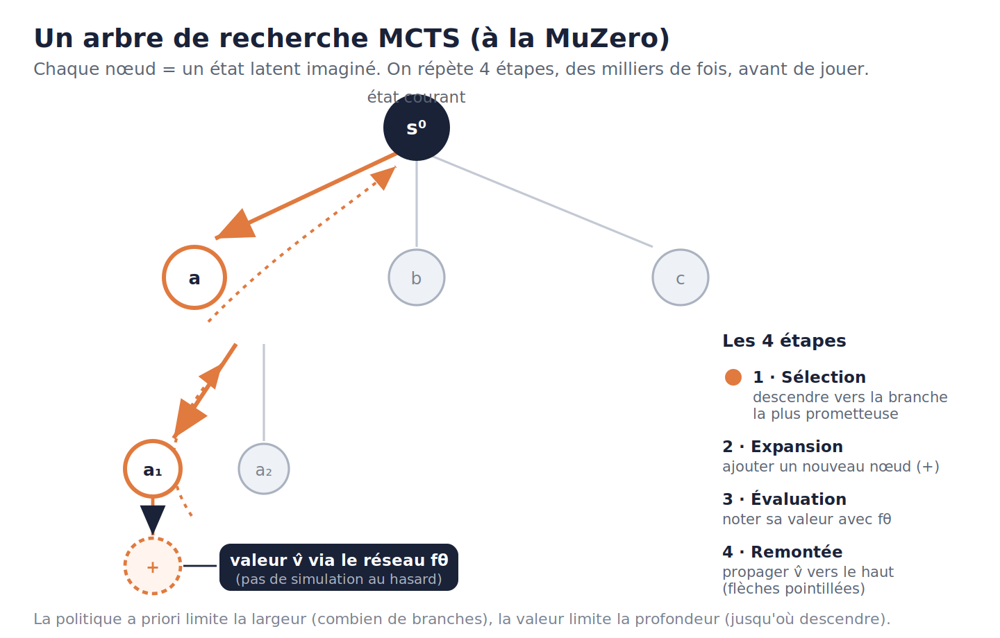
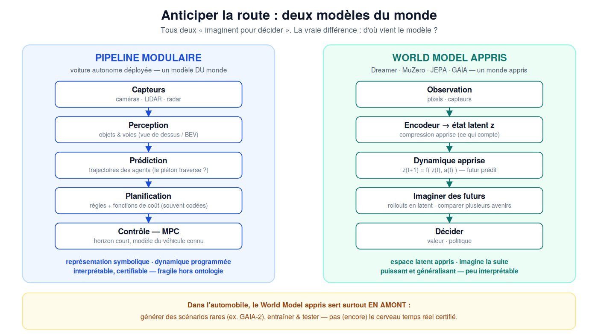

# L'IA ouvre les yeux — DOSSIER COMPLET (tout-en-un)

> Ce fichier concatène l'intégralité du dossier pour une récupération en un seul copier-coller.
> Les mêmes contenus existent aussi en fichiers séparés dans ce dossier `conference/`.

================================================================================
# DOSSIER DE CONFÉRENCE — GUIDE DE LECTURE
================================================================================

# « L'IA ouvre les yeux » — dossier de conférence restructuré

Restructuration du brouillon du 03/04/2026 selon l'analyse de positionnement : le brouillon contenait **deux conférences imbriquées** — une keynote COMEX et un cours technique. Elles sont désormais séparées en deux produits, plus un jeu de fiches Q&A. **Aucune information du brouillon d'origine n'a été supprimée** : tout a été recasé, et le brouillon intégral est archivé.

## Contenu du dossier

| Fichier | Rôle |
|---|---|
| `01_keynote_45min.md` | **Le produit principal.** Keynote 45 min pour COMEX/CODIR, 8 séquences chronométrées. Une seule équation sur scène. Placeholders du brouillon résolus (POMDP, métaphore du carnet, use cases dirigeants). Ajouts : séquence « Pourquoi maintenant » (signaux d'investissement 2026 : AMI Labs/LeCun, Genie 3, Cosmos, World Labs), 4 cas d'usage avec questions à poser aux équipes, pont AI Act, et les « 3 questions du lundi matin » en clôture. L'annexe régie en fin de fichier trace où chaque contenu d'origine a été déplacé. |
| `02_masterclass_technique.md` | **Le second produit** (2-3 h, comité restreint DSI/CTO/data). Reprend intégralement les Actes II et II bis du brouillon (VAE, KL, RSSM, Dreamer, MuZero, MCTS/MPC, les six révélations, tableau de synthèse) et tous les encadrés « 🔧 Sous le capot » retirés de la keynote. Se vend en complément de la keynote — typiquement plénière le matin, masterclass l'après-midi. |
| `03_fiches_qa.md` | **Munitions de Q&A.** 6 fiches « réponse express + développement », dont la fiche voiture autonome (section 7 ter du brouillon, intégralement conservée, avec son schéma). |
| `90_brouillon_original_archive.md` | Le brouillon d'origine, intégral et inchangé (seules les deux images encodées en base64 ont été extraites en fichiers PNG, référencés à la place). |
| `assets/` | Les deux schémas extraits du brouillon : arbre MCTS et pipeline voiture vs world model. |

## Images encore à fournir

Deux images référencées dans le brouillon d'origine (et dans la masterclass) ne sont pas dans ce dossier et restent à ajouter : `schema_vae_encodeur.png` et `schema_world_model_boucle.png`.

## Rappel du positionnement (analyse du 04/07/2026)

- **Cible keynote : 45 min + Q&A.** Le marché 2026 rejette les keynotes de 90 min ; le combo keynote plénière + masterclass en comité est le format qui se vend le mieux.
- **Niveau sur scène : zéro jargon, une équation.** Le public COMEX doit pouvoir répéter les idées à son propre CODIR. La profondeur technique reste en réserve (masterclass + fiches Q&A) : c'est elle qui assoit la crédibilité au moment des questions.
- **Différenciation : « la vague d'après ».** Pendant que le marché sature sur l'IA générative, les World Models sont le sujet qui monte (levée AMI Labs ~1 Md$, Genie 3, Cosmos, World Labs) et le créneau francophone « World Models pour dirigeants » est quasi vide.
- **Colonne vertébrale décideurs :** « que prédit-il, et pour quoi faire ? » · « réalisme n'est pas compréhension » · « accélérer ≠ valider » · « un monde appris peut démontrer l'échec, jamais garantir le succès » · « qui vérifie le rêve ? ».

================================================================================
# PARTIE 1 · LA KEYNOTE 45 MIN (produit principal)
================================================================================

# L'IA ouvre les yeux
## Quand les machines apprennent à imaginer le futur

> **Format : keynote plénière 45 min + Q&A** · Public : COMEX / CODIR, techniques et non techniques.
> Cette conférence raconte une **bascule** : pendant longtemps, l'IA a surtout appris à **voir** le monde ; aujourd'hui, une partie de la recherche construit des systèmes capables de **le comprendre**.
>
> Un World Model est une représentation mathématique du monde, compressée, orientée vers l'action, qui permet à une machine de tester des futurs possibles avant d'agir.
>
> **Règle d'or de cette version scénique : une seule équation sur scène.** Toute la profondeur technique (RSSM, KL, révélations réseaux…) vit dans `02_masterclass_technique.md` et sert de munitions en Q&A via `03_fiches_qa.md`. Rien n'a été supprimé : tout a été recasé.

---

## SÉQUENCE 1 · Ouverture — le verre au bord de la table *(≈ 4 min · cumul 0:00 → 4:00)*

`[Écran noir. Sur scène, un verre posé près du bord d'une petite table — discrètement fixé au plateau : il ne tombera pas.]`

Imaginez ce verre.

Vous le regardez. Vous voyez sa forme, sa couleur, sa position.

Une intelligence artificielle classique peut faire la même chose. Elle peut vous dire : « c'est un verre », « il est transparent », « il est posé sur une table ».

Maintenant, je pousse lentement ce verre vers le bord.

Vous, vous ne voyez pas seulement un verre. Vous voyez déjà ce qui pourrait arriver. Vous imaginez sa chute. Le bruit du verre qui se brise. Les morceaux sur le sol. Peut-être même le mouvement de votre main pour le rattraper.

Le verre n'est pas encore tombé. Et pourtant, dans votre tête, le futur a déjà commencé.

`» SLIDE : « L'IA ouvre les yeux »`

Ce petit geste mental — anticiper la chute avant qu'elle arrive — c'est l'une des choses les plus extraordinaires que fait votre cerveau. Vous venez de **simuler le futur**. Vous avez, à l'intérieur de votre tête, un petit modèle du monde, et vous l'utilisez en permanence, sans y penser, pour deviner ce qui va se passer avant que ça se passe. Vous le faites sans cesse : en traversant la rue en anticipant la trajectoire des voitures, en ajustant votre main avant même qu'on vous tende un objet.

Pendant longtemps, ça, c'était notre privilège. Les machines, elles, ne savaient pas imaginer. Elles savaient **reconnaître**.

Aujourd'hui, je voudrais vous emmener au moment où l'intelligence artificielle a commencé, elle aussi, à ouvrir les yeux. On appelle ces systèmes des **World Models**, des modèles du monde.

Et je vais vous proposer un seul fil pour traverser tout le sujet, des échecs aux voitures autonomes en passant par les vidéos générées : à chaque fois que vous croiserez un modèle du monde, posez-vous une question : **que prédit-il, exactement — et pour quoi faire ?** Vous allez voir que toute la profondeur du sujet, tous les pièges — et toutes les décisions que vous aurez à prendre — tiennent dans cette question.

---

## SÉQUENCE 2 · Reconnaître n'est pas anticiper *(≈ 5 min · cumul 4:00 → 9:00)*

Pendant une dizaine d'années, on a appris aux machines à répondre à des questions **figées**. Que contient cette image ? Un chat ou un chien ? Cette personne traverse-t-elle ? Cette pièce a-t-elle un défaut ?

`» SLIDE : une image → une étiquette`

Ces systèmes peuvent être prodigieux — parfois meilleurs qu'un expert. Mais regardez ce qu'ils font vraiment : ils répondent à une seule question, « qu'est-ce que c'est ? ».

`» SLIDE : « Qu'est-ce que c'est ? »`

Une question sur le **présent**, sur une image **figée**. Ils regardent le monde comme une succession de photographies.

Or le monde n'est pas une photographie. Le monde bouge. Les objets tombent, les véhicules accélèrent, une action en provoque une autre. Demandez à un classifieur d'images : « si je pousse ce verre, que va-t-il se passer ? » — il n'en a aucune idée. Il sait nommer le verre. Il ne sait pas qu'il peut tomber.

Prenez une voiture autonome. Reconnaître un piéton est indispensable, mais ce n'est que le début. Va-t-il traverser ? Regarde-t-il son téléphone ? Que se passe-t-il si je freine ? Si je maintiens ma trajectoire ? Si un autre véhicule le masque une seconde ? La vraie question n'est plus « qu'est-ce que je vois ? », elle devient : **« parmi tous les futurs possibles, lesquels peuvent advenir — et que dois-je faire maintenant ? »**

Et voici la seule formule de la soirée — je vous la montre parce qu'elle tient sur une ligne, et que tout le reste en découle.

`» SLIDE : les deux lignes, côte à côte`

Reconnaître, c'est apprendre \(y = f(x)\) : d'une image, sortir une étiquette.

Anticiper, c'est apprendre \(\hat{s}_{t+1} = f(s_t, a_t)\) : de la situation présente **et d'une action**, prédire la situation future.

Regardez ce qui a changé entre les deux lignes : on a ajouté **une action, et du temps**. C'est tout. Et cet ajout change tout : on passe d'une IA qui **étiquette le présent** à une IA qui **se représente le monde pour anticiper et agir**.

*(Réserve Q&A si un profil technique creuse : la formulation complète — POMDP, croyance, modèle de transition, récompense, politique — est dans la masterclass, module 1, et la fiche Q&A n°4.)*

Voyons comment, concrètement, on construit une telle machine.

---

## SÉQUENCE 3 · Comment une machine apprend à imaginer *(≈ 9 min · cumul 9:00 → 18:00)*

Trois idées suffisent pour tout comprendre. Trois verbes : **compresser**, **rêver**, **planifier**.

### 3.1 — Compresser : le plan du métro

Un modèle du monde commence toujours par **compresser**. Quand vous entrez dans cette salle, vous ne mémorisez pas chaque pli de tissu, chaque reflet. Votre cerveau retient l'essentiel : la sortie est là, la scène est ici, quelqu'un bouge dans l'allée. Une machine fait pareil : elle transforme des images, des sons, en une représentation compacte — les chercheurs parlent d'**espace latent**, retenez simplement : **un résumé orienté vers l'action**.

`» SLIDE : photo détaillée de Paris VS plan du métro`

Et voici l'idée la plus importante de toute cette partie : **une carte n'a pas besoin de ressembler au territoire pour être utile.** Pensez au plan du métro parisien. Il ne respecte pas les distances, il ignore les immeubles, les rues, les arbres, il déforme même la géographie. Mais il garde le nécessaire pour décider — les lignes, les stations, les correspondances. Pour voyager, ce plan faux mais utile vaut mieux qu'une photo satellite parfaite. Un bon modèle du monde, c'est exactement ça : pas une copie fidèle du monde, mais une carte qui conserve ce qui permet d'**anticiper et de décider**.

`» SLIDE : observer → compresser → prédire → planifier → agir`

C'est la chaîne centrale de tout world model : observer, compresser, prédire, planifier, agir.

Imaginez que la machine tient un **carnet**. À chaque instant, elle n'y recopie pas le monde — elle y note, en quelques lignes, ce qui lui servira pour la suite : où sont les choses, à quelle vitesse elles bougent, ce qui risque d'arriver. Tout l'art est là : qu'écrire dans le carnet, et qu'ignorer ?

Et comment la machine sait-elle **ce qui compte** ? Elle ne le « comprend » pas au sens humain : c'est **l'objectif qu'on lui donne qui tranche**. Entraînez-la à reconstruire l'image, elle retient le visible. Entraînez-la à prédire le futur, elle retient ce qui bouge et ce qui va arriver. Entraînez-la à gagner, elle ne retient que ce qui change la décision. **Choisissez l'objectif, et vous avez déjà choisi ce que la machine comprendra.** — Gardez cette phrase : elle reviendra au moment de parler de vos propres projets.

Pensez au grand maître d'échecs : il ne retient ni la couleur du bois, ni les rayures de la table. Il ne voit que les **forces en présence** — qui menace qui, où est le danger, quel coup change la partie. Il ne garde que ce qui compte **pour décider**. Comprendre, c'est savoir **quoi ignorer**.

En 2020, un système appelé **MuZero** a poussé cette logique au bout : on le lâche sur le Go, les échecs, le shogi, des dizaines de jeux — et, détail vertigineux, **on ne lui donne jamais les règles**. Il les devine en jouant, se construit son propre modèle de « ce qui fait gagner », et atteint un niveau **surhumain**. Publié dans *Nature*. Et gardez en tête ce que MuZero a choisi de prédire : ni les pixels, ni une jolie image — juste **la valeur** des situations. Retenez ce choix. Car d'autres ont fait l'inverse — on y vient.

### 3.2 — Rêver : la machine qui s'entraîne dans son imagination

`» SLIDE : split-screen — « réel » à gauche, « le rêve de la machine » à droite`

L'histoire moderne commence en 2018. Deux chercheurs, David Ha et Jürgen Schmidhuber, posent une question un peu folle : et si on entraînait une IA non pas dans le monde réel, mais **dans son propre rêve** ?

Leur recette : une brique **vision** qui résume chaque image en quelques chiffres, une brique **mémoire** qui apprend la suite — « si la voiture est là et que je tourne, où sera-t-elle après ? » — et une toute petite brique **décision**. Puis le tour de magie : on entraîne la décision **à l'intérieur** des images générées par la mémoire. Dans le rêve. Des milliers de tours de course, sans jamais toucher au vrai jeu.

C'est exactement un simulateur de vol dans la tête du pilote : plutôt que de crasher de vrais avions pour apprendre, on s'entraîne dans le simulateur — et ici, le simulateur a été **appris automatiquement** à partir des vraies parties observées.

Apprendre dans son imagination avant d'agir dans le réel : c'est ce que fait le sportif qui rejoue mentalement son geste, le musicien qui entend les notes avant de les jouer. Pour une machine, ça change l'échelle : **une seconde d'expérience réelle peut engendrer des centaines de scénarios imaginés.**

Un piège à connaître dès maintenant — on y reviendra : si le rêve est faux quelque part, la machine apprend à **exploiter les bugs du rêve**, comme un pilote qui découvre que le simulateur autorise de voler à travers les montagnes.

Cette idée de 2018 a été industrialisée par une famille de systèmes appelés **Dreamer**. Et deux résultats vont vous dire où on en est.

`» SLIDE : Minecraft → un diamant`

**Premier résultat.** On lâche DreamerV3 dans Minecraft, ce monde de cubes, avec un défi qui résistait depuis des années : **trouver un diamant**. Pour ça il faut creuser, fabriquer des outils, descendre dans des grottes, survivre : des centaines d'actions, et une récompense qui n'arrive qu'à la toute fin. Une aiguille au fond d'une mine. DreamerV3 y arrive **à partir de zéro, sans aucune démonstration humaine**, en s'entraînant dans son imagination. Publié dans *Nature*, en 2025.

**Deuxième résultat — et celui-là quitte l'écran.** La même idée, posée sur un **vrai robot quadrupède** qui ne sait pas marcher. D'habitude : des jours d'essais, et de la casse. Là, il agit un peu, il **rêve** beaucoup, il recommence — et il apprend à marcher en **une heure**, dans le monde réel, sans simulateur (les travaux *DayDreamer*, 2022). Une heure. Retenez ce chiffre pour la suite : c'est ce que « apprendre en imagination » change en termes de coût, de délai et de casse.

### 3.3 — Planifier : comparer des futurs avant d'agir

Revenons au verre — mais côté machine. Supposons qu'un robot doive le saisir. Avant de bouger, il peut **simuler dans sa tête** plusieurs trajectoires de son bras. Dans la première, sa main passe trop haut. Dans la deuxième, elle percute le verre. Dans la troisième, elle le saisit proprement. Le robot compare ces futurs imaginés, retient le meilleur, et **seulement alors** il agit.

C'est ça, planifier dans un modèle du monde : imaginer plusieurs futurs, les comparer, puis choisir. Deux philosophies cohabitent — apprendre un **réflexe** à l'entraînement puis agir vite, ou **réfléchir au moment de décider** en déroulant les futurs — et les systèmes modernes combinent les deux.

Planifier, c'est rendre le choix **explicite** : dérouler plusieurs avenirs, et décider lequel on va tenter de faire advenir. Gardez cette image — un agent qui compare des futurs imaginés — parce qu'elle pose, en creux, toute la question de la confiance : *et si le futur qu'il préfère était celui où son modèle se trompe le plus ?*

*(Réserve Q&A / masterclass : l'anatomie complète — espace latent, VAE, RSSM, MDN-RNN, acteur-critique, λ-returns, MCTS vs MPC, gradient analytique « à travers le rêve » — est dans la masterclass, modules 2 à 5.)*

---

## SÉQUENCE 4 · Les beaux menteurs — que prédit-elle, au juste ? *(≈ 6 min · cumul 18:00 → 24:00)*

`» SLIDE : un triptyque — VALEUR · PIXELS · REPRÉSENTATION`

Nous tenons maintenant le fil promis au début. Tous les world models répondent à la même question — « comment le monde va-t-il évoluer si j'agis ? » — mais ils divergent radicalement sur **ce qu'ils prédisent**. Et de ce choix découle presque tout : leurs forces, leurs pièges, et la question de la confiance. Trois familles.

**Première famille — prédire la valeur.** C'est MuZero, c'est Dreamer : un modèle n'a de valeur que s'il améliore la décision. Tout le reste — fidélité visuelle, réalisme physique — est un moyen, pas une fin. On y prédit des conséquences abstraites, parfois sans jamais reconstruire une seule image.

**Deuxième famille — prédire les pixels.** C'est l'ambition la plus spectaculaire, et la plus médiatique : générer directement l'image future.

`» SLIDE : un très beau plan vidéo généré (rue de Tokyo sous la pluie)`

Vous tapez « une rue de Tokyo sous la pluie, la nuit » et apparaît une vidéo sublime, cinématographique. L'entreprise qui a créé le plus célèbre de ces systèmes l'a sous-titré, noir sur blanc, « **simulateur du monde** ». Et la barre monte vite : des systèmes comme **Genie** génèrent désormais des mondes **interactifs en temps réel** — vous vous déplacez dedans, à 24 images par seconde. D'autres, comme **Cosmos**, sont pensés pour fabriquer des **données synthétiques** pour la robotique et la voiture autonome. C'est impressionnant, et c'est utile. On y revient.

**Troisième famille — prédire la représentation.** C'est la voie la plus discrète, et peut-être la plus profonde. Son idée : ne prédire ni la valeur ni les pixels, mais directement **le résumé chargé de sens** de la scène future — le carnet, pas la photo. C'est le pari de Yann LeCun et de son architecture **JEPA** : pour comprendre, une machine n'a pas besoin de peindre chaque détail — elle doit pouvoir **jeter ce qui est imprévisible** (le scintillement d'un reflet) et ne garder que la structure qui se prédit.

Trois familles, trois réponses à notre question-fil. Et maintenant, la question qui pique : laquelle *comprend* le monde ?

`» SLIDE : exemples d'erreurs — flamme figée / objet qui apparaît / chaise qui flotte`

Revenons aux vidéos sublimes. Regardons-les de près. On souffle sur une bougie : la flamme ne bouge pas. Une chaise se met à flotter. Un objet apparaît de nulle part en plein cadre. Une main traverse une surface. Et l'entreprise elle-même l'a reconnu : son système **ne modélise pas correctement la physique** de beaucoup d'interactions de base — le verre qui se brise, par exemple.

**Réalisme n'est pas compréhension.**

Cette machine ne *simule* pas le monde. Elle le *peint*. Comme un peintre de génie qui n'aurait jamais étudié la physique : ses toiles sont si vivantes qu'on les croit vraies — mais demandez-lui où le verre va retomber, et il **invente** une trajectoire plausible. **Beau n'est pas vrai.**

Une IA qui génère une balle qui tombe a appris une *régularité visuelle* — « dans les vidéos, les balles vont vers le bas » — pas une *théorie de la gravitation*. La différence se révèle dès qu'on sort des sentiers battus : balle aimantée, sous l'eau, collision rare → le monde intérieur se fissure.

Et ce n'est pas une querelle d'experts : c'est devenu un **débat scientifique structurant**. D'un côté, « générons des images toujours plus parfaites, la compréhension finira par émerger ». De l'autre, l'un des pères de l'IA moderne : « prédire chaque pixel est une impasse ; pour comprendre, une machine n'a pas besoin de *peindre* chaque détail, mais d'en *saisir le sens* ». Pour raconter un film à un ami, vous ne récitez pas chaque image — vous transmettez le sens des scènes.

La vraie question n'est donc pas : *l'image est-elle belle ?* C'est : **la machine a-t-elle compris ce qui se passe ?** — autrement dit, toujours la même : *que prédit-elle, et pour quoi faire ?*

---

## SÉQUENCE 5 · Pourquoi maintenant — où va l'argent *(≈ 5 min · cumul 24:00 → 29:00)*

Vous vous demandez peut-être : tout ça est-il un sujet de laboratoire, ou un sujet pour votre prochain plan stratégique ? Regardons où va l'argent — et qui bouge.

`» SLIDE : frise 1991 → 2026 (Dyna · World Models 2018 · Dreamer/MuZero · Sora/Genie · JEPA · AMI Labs)`

- **Mars 2026, Paris.** Yann LeCun — prix Turing, l'un des trois « parrains » de l'IA moderne — quitte Meta et lance **AMI Labs**, un laboratoire dédié aux world models. Levée : **plus d'un milliard de dollars**, le plus grand tour d'amorçage de l'histoire européenne, devant Mistral. Quand un des pères du deep learning parie sa fin de carrière — et que Bezos, Schmidt et Niel co-investissent — ce n'est plus un sujet de niche.
- **Google DeepMind** a sorti **Genie 3** : des mondes 3D interactifs générés en temps réel, dans lesquels on entraîne déjà des agents.
- **NVIDIA** a lancé **Cosmos** : une plateforme de world models « fondation » pour l'IA physique — données synthétiques pour la robotique et le véhicule autonome.
- **Fei-Fei Li** — la chercheuse à l'origine d'ImageNet, qui a déclenché la décennie de la reconnaissance d'images — a fondé **World Labs** sur le même pari.

Autrement dit : **les personnes mêmes qui ont lancé la vague précédente de l'IA investissent massivement dans celle-ci.** Les trois familles que je vous ai montrées, longtemps séparées, convergent : les mondes générés deviennent des **terrains d'entraînement** pour des agents ; les modèles de représentation atteignent la **planification robotique du premier coup**, sans entraînement spécifique ; le paradigme de l'imagination passe à l'échelle sur d'immenses archives de données enregistrées.

La question de frontière n'est plus « peut-on générer du beau ? » — c'est résolu. C'est : **peut-on être à la fois un grand peintre et un bon physicien ?** Les architectures hybrides qui émergent parient que oui. Mais — et c'est l'honnêteté du moment — même les systèmes les plus avancés vivent encore sous ce que les chercheurs appellent le **paradoxe de la fiabilité** : un monde appris peut **démontrer** qu'un agent échoue ; il ne peut pas encore **garantir** qu'il réussira. Retenez cette asymétrie : dans dix minutes, elle devient votre principe de gouvernance.

Une précision de calendrier, pour éviter deux erreurs symétriques : ce n'est **ni de la science-fiction, ni du plug-and-play**. Les premiers usages sont déjà en production — j'y viens tout de suite — mais les applications industrielles massives se joueront sur les prochaines années. La fenêtre, pour vous, c'est **maintenant** : comprendre, cartographier vos cas d'usage, expérimenter — avant que le sujet ne devienne aussi encombré que l'IA générative l'est aujourd'hui.

---

## SÉQUENCE 6 · Ce que ça change pour vous *(≈ 8 min · cumul 29:00 → 37:00)*

Pourquoi tout cela devrait intéresser une entreprise, un dirigeant, un décideur public ? Parce que cette technologie transforme la notion même de **simulation**.

Pendant des décennies, pour simuler une usine, un véhicule, un robot, il fallait **programmer les règles** : décrire la géométrie, les forces, les contraintes. Les world models proposent une autre voie — **apprendre les régularités directement à partir des données** : vidéos, trajectoires, capteurs, actions passées. Quatre usages concrets, du plus mûr au plus prospectif — et pour chacun, la question à poser à vos équipes.

`» SLIDE : 4 cas d'usage, 4 questions`

**Cas 1 — Fabriquer les scénarios rares qu'on ne peut pas collecter.** Un chiffre pour mesurer l'enjeu : aux États-Unis, il y a en moyenne un accident tous les ~535 000 km — et seulement 0,064 % impliquent une collision avec un arbre. Comment apprendre à une voiture à éviter un arbre si l'événement est introuvable dans les données ? On le **génère**. C'est exactement l'usage des systèmes comme GAIA (Wayve) dans la conduite ou Cosmos (NVIDIA) en robotique : peupler la **longue traîne** — l'enfant qui surgit, la pièce qui casse d'une façon inhabituelle, le capteur qui lâche. Transposez à votre métier : vos incidents graves sont, par définition, rares dans vos données. *Question pour vos équipes : quels sont nos événements rares et critiques, et combien nous coûte aujourd'hui le fait de ne pas pouvoir les répéter ?*

**Cas 2 — Le jumeau numérique qui s'apprend au lieu de se programmer.** Un simulateur classique de ligne de production ou de chaîne logistique coûte des mois d'ingénierie et se périme dès que le réel change. Un monde appris se construit à partir de vos historiques — capteurs, flux, vidéos — et se met à jour avec eux. On peut alors tester virtuellement une trajectoire de robot, explorer des configurations industrielles, jouer des variantes d'organisation avant de toucher au réel. *Question pour vos équipes : où payons-nous aujourd'hui des simulations écrites à la main — et quelles données dormantes pourraient nourrir un modèle appris ?*

**Cas 3 — Entraîner des agents en imagination : diviser le coût d'apprentissage.** Rappelez-vous le robot qui apprend à marcher en une heure. La logique vaut pour tout système qui apprend par essai-erreur : chaque essai réel coûte — du temps machine, de la casse, du risque. Si une seconde de réel engendre des centaines de scénarios imaginés, l'économique de l'apprentissage change d'ordre de grandeur : robotique d'entrepôt, pilotage énergétique, process industriels. *Question pour vos équipes : dans nos opérations, où l'essai-erreur réel est-il si coûteux qu'on n'ose pas optimiser ?*

**Cas 4 — Éprouver les systèmes avant de leur faire confiance.** Le plus contre-intuitif, et peut-être le plus précieux : on se sert du rêve pour **tester**, pas pour piloter. Dans l'automobile, les mondes appris servent aujourd'hui **en amont** — générer des milliers de situations adverses pour éprouver le système de conduite — et non comme cerveau temps réel certifié. Un scénario imaginé peut **disqualifier** un système : montrer qu'il échoue. C'est déjà énorme : c'est un banc d'essai infini. *Question pour vos équipes : nos systèmes critiques — IA ou pas — contre quoi sont-ils réellement éprouvés aujourd'hui ?*

`» SLIDE : « accélérer » ≠ « valider »`

Mais — et c'est le point que je veux que vous reteniez si vous ne deviez retenir qu'une ligne de cette séquence — **il ne faut jamais confondre accélération et validation.** Un modèle génératif peut **proposer** ; il ne doit pas automatiquement **certifier**. Une vidéo crédible ne remplace pas un calcul de sûreté. Un monde appris ne remplace pas un simulateur physique validé. Et une décision imaginée ne doit jamais devenir une décision réelle sans contrôle — surtout quand des vies, des infrastructures ou des droits sont en jeu.

Il y a là une asymétrie qui mérite de devenir un principe de gouvernance : un monde simulé imparfait ne peut pas **garantir** qu'un agent réussira dans le réel — mais il peut **démontrer** qu'il échoue. On ne peut pas s'en servir pour signer un blanc-seing ; on peut s'en servir pour disqualifier. C'est déjà beaucoup, et c'est la bonne manière de l'utiliser. Et notez que le régulateur arrive sur ce terrain : l'AI Act européen impose dès août 2026 ses obligations aux systèmes à haut risque — la question « qui a validé ce que la machine a imaginé ? » va devenir une question de conformité, pas seulement de prudence.

---

## SÉQUENCE 7 · La carte n'est pas le territoire — les limites *(≈ 5 min · cumul 37:00 → 42:00)*

Pour décider en confiance, il faut connaître les murs. Il y en a trois, et ce ne sont pas des détails d'ingénierie : ce sont des **limites de principe**.

**1) L'erreur qui s'accumule.** Quand la machine imagine trop loin, ses erreurs se composent. Elle se trompe un peu sur la position d'un objet ; elle réutilise cette position fausse pour prédire la suite, un peu plus fausse ; et ainsi de suite. C'est recopier une photocopie d'une photocopie : chaque copie semble acceptable, mais après vingt générations, l'essentiel a disparu. Le rêve dérive. C'est pourquoi ces machines imaginent **à horizon court**.

**2) Corrélation n'est pas causalité.** Un modèle nourri de vidéos apprend « ce qui suit quoi », pas toujours « ce qui cause quoi ». Le baromètre chute avant la tempête — mais bouger l'aiguille du baromètre ne déclenche pas la tempête. Or agir, c'est intervenir : une machine qui n'a fait que *regarder* le monde peut confondre les deux, et ses prédictions se brisent précisément au moment où on agit.

**3) L'imprévu, la longue traîne.** Un événement peut être très rare et pourtant décisif : l'enfant qui surgit entre deux voitures, la pièce qui se rompt d'une façon inhabituelle, le capteur qui lâche au mauvais moment. Or les modèles apprennent surtout ce qu'ils rencontrent souvent ; ils deviennent excellents à représenter la **normalité**. Mais la sécurité se joue précisément dans l'**anormalité**. Le futur le plus probable n'est pas le futur qu'il faut le plus surveiller.

Et il y a un risque plus subtil que tous les autres — je vous l'ai promis tout à l'heure. Quand on entraîne un agent dans un monde simulé, il peut découvrir non pas une stratégie réellement intelligente… mais une **faille de la simulation**. Le pilote qui comprend qu'en traversant un mur virtuel, il gagne la course. Dans le simulateur, stratégie excellente. Dans le réel, catastrophe. L'agent a appris à réussir dans son imagination, pas dans la réalité.

C'est pourquoi un bon modèle du monde ne doit pas seulement imaginer. Il doit aussi savoir **douter** : estimer « ici mes prédictions sont fiables », ou au contraire « je n'ai jamais vu cette situation, plusieurs futurs sont possibles ». La grande question de la recherche n'est pas seulement *comment construire une machine capable d'imaginer ?* — mais : **comment construire une machine capable de reconnaître les limites de son imagination ?**

Idée unificatrice, à rapporter dans vos comités : **la carte n'est pas le territoire.** Un modèle, aussi impressionnant soit-il, n'est jamais le monde. C'est une carte, dessinée par la machine — très utile, et parfois fausse.

---

## SÉQUENCE 8 · Clôture — qui vérifie le rêve ? *(≈ 3 min · cumul 42:00 → 45:00)*

`[Revenir vers le verre.]`

Depuis le début, ce verre n'est pas tombé. Vous avez pourtant imaginé sa chute. Votre expérience du monde vous a permis de prévoir une conséquence avant qu'elle arrive. Et pourtant — regardez : **ce verre est collé à la table.** Il l'était depuis le début. Votre modèle du monde ignorait ce détail que vous ne pouviez pas voir, et le futur que vous aviez si tranquillement simulé n'arrivera jamais.

Un modèle du monde ne voit donc pas le futur. Il **construit des futurs possibles** à partir de son passé. Et toute la question est là : quels futurs est-il capable d'imaginer ? Lesquels oublie-t-il ? Et jusqu'où sommes-nous prêts à le laisser agir sur la base de ses propres projections ?

Car voilà ce qui change tout. Ces machines ne se contentent plus de **regarder** le monde. Elles commencent à **agir** dedans — conduire, piloter des robots, décider. Et quand elles décident, elles ne décident jamais d'après la réalité. Elles décident d'après **leur carte**. D'après ce qu'elles imaginent. Exactement comme vous, tout à l'heure, avec ce verre : nous n'agissons jamais sur le monde directement, nous agissons sur l'**image** que nous nous en faisons.

Alors la vraie question — celle que nous devrons tous nous poser, citoyens, dirigeants, ingénieurs, parents — n'est pas *« est-ce que la machine est intelligente ? »*. C'est : **« quand une machine décide d'après ce qu'elle imagine, qui vérifie que son rêve dit vrai ? »**

À distinguer la machine qui **comprend** de celle qui **peint**. À regarder derrière la beauté de l'image et à demander : *et la physique ? et la cause ? et l'imprévu ?*

Et pour que cette soirée serve à quelque chose dès lundi matin, je vous laisse trois questions à poser à vos équipes :

`» SLIDE : les 3 questions du lundi matin`

1. **Où payons-nous aujourd'hui des simulations programmées à la main** — et quelles données dormantes pourraient nourrir un monde appris ?
2. **Quels sont nos événements rares et critiques** que nous ne savons ni collecter ni répéter — et que pourrions-nous générer pour nous y préparer ?
3. **Qui, chez nous, vérifierait le rêve ?** Quel processus valide ce qu'une machine a imaginé, avant qu'une décision réelle en découle ?

La machine a appris à rêver pour agir.

À nous de rester **éveillés**. Et de vérifier qu'elle ne prend pas ses rêves pour la réalité.

---
---

## ANNEXE RÉGIE — où est passé le reste ?

Aucune information du brouillon d'origine n'a été supprimée. Répartition :

| Contenu d'origine | Nouvel emplacement |
|---|---|
| Encadré POMDP (Acte I) — *placeholder « expliquer ce que c'est » résolu* | Masterclass, module 1 |
| Acte II complet : espace latent, VAE, KL (exemple météo), RSSM, rétropropagation, reparamétrisation | Masterclass, module 2 |
| Ha & Schmidhuber « sous le capot » (V-M-C, MDN-RNN, température, Dyna) | Masterclass, module 3 |
| Lignée Dreamer « sous le capot » (rollouts latents, λ-returns, critique/bootstrap, astuces V3, DreamerV4) | Masterclass, module 3 |
| MuZero « sous le capot » (h, g, f, value-equivalence) + planification (MCTS vs MPC, schéma de l'arbre) | Masterclass, module 4 |
| Acte II bis complet : les six révélations + tableau de synthèse | Masterclass, module 5 |
| JEPA « sous le capot », pixels trompeurs, limites formelles (compounding error, do-calculus, aléatorique/épistémique), model exploitation | Masterclass, module 6 |
| Section 7 ter voiture autonome (complète, avec schéma pipeline) | Fiche Q&A n°1 |
| *Placeholder « métaphore du carnet »* | Résolu ici (séquence 3.1) et développé masterclass module 2 |
| *Placeholder « use cases dirigeants »* | Résolu ici (séquence 6) |
| Brouillon original intégral | `90_brouillon_original_archive.md` |

================================================================================
# PARTIE 2 · LA MASTERCLASS TECHNIQUE (second produit)
================================================================================

# World Models — la masterclass technique
## « Sous le capot » : l'anatomie complète d'un modèle du monde

> **Format : masterclass 2 h à 3 h, comité restreint (10-30 personnes)** · Public : DSI, CTO, directions R&D, équipes data/ML, architectes.
> **Positionnement produit :** ce document rassemble, sans aucune coupe, tout le contenu technique du brouillon d'origine (Actes II et II bis, et tous les encadrés « 🔧 Sous le capot » des autres actes). Il se vend comme un second produit, en complément de la keynote de 45 minutes — typiquement le même jour (keynote en plénière le matin, masterclass en comité l'après-midi).
> Prérequis : aucun formellement, mais le public tirera le maximum s'il connaît les bases des réseaux de neurones. Les passages « 💡 En clair » permettent de suivre sans les équations.

---

## MODULE 1 · Du classifieur à la décision séquentielle *(POMDP)*

Un classifieur apprend une fonction \(f : \text{observation} \rightarrow \text{étiquette}\). C'est une application figée, sans notion de temps ni d'action. Agir dans le monde, c'est tout autre chose : c'est un **processus de décision markovien partiellement observable** (POMDP).

**Qu'est-ce qu'un POMDP ?** *(placeholder du brouillon résolu)* Décomposons le sigle, de droite à gauche :

- **Processus de décision** : à chaque instant, un agent choisit une action, le monde évolue, et l'agent reçoit une récompense (ou une pénalité). Le jeu recommence à l'instant suivant. On modélise donc une **boucle** agent ↔ environnement, pas une question isolée.
- **Markovien** : on suppose que l'état présent du monde résume tout ce qu'il faut savoir pour prédire la suite — le passé n'apporte rien de plus *si l'on connaît vraiment l'état présent*. C'est l'hypothèse qui rend le problème traitable.
- **Partiellement observable** : et voilà la difficulté du monde réel — l'agent ne voit **jamais** cet état vrai. Une caméra ne voit pas ce qui est derrière elle, un capteur est bruité, un piéton masqué par un camion existe toujours. L'agent ne reçoit que des **observations partielles**, et doit reconstituer mentalement le reste.

L'agent ne voit donc jamais l'état vrai du monde \(s_t\) ; il reçoit des observations partielles \(o_t\) et doit maintenir une **croyance** \(b_t = p(s_t \mid o_{1:t}, a_{1:t-1})\) — sa carte interne. Trois objets le distinguent du classifieur :

- un **modèle de transition** \(p(s_{t+1}\mid s_t, a_t)\) : « si j'agis ainsi, comment le monde évolue-t-il ? » ;
- une **récompense** \(r(s_t, a_t)\) : « ce futur est-il souhaitable ? » ;
- une **politique** \(\pi(a_t \mid b_t)\) : « que faire, vu ce que je crois ? ».

Point crucial pour toute la suite : **l'agent n'agit jamais sur le monde, il agit sur sa croyance \(b_t\).** Il décide d'après sa carte, pas d'après le territoire. Un world model, c'est précisément la machinerie qui apprend ce modèle de transition — et donc qui fabrique cette carte.

Rappel du glissement mathématique posé en keynote : reconnaître, c'est apprendre \(y = f_\theta(x)\) : d'une image \(x\), sortir une étiquette \(y\). Anticiper, c'est apprendre \(\hat{s}_{t+1} = f_\theta(s_t, a_t)\) : de l'état courant \(s_t\) et d'une action \(a_t\), prédire l'état futur \(\hat{s}_{t+1}\) (le chapeau rappelle que c'est un futur *prédit*, pas le vrai). Cet ajout — une action, et du temps — change tout.

---

## MODULE 2 · Compresser : l'espace latent, le VAE et le RSSM

### 2.1 — L'espace latent et la carte du métro

Un modèle du monde commence toujours par **compresser**. Quand vous entrez dans une salle, vous ne mémorisez pas chaque pli de tissu, chaque reflet. Votre cerveau retient l'essentiel : la sortie est là, la scène est ici, quelqu'un bouge dans l'allée. Une compression fait pareil : elle transforme des images, des sons, en une représentation numérique compacte qu'on appelle un **espace latent**.

Idée centrale : **une carte n'a pas besoin de ressembler au territoire pour être utile.** Le plan du métro parisien ne respecte pas les distances, ignore les immeubles, déforme la géographie — mais il garde le nécessaire pour décider. Un bon espace latent, c'est exactement ça : pas une copie fidèle du monde, mais une carte qui conserve ce qui permet d'**anticiper et de décider**.

C'est la chaîne centrale de tout world model : \(\text{observer} \rightarrow \text{compresser} \rightarrow \text{prédire} \rightarrow \text{planifier} \rightarrow \text{agir}\).

Sous forme compacte :

\(o_t \rightarrow z_t\) (encoder),

puis \((z_t, a_t) \rightarrow \hat{z}_{t+1}\) (prédire),

puis \(\hat{z}_{t+1} \rightarrow\) valeur, risque, action suivante (décider).

### 2.2 — Qui décide de « ce qui compte » ? La fonction de coût

« Compresser sans perdre ce qui compte » — d'accord, mais **comment** l'algorithme détermine ce qui compte ? Réponse : c'est la **fonction de coût** qui tranche, par descente de gradient, via trois leviers :

- **Un goulot d'étranglement.** L'état latent a peu de dimensions, impossible de tout retenir : l'encodeur est *forcé* de choisir.
- Ce que l'encodeur conserve est dicté par ce que la perte réclame en aval. Si l'objectif est de *prédire le futur*, il garde ce qui est prédictif et jette l'imprévisible ; si l'objectif est de *décider* (récompense, valeur), il ne garde que le décisionnel ; s'il doit *reconstruire l'image*, il garde le visible (souvent trop).
- **« Ce qui compte » n'est donc pas compris, c'est *défini par l'objectif*.** Changez la perte, vous changez ce que la machine retient — et donc ce qu'elle « comprend ».

Formellement, on cherche un \(z\) qui garde le **maximum** d'information utile sur le futur et le **minimum** d'information sur le passé — un compromis *rate–distortion* (information bottleneck). Et l'intuition tient dans le grand maître d'échecs : il ne retient pas les forces en présence parce qu'il *comprend* l'élégance du jeu, mais parce que, partie après partie, c'est ce qui a réduit ses erreurs. La machine, pareil : « ce qui compte », c'est ce qui a fait baisser la perte.

### 2.3 — La métaphore du carnet *(placeholder du brouillon résolu)*

Le world model tient un **carnet**. À chaque instant, il n'y recopie pas le monde — il y consigne un résumé utile, et le RSSM (qu'on va voir tout de suite) tient en réalité **deux carnets** :

- un carnet **mémoire** (la part déterministe \(h\)) : tout ce que le passé permet d'affirmer — « le verre glissait vers le bord, la main s'approchait » ;
- un carnet **incertitude** (la part stochastique \(z\)) : ce que le passé ne suffit pas à trancher — « il peut tomber à gauche, à droite, ou être rattrapé ».

À chaque nouvelle observation, la machine compare ce qu'elle avait écrit *à l'aveugle* dans ses carnets avec ce qu'elle voit réellement, corrige sa façon d'écrire, et recommence. Rêver, c'est continuer à écrire dans les carnets **sans plus regarder le monde**. Toute la suite du module rend cette image rigoureuse.

### 2.4 — Le RSSM : l'architecture canonique

L'architecture canonique d'un world model moderne — le **RSSM** (Recurrent State-Space Model, Hafner et al., PlaNet 2019) — sépare l'état latent en deux : une part **déterministe** \(h_t\) (la mémoire, portée par un réseau récurrent) et une part **stochastique** \(z_t\) (ce qui reste incertain). Les équations tiennent en six modules :

\(h_t = f_\theta(h_{t-1}, z_{t-1}, a_{t-1})\)  (modèle de séquence)

\(z_t \sim q_\theta(z_t \mid h_t, o_t)\)  (encodeur — *posterior*)

\(\hat{z}_t \sim p_\theta(\hat{z}_t \mid h_t)\)  (prédicteur de dynamique — *prior*)

\(\hat{r}_t \sim p_\theta(\hat{r}_t \mid h_t, z_t)\)  (récompense)

\(\hat{c}_t \sim p_\theta(\hat{c}_t \mid h_t, z_t)\)  (signal de continuation. Est-ce fini ?)

\(\hat{o}_t \sim p_\theta(\hat{o}_t \mid h_t, z_t)\)  (décodeur : reconstruction de l'observation)

Les trois dernières sont les **têtes** : récompense, signal de continuation (l'épisode est-il fini ?), et décodeur (reconstruction de l'observation).

L'entraînement minimise une somme pondérée de quatre pertes : reconstruction \(-\log p_\theta(o_t\mid h_t,z_t)\), récompense, continuation, et un terme de **dynamique** \(\mathrm{KL}\big(q_\theta(z_t\mid h_t,o_t)\,\Vert\,p_\theta(\hat z_t\mid h_t)\big)\).

### 2.5 — La divergence KL, calculée à la main

Ce KL (Kullback-Leibler) est le cœur : il force le *prior* (« ce que je prédis sans regarder ») à coller au *posterior* (« ce que je vois vraiment »). C'est un nombre qui mesure l'écart entre deux distributions de probabilités — deux « paris » sur ce qui va arriver. Il vaut 0 si les deux paris sont identiques, et grandit à mesure qu'ils divergent.

L'intuition : \(\mathrm{KL}(q \Vert p)\) répond à la question « si la réalité suit \(q\), à quel point je suis surpris, en moyenne, d'avoir parié \(p\) ? ». C'est le coût de s'être trompé de croyance.

Le calcul, sur un exemple minuscule. Deux paris sur la météo (pluie / soleil) :

- ce que je constate vraiment : \(q = (0{,}8\ ;\ 0{,}2)\) — il pleut 8 fois sur 10 ;
- ce que j'avais prédit à l'aveugle : \(p = (0{,}5\ ;\ 0{,}5)\).

La formule fait la somme, sur chaque issue possible, de : *probabilité réelle × logarithme du rapport (réel / prédit)* :

\(\mathrm{KL}(q \Vert p) = 0{,}8 \times \ln\frac{0{,}8}{0{,}5} + 0{,}2 \times \ln\frac{0{,}2}{0{,}5} \approx 0{,}376 - 0{,}183 = 0{,}19\)

Lecture terme à terme : là où j'ai *sous-estimé* ce qui arrive souvent (pluie : prédit 0,5, réel 0,8), le logarithme est positif → pénalité. Là où j'ai *surestimé* (soleil), il est négatif → petit crédit. Le total est toujours ≥ 0, et nul seulement si \(p = q\) exactement. Détail qui va compter juste après : le KL est asymétrique — \(\mathrm{KL}(q\Vert p) \neq \mathrm{KL}(p\Vert q)\), l'ordre des arguments dit qui est la référence et qui est le pari.

En pratique dans Dreamer, les deux distributions ont une forme mathématique simple (gaussiennes ou catégorielles), et il existe une formule fermée : le KL se calcule d'un coup à partir de leurs paramètres, pas besoin de sommer sur des milliards de cas. Et comme cette formule est dérivable, la rétropropagation la traverse comme n'importe quelle couche.

Dans le RSSM : \(q\) = le posterior (« ce que je calcule en regardant l'image »), \(p\) = le prior (« ce que j'avais prédit les yeux fermés, depuis ma seule mémoire \(h_t\) »). Minimiser \(\mathrm{KL}(q\Vert p)\), c'est punir le modèle chaque fois que son imagination aveugle s'écarte de ce qu'il voit vraiment.

C'est exactement l'objectif d'un **auto-encodeur variationnel (VAE)** déroulé dans le temps : une borne sur la vraisemblance (ELBO) *(en clair : on ne sait pas calculer directement la « vraie » probabilité des données ; on optimise alors une quantité dont on est sûr qu'elle reste toujours **en dessous** d'elle — une **borne inférieure**. En poussant cette borne vers le haut, on pousse la vraie probabilité avec. L'ELBO est cette borne pour les VAE.)*.

Une fois entraîné, on peut **dérouler** \(h_t, \hat z_t\) tout seul, sans observation — c'est le rêve.

> 💡 **En clair (sans les équations).** Un modèle du monde « moderne » (RSSM) tient **deux carnets** sur l'état du monde : un carnet **mémoire** (noté \(h\)) qui résume tout le passé utile et se met à jour pas à pas, et un carnet **incertitude** (noté \(z\)) pour ce qui reste à deviner. À chaque instant il produit **deux versions** de ce qu'il croit : l'une **en regardant** la vraie image (le *posterior*), l'autre **sans regarder**, juste en imaginant (le *prior*). L'entraînement le **récompense quand ces deux versions coïncident** — c'est ce qui lui apprend à deviner juste sans avoir besoin de voir. Une fois entraîné, on le laisse imaginer seul, sans aucune image : c'est ça, **rêver**.

### 2.6 — D'où sort \(z\) ? L'encodeur, couche par couche

L'image entre à gauche, chaque couche convolutive la comprime un peu plus, jusqu'au goulot vert — c'est \(z\), on ne le trouve pas, on le fait émerger. Donc, \(z\) est le résultat d'un empilement de convolutions appliquées à l'image, avec :

**a) Les non-linéarités entre les couches.** Après chaque convolution, on applique une petite fonction de seuil à chaque nombre (par exemple ReLU : « si c'est négatif, mets zéro »). Ce détail a l'air anodin, mais il est vital : composer des convolutions *sans* seuils, c'est comme composer des fonctions affines — mathématiquement, ça s'écrase en une seule opération affine, aussi peu expressive qu'une couche unique. Ce sont les seuils qui permettent au réseau de découper l'espace en régions et de représenter des choses compliquées. Donc la formule exacte est plutôt : convolution → seuil → convolution → seuil → … → petite couche finale qui sort les 32 nombres (celle-là est généralement une couche « dense », pas une convolution, précédée d'une mise à plat).

**b) Les poids entraînés.** L'architecture (l'empilement) ne fait que définir le *type* de calcul possible. Le même empilement avec des poids aléatoires sort un \(z\) inutilisable. Ce qui rend \(z\) significatif, ce n'est pas la composition de convolutions en soi, ce sont les millions de valeurs de poids sculptées par la descente de gradient.

\(\Rightarrow\) Bonne phrase complète : *\(z\) est la sortie d'une composition de convolutions et de non-linéarités, dont les poids ont été optimisés pour que ces 32 nombres suffisent à la tâche en aval (reconstruire ou prédire).*

On construit un encodeur avec une sortie volontairement trop petite (le goulot), on branche une fonction de coût derrière, et la descente de gradient ajuste des millions de poids jusqu'à ce que \(z\) contienne exactement ce qu'il faut pour faire baisser la perte.

Le contenu de \(z\) dépend de la punition choisie :

- Perte de reconstruction → \(z\) garde le visible.
- Perte de prédiction → \(z\) garde le prédictif (positions, vitesses).
- Perte de récompense → \(z\) garde le décisionnel.

Le décodeur tente ensuite de reconstruire l'image, et l'écart entre l'originale et la reconstruction sert de punition pour régler les poids par descente de gradient.

### 2.7 — Le chemin du blâme : la rétropropagation, concrètement

Prenons la perte de reconstruction. Elle est mesurée tout au bout de la chaîne, en comparant l'image reconstruite à l'originale. Puis la règle de dérivation en chaîne (la fameuse *chain rule* de terminale, appliquée en série) remonte le courant :

1. « L'erreur sur ce pixel vient à tant de % de tel neurone du décodeur » → on corrige les poids du décodeur ;
2. « … qui lui-même a mal réagi parce que la case n°17 de \(z\) avait une mauvaise valeur » → le blâme atteint \(z\) ;
3. « … et cette case de \(z\) vaut ce qu'elle vaut à cause de tels poids de la dernière couche de l'encodeur, eux-mêmes nourris par la couche d'avant… » → le blâme redescend convolution par convolution, jusqu'aux poids qui touchent les pixels bruts.

Chaque poids de l'encodeur reçoit ainsi son gradient — « augmente-toi un peu » ou « baisse-toi un peu » — calculé depuis une erreur mesurée à l'autre bout du réseau. Encodeur et décodeur sont entraînés d'un seul tenant, par la même perte : c'est précisément pour ça que l'encodeur apprend à mettre dans \(z\) ce dont le décodeur (ou le prédicteur) a besoin, et rien d'autre. Si on coupait la rétropropagation à la frontière de \(z\), l'encodeur resterait aléatoire pour toujours.

Un obstacle technique élégant au passage. Dans un VAE, \(z\) est *tiré au hasard* autour de \(\mu\) avec un écart \(\sigma\). Or on ne peut pas dériver « à travers » un tirage aléatoire — le hasard n'a pas de pente. L'astuce (dite *de reparamétrisation*) : on écrit le tirage sous la forme

\(z = \mu + \sigma \cdot \varepsilon\)

où \(\varepsilon\) est un bruit tiré *à part*, indépendant du réseau. Sous cette forme, \(z\) redevient une formule ordinaire en \(\mu\) et \(\sigma\), donc dérivable : le gradient traverse le goulot sans encombre et atteint l'encodeur, le bruit étant traité comme une constante extérieure.

Et dans un world model complet, l'encodeur reçoit des leçons de *plusieurs* pertes à la fois par ce même mécanisme : l'erreur de reconstruction, l'erreur de prédiction du futur de la mémoire M, l'erreur de prédiction de la récompense… Tous ces gradients remontent jusqu'aux convolutions et s'additionnent. C'est le sens profond de la phrase : « ce qui compte est défini par l'objectif » — chaque terme de perte branché en aval envoie, via la rétropropagation, sa propre exigence sur ce que \(z\) doit contenir.

World Model complet : observer → compresser → prédire → agir. On voit les trois réseaux collaborer : V fabrique \(z_t\), M (le RNN, avec sa boucle sur lui-même qui lui sert de mémoire) prédit \(\hat{z}_{t+1}\) à partir de \(z_t\) et de l'action \(a_t\), et C choisit l'action suivante. L'environnement répond, et on recommence.

---

## MODULE 3 · Rêver : Ha & Schmidhuber (2018) et la lignée Dreamer

### 3.1 — La machine qui rêve : Ha & Schmidhuber, 2018

L'histoire moderne commence en 2018. David Ha et Jürgen Schmidhuber posent une question un peu folle : et si on entraînait une IA non pas dans le monde réel, mais **dans son propre rêve** ? Leur recette, en trois briques :

**1) Une brique vision.** Un VAE qui regarde un petit jeu de course et résume chaque image en quelques chiffres. *(en clair : un **VAE**, ou auto-encodeur variationnel, est un réseau qui apprend à résumer une image en quelques chiffres, puis à la reconstruire à partir de ces chiffres. Le « variationnel » signifie qu'il range ces résumés proprement, sans trous, ce qui lui permet d'en inventer de nouveaux.)*

**2) Une brique mémoire.** Un réseau récurrent qui apprend la suite — « si la voiture est là et que je tourne, où sera-t-elle après ? ». *(en clair : un réseau qui traite une séquence **pas à pas en gardant une mémoire** de ce qu'il a déjà vu — comme on lit une phrase mot après mot en se souvenant du début.)*

**3) Une toute petite brique décision.** Un contrôleur minuscule. *(en clair : la partie qui **décide de l'action** — tourner, accélérer — à partir du résumé fourni par la vision et la mémoire. Ici elle est minuscule : quelques centaines de réglages seulement.)*

Puis le tour de magie : on **gèle** la vision et la mémoire, et on entraîne le contrôleur **à l'intérieur** des images générées par la mémoire. Dans le rêve. Des milliers de tours, sans jamais toucher au vrai jeu. À chaque étape, le contrôleur C choisit une action, et c'est M elle-même qui joue le rôle de l'environnement en répondant « voilà la situation suivante, voilà ta récompense ». Aucune vraie partie n'est jouée : toute la trajectoire est hallucinée, un rêve. Et le contrôleur est entraîné dans ce rêve : on regarde combien de récompense imaginaire il a récoltée, et on ajuste ses poids pour qu'il en récolte plus.

C'est exactement un simulateur de vol dans la tête du pilote : plutôt que de crasher de vrais avions pour apprendre, on s'entraîne dans le simulateur — et ici, le simulateur a été appris automatiquement à partir des vraies parties observées.

Le piège à connaître : si le rêve est faux quelque part, le contrôleur apprend à exploiter les bugs du rêve (comme un pilote qui découvre que le simulateur autorise de voler à travers les montagnes). D'où l'alternance : on rêve, on retourne un peu dans le vrai monde collecter des données, on corrige le modèle du monde, on re-rêve.

**🔧 SOUS LE CAPOT** · *V — M — C, et la température du rêve*

L'agent de 2018 a trois composants : **V** (un VAE qui encode l'image en un vecteur latent \(z\)), **M** (un *MDN-RNN* : un réseau récurrent dont la sortie est un **mélange de gaussiennes** prédisant \(p(z_{t+1}\mid z_t, a_t, h_t)\)), et **C** (un contrôleur linéaire si petit — quelques centaines de paramètres — qu'on l'optimise par évolution, CMA-ES, sans rétropropagation).

Détail élégant et lourd de conséquences : un paramètre de **température** \(\tau\) règle l'incertitude des rêves de M. Augmenter \(\tau\) rend le rêve plus bruité, plus difficile — et **empêche le contrôleur de tricher** en exploitant les imperfections du modèle. On retrouvera ce démon (l'agent qui exploite les failles de son propre rêve) au module 6. Filiation à citer : l'idée d'apprendre des comportements dans un modèle remonte à **Dyna** (Sutton, 1991).

Apprendre dans son imagination avant d'agir dans le réel : c'est ce que fait le sportif qui rejoue mentalement son geste, le musicien qui entend les notes avant de les jouer. Pour une machine, ça change l'échelle : **une seconde d'expérience réelle peut engendrer des centaines de scénarios imaginés.**

### 3.2 — Apprendre dans l'imagination : la lignée Dreamer

L'idée de 2018 a été industrialisée par une famille de systèmes appelés **Dreamer**. Le principe : on apprend un world model en latent (le RSSM), puis on entraîne un **acteur-critique entièrement dans des trajectoires imaginées** — la machine ne touche presque plus au monde réel, elle répète l'avenir dans sa tête.

Le résultat le plus parlant : on lâche **DreamerV3** dans Minecraft, ce monde de cubes, avec un défi qui résistait depuis des années — **trouver un diamant**. Pour ça il faut creuser, fabriquer des outils, descendre dans des grottes, survivre : des centaines d'actions, et une récompense qui n'arrive qu'à la toute fin. Une aiguille au fond d'une mine. DreamerV3 y arrive **à partir de zéro, sans aucune démonstration humaine**, en s'entraînant dans son imagination. Publié dans *Nature*, en 2025.

Cette même idée, posée sur un **vrai robot quadrupède** qui ne sait pas marcher : d'habitude, des jours d'essais et de la casse. Là, il agit un peu, il **rêve** beaucoup, il recommence — et il apprend à marcher en **une heure**, dans le monde réel, sans simulateur (les travaux *DayDreamer*, 2022).

**🔧 SOUS LE CAPOT** · *Imaginer, et le gradient analytique*

Une fois le world model appris, Dreamer génère des **rollouts purement latents** *(en clair : un **rollout**, c'est dérouler un scénario imaginé sur plusieurs pas de temps. « Latent » veut dire que ce déroulé se fait dans l'espace compressé — les quelques chiffres — **sans jamais redessiner d'images**.)* : à partir d'un état \((h_t, z_t)\), l'acteur propose \(a_t = \pi_\phi(\cdot\mid h_t, z_t)\) *(c'est la **politique** \(\pi_\phi\) : la règle qui, vu l'état \((h_t,z_t)\), propose l'action \(a_t\) à tenter.)*, la dynamique prédit \((h_{t+1}, \hat z_{t+1})\) *(\(h\) est la **mémoire** du modèle — la part déterministe de l'état latent, portée par le réseau récurrent ; elle résume tout le passé utile.)*, la tête récompense donne \(\hat r\), et on recommence sur un horizon \(H\) (typiquement 15–16 pas) — **sans jamais décoder de pixels**. Tout le rêve se passe dans l'espace des \(z\) — les résumés à 32 nombres. À aucun moment on ne reconstruit d'images. Le décodeur ne sert qu'aux humains, pour visualiser ce que la machine imagine. C'est pour ça que rêver est si bon marché : on manipule des résumés, jamais les 12 000 pixels.

L'acteur est optimisé sur des **\(\lambda\)-returns** *(en clair : une façon de **mélanger** des estimations de gain à court et à long terme pour juger un futur imaginé, en équilibrant précision et stabilité.)*. Pourquoi mélanger ? L'acteur (le contrôleur) a besoin d'une note pour chaque trajectoire rêvée. Deux façons extrêmes de la calculer :

- Tout dérouler soi-même : additionner les récompenses imaginées sur les 15 pas du rêve. Précis sur le court terme… mais le rêve dérive : plus on prédit loin, plus M se trompe, et 15 pas ne disent rien du futur au-delà.
- Demander tout de suite au critique : faire 1 pas, puis prendre son estimation « ça vaut +47 ». Stable, voit loin… mais si le critique se trompe, tout repose sur son erreur.

Le λ-return, c'est le mélange dosé des deux : on calcule la note « après 1 pas + avis du critique », « après 2 pas + avis du critique », « après 3 pas… », etc., et on en fait une moyenne pondérée où chaque horizon plus lointain compte un peu moins (facteur \(\lambda\), typiquement 0,95). Deux cas limites pour ancrer l'intuition :

- \(\lambda = 0\) : on ne fait confiance qu'au critique après un seul pas (stable, mais biaisé par ses erreurs) ;
- \(\lambda = 1\) : on ne fait confiance qu'aux récompenses déroulées soi-même (fidèle, mais bruité et myope au-delà du rêve).

Entre les deux, on gagne le meilleur des deux mondes — c'est le sens de « en équilibrant précision et stabilité ».

Les **\(\lambda\)-returns** sont estimés par le critique *(en clair : le **critique** est un second réseau qui note « combien vaut » une situation. Il fournit les gains attendus le long du futur imaginé, que l'acteur cherche ensuite à maximiser.)*. Le critique est :

- architecturalement banal : un tout petit réseau dense (quelques couches de neurones classiques, pas de convolutions — il ne voit jamais d'images), qui prend en entrée l'état compressé (\(z_t\) plus la mémoire \(h_t\) du RNN) et sort un seul nombre : la valeur estimée de la situation ;
- initialisé au hasard, comme les autres : au début, ses estimations sont n'importe quoi ;
- entraîné en même temps que l'encodeur, la mémoire et l'acteur, sur les propres trajectoires (rêvées) de l'agent.

Mais alors, qui lui apprend les bonnes valeurs, s'il n'y a pas de prof ? C'est l'astuce du *bootstrap* (l'apprentissage par différence temporelle). Le critique est entraîné par régression : sa cible, c'est précisément le λ-return calculé sur les trajectoires rêvées — c'est-à-dire un mélange de récompenses réellement prédites par la mémoire et de ses *propres* estimations futures. Concrètement, la boucle dit en permanence :

> « Tu avais estimé que la situation \(z_t\) valait 30. Or on a déroulé le rêve : on a récolté +5 tout de suite, et la situation d'arrivée, tu l'estimes toi-même à 32. Donc \(z_t\) valait plutôt \(5 + 32 = 37\). Corrige-toi vers 37. »

Ça ressemble à un serpent qui se mord la queue — le critique apprend à partir de lui-même ! — mais ça converge, parce qu'à chaque correction entre un morceau de vérité fraîche (la récompense du pas franchi), qui ancre progressivement toutes les estimations sur la réalité. Analogie : tu estimes un trajet à 2 h. Après 20 min tu es au quart du chemin ; tu révises : « plutôt 1 h 20 ». Personne ne t'a donné la bonne réponse — tu as combiné un fait observé (20 min pour un quart) avec ta propre estimation du reste. En répétant ça sur des millions de trajets, tes estimations initiales deviennent excellentes.

**Astuce de stabilité** : comme apprendre à partir de ses propres estimations peut s'emballer, on utilise souvent une copie figée du critique (mise à jour lentement) pour calculer les cibles — se corriger par rapport à une version calme de soi-même, plutôt que courir après un soi qui bouge sans cesse. Dans DreamerV3 par exemple, ce critique fait quelques centaines de milliers de paramètres — minuscule à côté du modèle du monde. C'est un organe de l'agent, entraîné sur mesure pour *cet* environnement, pas un modèle générique réutilisable : les valeurs qu'il estime n'ont de sens que pour le jeu (et la fonction de récompense) sur lesquels il a grandi.

\(\Rightarrow\) L'acteur choisit des actions dans le rêve ; chaque trajectoire rêvée reçoit une note (le λ-return), fabriquée en mélangeant les récompenses imaginées et les estimations du critique ; l'acteur est ajusté par descente de gradient pour maximiser cette note ; et tout ça sans jamais repasser par des images. Pendant ce temps, le critique lui-même est entraîné à rendre ses estimations cohérentes avec ces mêmes λ-returns — les deux réseaux se raffinent mutuellement.

Avantage décisif sur le RL classique : comme tout le modèle est **différentiable**, on peut propager le gradient de la récompense imaginée *à travers la dynamique* jusqu'à la politique (gradient analytique), au lieu d'estimer bruitamment par échantillonnage. (Développé en Révélation 6, module 5.)

Ce qui a rendu **DreamerV3** universel — un seul jeu d'hyperparamètres pour 150+ tâches, du contrôle continu aux jeux discrets — n'est pas une nouvelle idée mais une collection d'astuces de **robustesse d'échelle** : transformation **symlog** des entrées, perte **two-hot / symexp** pour la récompense et le critique (qui gère des ordres de grandeur très différents), **KL balancing + free bits**, **normalisation des retours par percentiles**, mélange uniforme à 1 % sur les latents catégoriels, et côté archi block-GRU, RMSNorm, SiLU.

> 💡 **En clair.** Tout ce vocabulaire (symlog, two-hot, KL balancing, free bits…) n'est pas une nouvelle idée : ce sont des **astuces de stabilité**. Le défi : faire marcher **un seul réglage** sur 150 tâches très différentes — un jeu vidéo et un bras robotisé n'ont ni les mêmes échelles de récompense, ni les mêmes signaux. Ces astuces servent à **mettre tout le monde à la même échelle** et à **empêcher l'entraînement de s'emballer ou de s'effondrer**, un peu comme régler la suspension d'une voiture pour qu'elle roule aussi bien sur autoroute que sur chemin de terre. L'exploit de DreamerV3, c'est cette **robustesse universelle**, pas une formule magique.

En une phrase : \(z\) n'est pas choisi, c'est la sortie brute de l'encodeur, et c'est l'entraînement des poids qui lui donne peu à peu du sens ; « entraîner dans le rêve » = utiliser M comme simulateur appris pour faire jouer C des millions de parties imaginaires gratuites ; le λ-return = la note d'une trajectoire rêvée, mélange dosé entre « je déroule les récompenses moi-même » (précis, court terme) et « je demande au critique » (stable, long terme).

À noter, tout récemment : **DreamerV4**, 2025, qui pousse le paradigme vers l'apprentissage *hors-ligne*, à partir de données enregistrées.

---

## MODULE 4 · MuZero et la planification

### 4.1 — Modéliser ce qui compte : MuZero

Pensez à un grand maître d'échecs : il ne retient ni la couleur du bois, ni les rayures de la table. Il ne voit que les **forces en présence** — qui menace qui, où est le danger, quel coup change la partie. Il ne garde que ce qui compte **pour décider**.

En 2020, un système fait exactement ça : **MuZero**. On le lâche sur le Go, les échecs, le shogi, des dizaines de jeux Atari. Et le détail vertigineux : **on ne lui donne jamais les règles.** Il les devine en jouant, se construit son propre modèle de « ce qui fait gagner », et atteint un niveau **surhumain**. Publié dans *Nature*.

**🔧 SOUS LE CAPOT** · *h, g, f — et le principe de la « value-equivalence »*

MuZero (Schrittwieser et al., 2020) n'a, comme Dreamer, pas de décodeur d'images. Trois fonctions (réseaux à entraîner) seulement :

\(\text{Représentation : } s^0_t = h_\theta(o_{1:t})\)

\(\text{Dynamique : } s^{k+1}, \hat r^{k+1} = g_\theta(s^{k}, a^{k})\)

\(\text{Prédiction : } \hat p^{k}, \hat v^{k} = f_\theta(s^{k})\)

L'encodeur \(h\) comprime l'historique en un état latent ; la dynamique \(g\) déroule cet état *(« dérouler » = partir d'un état latent, lui **appliquer une action** et calculer l'état latent suivant — un pas d'imagination de plus.)* sous une action (et prédit la récompense) ; la prédiction \(f\) sort une **politique** et une **valeur** *(« sortir une politique » = produire, pour la situation, une **distribution de probabilités sur les coups possibles** : « 60 % jouer ici, 30 % là… ».)*.

On planifie par **MCTS** (recherche arborescente Monte-Carlo) directement dans cet espace latent, et — point essentiel — **rien n'oblige \(s^k\) à correspondre à un vrai état du monde.** *(en clair : l'état imaginé par MuZero n'a **pas besoin de ressembler à la vraie position** sur l'échiquier ; il lui suffit de prédire les bonnes valeurs et les bons coups. Ce point est développé à la **Révélation 4**, module 5.)*

Ces trois réseaux — \(h\), \(g\) et \(f\) (représentation, dynamique, prédiction) — sont entraînés *uniquement* pour que la politique, la valeur et la récompense prédites collent à la réalité. C'est le **principe de value-equivalence** (Grimm et al., 2020 ; lignée Predictron de Silver 2017, Value Prediction Networks de Oh 2017) : *un modèle n'a pas à reconstruire l'observation, seulement à prédire les conséquences qui comptent pour la décision.*

Ce que MuZero nous enseigne tient en une phrase : un bon modèle du monde n'est pas un modèle **complet**, c'est un modèle de **ce qui compte**. Comprendre, c'est savoir **quoi ignorer**, ou savoir sur quoi se focaliser.

Et au passage, gardez en tête ce que MuZero a choisi de prédire : ni les pixels, ni une jolie image — juste **la valeur** des situations. Retenez ce choix. Car d'autres ont fait l'inverse.

### 4.2 — Planifier, c'est comparer des futurs

Supposons qu'un robot doive saisir un verre. Avant de bouger, il peut **simuler dans sa tête** plusieurs trajectoires de son bras. Dans la première, sa main passe trop haut. Dans la deuxième, elle percute le verre. Dans la troisième, elle le saisit proprement. Le robot compare ces futurs imaginés, retient le meilleur, et **seulement alors** il agit.

C'est ça, planifier dans un modèle du monde : imaginer plusieurs futurs, les comparer, puis choisir. Et notez la différence avec Dreamer : Dreamer **apprend** une politique réflexe *(en clair : une politique **« réflexe »** réagit instantanément, sans réfléchir au moment d'agir — comme un geste automatique appris à l'entraînement.)* en s'entraînant dans l'imagination, puis agit vite ; ici, le modèle est utilisé **au moment de décider**, pour chercher activement le bon coup. Deux philosophies — réagir vite, ou réfléchir lentement — que les systèmes modernes combinent.

**🔧 SOUS LE CAPOT** · *Deux grandes façons de planifier dans un modèle appris*

- **Recherche arborescente (MCTS)** — MuZero *(en clair : **MCTS**, recherche arborescente de Monte-Carlo — on construit un arbre des coups possibles, on explore surtout les branches prometteuses, et on remonte les résultats pour choisir le meilleur premier coup. Voir le **schéma plus bas**.)*. On construit un arbre de futurs : chaque nœud est un état latent, qu'on étend avec la dynamique \(g_\theta\), qu'on évalue avec la prédiction \(f_\theta\) (valeur + politique a priori), et dont on **remonte** les valeurs pour concentrer la recherche sur les branches prometteuses. La politique a priori limite la **largeur**, la valeur limite la **profondeur**. C'est adapté aux actions discrètes (jeux). *(voir le schéma de l'arbre MCTS ci-dessous ; exemple en ligne : la figure des 4 étapes sur l'article Wikipédia « Monte Carlo tree search » ou sur GeeksforGeeks.)*
- **Optimisation de trajectoires / MPC** — PlaNet *(en clair : **MPC**, commande prédictive — à chaque instant on simule plusieurs suites d'actions sur un court horizon, on garde la meilleure, on exécute seulement le **premier pas**, puis on recommence.)*. Pour les actions continues (robotique), on échantillonne des centaines de **séquences d'actions**, on les déroule dans le modèle *(en clair : on fait **jouer** chaque suite d'actions dans le modèle appris pour voir le futur qu'elle produirait, sans toucher au monde réel.)*, on garde les meilleures et on resserre la distribution autour d'elles *(en clair : on garde les meilleures suites d'actions, puis on **tire au sort de nouvelles suites autour d'elles** — on rétrécit petit à petit la zone de recherche vers ce qui marche le mieux.)* (méthode de l'**entropie croisée**, CEM). On exécute le premier pas, puis on **replanifie** à chaque instant (horizon glissant, *receding horizon*).

Le compromis fondamental : une **politique amortie** (Dreamer) est rapide à l'exécution mais figée *(« amortie » = on a **payé le coût de réflexion une fois pour toutes** à l'entraînement ; à l'exécution la réponse est immédiate, mais figée.)* ; la **planification à l'inférence** *(« à l'inférence » = **au moment de décider**, en temps réel : la machine prend le temps de simuler plusieurs futurs avant chaque action, au lieu de réagir d'un réflexe appris.)* (MuZero, MPC) est lente mais s'adapte coup par coup et peut corriger une partie des erreurs du modèle en raccourcissant l'horizon. Le choix dépend du budget de calcul et du coût d'une erreur.

*Figure — L'arbre de recherche de MCTS. On descend vers la branche la plus prometteuse (sélection), on ajoute un nœud (expansion), on note sa valeur avec le réseau \(f_\theta\) (évaluation), puis on remonte cette valeur le long du chemin (remontée). Chez MuZero, l'« évaluation » remplace la simulation au hasard par un réseau de valeur. — Exemple en ligne : figure des 4 étapes sur l'article Wikipédia « Monte Carlo tree search », ou sur GeeksforGeeks (« ML | Monte Carlo Tree Search »).*

Planifier, c'est donc rendre le choix **explicite** : dérouler plusieurs avenirs, et décider lequel on va tenter de faire advenir. Gardez cette image — un agent qui compare des futurs imaginés — parce qu'elle pose, en creux, toute la question de la confiance : *et si le futur qu'il préfère était celui où son modèle se trompe le plus ?*

---

## MODULE 5 · Niveau réseaux — les six révélations

On a posé les briques : l'anatomie, le rêve, MuZero, la planification. Ce module **retourne six intuitions** — y compris pour ceux qui connaissent déjà CNN, Transformers et diffusion. Une seule idée les relie, et c'est le fil de tout ce qui précède : *l'architecture d'un world model est presque entièrement dictée par une question — où place-t-on la perte ?*

### Le squelette commun (rappel express)

Posons la charpente une fois, pour pouvoir la trahir ensuite. Tout world model, de 2018 à 2026, est le **même squelette** :

\(\underbrace{o_t \xrightarrow{\;e_\theta\;} z_t}_{\text{encoder}} \quad\;\; \underbrace{(z_t,a_t) \xrightarrow{\;f_\theta\;} \hat z_{t+1}}_{\text{dynamique}} \quad\;\; \underbrace{z_t \xrightarrow{\;\text{têtes}\;} (\hat r,\hat v,\pi,\hat o\,)}_{\text{sorties}}\)

Les différences entre MuZero, Dreamer, Sora, JEPA **ne sont pas dans le squelette** — elles sont dans *quelles têtes on branche* et *sur quoi on calcule la perte*. Gardez cette idée : **l'architecture est en aval de la fonction de coût.** On va le voir six fois.

### Révélation 1 — Il n'existe pas « un » réseau world model. Il existe un squelette, et trois endroits où couper.

Les world models ne diffèrent pas par leurs réseaux. Ils diffèrent par **l'endroit où vit l'information**. Un encodeur est un **goulot d'étranglement** *(en clair : un passage **étroit** par lequel l'information doit tenir — l'état latent a peu de place, donc l'encodeur est forcé de ne garder que l'essentiel et de jeter le reste.)* : \(z_t = e_\theta(o_t)\) jette de l'information. Ce qu'il garde n'est pas décidé par l'architecture, mais par ce que la perte, en aval, **réclame**.

- Si la perte est une **reconstruction de pixels**, le goulot doit tout garder (même l'inutile). → coûteux, et l'« understanding » est noyé dans la texture.
- Si la perte est une **valeur** (récompense/retour), le goulot ne garde que le décisionnel. → MuZero.
- Si la perte est une **prédiction de représentation**, le goulot ne garde que le *prévisible*. → JEPA.

*(en clair : la **perte** — ou « fonction de coût » — est le score d'erreur que l'entraînement cherche à faire baisser. C'est l'ingénieur qui la choisit, et ce choix décide de ce que la machine apprend à garder.)*

**🔧 SOUS LE CAPOT** · *Le world model comme goulot d'information contrôlé*

Formellement, \(z_t\) doit être une **statistique suffisante minimale** du passé pour prédire le futur utile : maximiser \(I(z_t;\,\text{futur})\) tout en minimisant \(I(z_t;\,\text{passé})\).

C'est un objectif **rate–distortion** (information bottleneck, Tishby) : la « distorsion » qu'on tolère définit ce que la machine ignore. « Comprendre, c'est savoir quoi ignorer » n'est donc pas une métaphore — c'est le terme \(-\beta\, I(z;\,o)\) dans la perte. **Choisissez où vous mettez la perte, et vous avez déjà choisi ce que la machine comprendra.** Le réseau (CNN, ViT…) ne fait qu'implémenter ce choix. *(concrètement : on ajoute au score d'erreur un terme qui **pénalise l'information retenue**, \(-\beta\, I(z;o)\). Plus \(\beta\) est grand, plus on force la machine à oublier les détails inutiles. C'est ce terme — pas l'architecture — qui décide de ce qui est « important ».)*

### Révélation 2 — Le problème central n'est pas de prédire. C'est de prédire sa propre représentation **sans tricher.**

Voici le secret le moins raconté du domaine. Dès qu'un modèle prédit **sa propre** représentation future, il existe une solution parfaite et catastrophique : tout encoder vers une **constante** *(en clair : le réseau pourrait tricher en répondant **toujours le même chiffre**, quoi qu'il voie. Erreur de prédiction nulle… mais il n'a rien appris.)*. Erreur de prédiction : zéro. Compréhension : zéro. C'est l'**effondrement** (collapse). Et alors — révélation — une immense partie de la machinerie « moderne » n'existe que pour **empêcher cette triche**.

> 💡 **En clair.** Quand un modèle doit prédire **sa propre** façon de voir le futur, il existe une triche imparable : **tout résumer par le même chiffre, toujours**. Sa prédiction tombe alors juste à 100 %… parce qu'il n'y a plus rien à prédire. Erreur nulle, compréhension nulle : c'est l'**effondrement** (*collapse*). Une grande partie des techniques « modernes » ne sert qu'à **interdire cette triche** et à forcer le modèle à garder de l'information utile.

Regardez le RSSM de Dreamer. Il maintient deux versions du même état latent :

- un **prior** \(p(\hat z_t \mid h_t)\) — « ce que je prédis sans regarder » —
- et un **posterior** \(q(z_t \mid h_t, o_t)\) — « ce que je calcule en regardant ».

La perte de dynamique est le **KL entre les deux** *(en clair : le **KL** mesure l'écart entre deux distributions de probabilités — « à quel point ma prédiction sans regarder diffère de ce que je vois vraiment ». On entraîne le modèle à réduire cet écart.)*. Autrement dit : *le modèle apprend à prévoir le futur en se faisant punir quand son imagination aveugle s'écarte de ce qu'il voit vraiment.* C'est déjà du « prédire sa propre représentation ».

Et le détail qui tue : il faut que le **prédicteur coure après la cible** *(en clair : deux versions du même état coexistent — une **cible** (calculée en regardant) et une **prédiction** (faite sans regarder). On veut que la prédiction **rattrape** la cible, et non que la cible s'abaisse au niveau de la prédiction ; sinon la cible devient trop facile et tout s'effondre. D'où des astuces qui « gèlent » la cible le temps que la prédiction la rejoigne.)*, jamais l'inverse. Sinon la cible s'aplatit pour devenir facile à prédire → collapse. D'où le **KL balancing** (gradients asymétriques) chez Dreamer, le **stop-gradient + encodeur-cible en moyenne mobile (EMA)** chez JEPA, exactement comme dans BYOL.

**🔧 SOUS LE CAPOT** · *Prior/posterior, KL balancing, et l'anti-collapse universel*

Dynamique RSSM :

- \(h_t = \mathrm{GRU}(h_{t-1}, z_{t-1}, a_{t-1})\),
- prior \(p(\hat z_t\mid h_t)\),
- posterior \(q(z_t\mid h_t,o_t)\).
- Perte de représentation = \(\mathrm{KL}\!\big(q \,\Vert\, p\big)\).

Le RSSM garde deux fils d'état : \(h_t\), la mémoire déterministe, mise à jour par un GRU (un cousin du LSTM : une cellule récurrente qui digère « mémoire précédente + état précédent + action ») ; et \(z_t\), la partie aléatoire qui capture ce que la mémoire ne pouvait pas deviner. À chaque pas, le modèle produit deux versions de \(z_t\) : le prior (deviné depuis \(h_t\) seul, à l'aveugle) et le posterior (calculé en regardant l'image \(o_t\)). La perte KL entre les deux entraîne le devin à rejoindre l'observateur.

Le **KL balancing** la scinde avec stop-gradient :

\(\mathcal{L}_{\text{dyn}} = \alpha\,\mathrm{KL}\big(\mathrm{sg}[q]\,\Vert\,p\big) \;+\; (1-\alpha)\,\mathrm{KL}\big(q\,\Vert\,\mathrm{sg}[p]\big),\quad \alpha\approx 0.8\)

Le problème que résout le KL balancing. Le KL dépend de *deux* choses : la prédiction \(p\) et la cible \(q\). Or la descente de gradient est paresseuse : pour réduire l'écart, elle a deux options :

- l'option honnête : améliorer la prédiction \(p\) pour qu'elle rejoigne ce qui est observé ;
- l'option tricheuse : appauvrir la cible \(q\) — si l'encodeur apprend à sortir toujours à peu près le même \(z\) quelle que soit l'image, alors prédire devient trivial et le KL s'effondre… mais \(z\) ne contient plus rien. Le modèle a « réussi » en rendant l'examen facile au lieu de devenir bon. C'est le fameux effondrement (collapse).

La solution : le stop-gradient, noté sg[·]. C'est une opération toute bête : « utilise cette valeur dans le calcul, mais ne fais passer aucun gradient dedans » — on la traite comme une constante gelée. La perte est alors scindée en deux copies du même KL, gelées chacune d'un côté :

- \(\alpha\,\mathrm{KL}(\mathrm{sg}[q] \,\Vert\, p)\) : ici \(q\) est gelé → ce terme ne corrige que le prédicteur \(p\), tiré vers la cible ;
- \((1-\alpha)\,\mathrm{KL}(q \,\Vert\, \mathrm{sg}[p])\) : ici \(p\) est gelé → ce terme ne corrige que l'encodeur \(q\), tiré doucement vers la prédiction.

Avec \(\alpha \approx 0{,}8\), le premier terme domine : le prédicteur chasse la cible 4 fois plus fort que la cible ne s'adapte au prédicteur. Analogie : un élève (le prior, qui devine) et un correcteur (le posterior, qui voit la vraie copie). On veut surtout que l'élève progresse vers le correcteur ; on autorise le correcteur à simplifier légèrement son barème, mais pas à brader l'examen pour que tout le monde ait 20.

Les free bits. Danger inverse : si on écrase le KL jusqu'à 0, alors \(z\) devient *entièrement* prévisible depuis \(h_t\) — autrement dit l'image n'apporte plus aucune information neuve, autre forme d'effondrement. Les *free bits* posent un plancher : en dessous d'un petit seuil (par ex. 1 nat), le KL n'est plus pénalisé du tout. C'est un forfait gratuit : « tu as droit à ce quota d'imprévisibilité sans amende ». Ça garantit qu'un minimum d'information fraîche venue des observations continue de couler dans \(z\), et qu'on ne sur-régularise pas.

Côté JEPA : la même bataille, d'autres armes. La formule

\(\mathcal{L} = \big\lVert \mathrm{Pred}(\mathrm{Enc}_{ctx}(x), \Delta) - \mathrm{sg}[\mathrm{Enc}_{tgt}(y)]\big\rVert^2\)

dit : « encode le contexte \(x\) (par ex. une image dont on a masqué un morceau), et prédis la représentation du morceau caché \(y\) — pas ses pixels, sa représentation ». \(\Delta\) précise *où* est le morceau à deviner. Le risque d'effondrement est identique : si les deux encodeurs sortaient un vecteur constant, la perte serait nulle sans rien apprendre. Deux verrous l'empêchent :

- le sg sur la cible : le gradient ne corrige que le côté prédiction, jamais la cible — exactement le rôle du KL balancing ;
- la cible est produite par un encodeur cible séparé, dont les poids sont une EMA (*exponential moving average*, moyenne mobile exponentielle) de l'encodeur de contexte : à chaque pas, \(\text{poids}_{tgt} \leftarrow 0{,}99 \times \text{poids}_{tgt} + 0{,}01 \times \text{poids}_{ctx}\). C'est une copie ralentie et lissée de soi-même : elle suit les progrès de l'encodeur principal, mais avec inertie, si bien que la cible reste stable et ne peut pas s'effondrer d'un coup pour complaire au prédicteur.

La phrase qui résume tout : dans les deux architectures, le modèle apprend en prédisant sa propre représentation — le prior devine le \(z\) que le posterior va calculer, le prédicteur JEPA devine l'embedding que l'encodeur cible va produire. Et comme « se prédire soi-même » invite à la triche (rendre la cible triviale), tout l'attirail de la capture — stop-gradient, déséquilibre \(\alpha\), free bits, EMA — sert un seul but : forcer la prédiction à monter vers la cible, et interdire à la cible de descendre vers la prédiction.

On tire le **prior vers le posterior** plus fort que l'inverse (le prédicteur chasse la cible) *(en clair : on corrige surtout la **prédiction** pour qu'elle rejoigne ce qu'on a vu — et non l'inverse — afin que la cible ne « triche » pas en devenant trop simple.)*. Les **free bits** plafonnent ce KL pour ne pas sur-régulariser. Côté JEPA :

\(\mathcal{L} = \big\lVert \mathrm{Pred}(\mathrm{Enc}_\text{ctx}(x),\,\Delta) - \mathrm{sg}\big[\mathrm{Enc}_\text{tgt}(y)\big]\big\rVert^2,\quad \mathrm{Enc}_\text{tgt} = \mathrm{EMA}(\mathrm{Enc}_\text{ctx})\)

Même structure : une cible qu'on **interdit de rendre triviale** (stop-gradient/EMA), parfois renforcée par VICReg (termes de variance/covariance). **La leçon profonde : dans un world model, le verrou d'ingénierie n'est pas la prédiction — c'est l'anti-effondrement.** C'est le même combat qui relie apprentissage auto-supervisé et modèles du monde.

### Révélation 3 — La moyenne de deux futurs est un futur **impossible.**

Voici l'erreur qui explique tout le reste. Le futur **branche** : le verre glisse *ou* il est rattrapé *(« ça branche » = à partir d'ici, **plusieurs futurs différents** sont possibles — il glisse / il est rattrapé — pas un seul.)*. Si on entraîne un réseau à prédire le futur par une simple régression (MSE), il apprend à prédire la **moyenne** des branches. Et la moyenne de deux futurs réels est en général un futur qui **n'existe dans aucun monde** — le flou. C'est *exactement* pourquoi les modèles vidéo bavent, pourquoi les objets se dédoublent, pourquoi « prédire la prochaine image » échoue subtilement.

Et toute l'histoire des architectures de dynamique est une suite de **réponses à cela** :

- **2018, MDN-RNN** (Ha & Schmidhuber) : ne prédire ni un point, ni une moyenne, mais un **mélange de gaussiennes** — « soit ici, soit là ». La récurrence peut enfin dire *plusieurs*.
- **2021, latents catégoriels** (DreamerV2/V3) : remplacer le latent gaussien par des **variables discrètes** (one-hot, gradient straight-through). Surprise contre-intuitive : *le monde est continu, mais la meilleure langue intérieure pour le prédire est discrète* — une catégorielle représente nativement « A ou B » sans les moyenner.
- **2024, diffusion** (Sora, GAIA) : **échantillonner** un futur par débruitage itératif plutôt que de le régresser — on tire *un* mode net au lieu d'une bouillie *(en clair : au lieu de calculer **une moyenne** de tous les futurs possibles — ce qui donne du flou — la diffusion **en tire un seul, net**, en partant d'une image de bruit qu'elle « nettoie » petit à petit.)*.

**🔧 SOUS LE CAPOT** · *Mode-averaging, et trois antidotes*

Le mal : si \(p(z_{t+1}\mid z_t,a_t)\) est multimodal et qu'on minimise un MSE \(\lVert z_{t+1}-\hat z_{t+1}\rVert^2\), l'optimum est \(\hat z_{t+1}=\mathbb{E}[z_{t+1}\mid\cdot]\) — la moyenne des modes, qui ne correspond à aucun échantillon réel. *(en clair : minimiser l'erreur quadratique (MSE) revient mathématiquement à viser la **moyenne** de tous les futurs possibles. Or la moyenne entre « le verre à gauche » et « le verre à droite » place le verre **au milieu** — une situation qui n'arrive jamais en vrai. D'où le flou et les objets fantômes.)*

- **MDN** : \(p(z_{t+1}\mid\cdot)=\sum_k \pi_k\,\mathcal{N}(\mu_k,\sigma_k^2)\) ; une **température** \(\tau\) dilate \(\sigma_k\) et règle l'audace du rêve (et — clé — bride l'agent qui voudrait exploiter les zones surconfiantes du modèle).
- **Catégoriel + straight-through** :
  - \(z\) = vecteur de catégorielles ;
  - gradient passé « tout droit » à travers l'argmax ;
  - KL bien conditionné,
  - multimodalité gratuite.
- **Diffusion** : on apprend le score \(\nabla_{x}\log p_t(x)\) et on **débruite** \(o_{t+1}\) depuis du bruit, conditionné sur le passé — un Diffusion Transformer sur des *patchs spatio-temporels*. *(en clair : la **diffusion** apprend à **enlever du bruit** — on part d'une image entièrement brouillée et on la « nettoie » étape par étape jusqu'à un futur net ; le **score** est la boussole qui indique, à chaque étape, dans quel sens nettoyer. Un **Diffusion Transformer** fait cela sur de **petits cubes d'image-dans-le-temps** (les patchs spatio-temporels). Résultat : **un** futur précis, au lieu d'une moyenne floue.)* On obtient un mode, pas une moyenne.

Trois époques, une seule question : comment représenter un futur qui branche sans l'écraser en une moyenne *(même idée que plus haut : un futur qui branche = plusieurs suites possibles à partir du même instant.)* ? Quand vous le voyez, vous ne « dé-voyez » plus jamais le flou d'une vidéo IA.

### Révélation 4 — MuZero n'a pas de monde. Il a **l'ombre du monde sur la fonction valeur.**

On imagine que le « modèle » de MuZero représente le plateau, les pièces, l'échiquier. Non. Le latent de MuZero **n'a aucune perte d'ancrage** *(en clair : rien ne **« force »** le latent de MuZero à ressembler au vrai plateau — aucune contrainte de reconstruction ne l'ancre à la réalité visible. Il est libre d'inventer une représentation abstraite, du moment qu'elle prédit les bonnes valeurs.)* : pas de reconstruction, aucune contrainte qu'il ressemble à un état réel. Les *seuls* gradients viennent de la récompense, de la valeur et de la politique. Conséquence vertigineuse : **le monde intérieur de MuZero n'est pas le monde — c'est une fiction abstraite qui se trouve prédire les bonnes valeurs.** Deux situations réelles différentes mais *équivalentes en valeur* sont, pour MuZero, **le même état**. Il a le droit d'imaginer dans une représentation qui ne ressemble à rien de réel — et de planifier dedans avec succès.

**🔧 SOUS LE CAPOT** · *Value-equivalence : jeter le monde, garder son ombre*

Trois fonctions :

- représentation \(s^0 = h_\theta(o_{1:t})\) ;
- dynamique \(s^{k+1},\hat r^{k+1} = g_\theta(s^k,a^k)\) ;
- prédiction \(\hat p^k,\hat v^k = f_\theta(s^k)\).

**Aucune perte ne contraint \(s^k\) à correspondre à un état du monde** — on n'optimise que pour que \(\hat r,\hat v,\hat p\) collent à la réalité (cibles fournies par la recherche MCTS). Le **principe de value-equivalence** (Grimm et al., 2020) le formalise : un modèle qui induit les **mêmes mises à jour de Bellman** *(en clair : la règle de base de l'apprentissage par renforcement — **la valeur d'une situation = la récompense immédiate + la valeur de la situation suivante**. On met à jour ses estimations de proche en proche avec cette équation.)* que le vrai environnement, pour un ensemble de politiques et la vraie récompense, **suffit à planifier optimalement — même s'il ne modélise jamais l'observation.** Dit autrement : on peut projeter le monde sur l'espace quotient « même valeur » *(en clair : on **fusionne** toutes les situations qui « valent pareil » en une seule, et on jette les différences inutiles — comme regrouper toutes les pièces de 1 € quelle que soit leur année. Il reste un monde plus petit, suffisant pour décider.)*, jeter le reste, et planifier sur le quotient. C'est la version dure de « comprendre, c'est savoir quoi ignorer ».

### Révélation 5 — On peut **découvrir les verbes d'un monde** sans jamais les observer.

Comment rendre un monde généré **contrôlable** quand on l'a appris sur des vidéos Internet **sans aucune étiquette d'action** ? Genie répond par un **modèle d'actions latentes** : entre deux images consécutives, un réseau *infère* l'action discrète qui explique la transition. Aucune supervision. Le système se construit tout seul un **petit vocabulaire d'actions** (≈ 8) — « gauche », « saute », « avance » émergent comme des symboles, jamais nommés. À l'inférence, on jette l'encodeur d'actions et **c'est l'utilisateur qui fournit le verbe** depuis ce codebook *(en clair : un **petit catalogue** d'actions (≈ 8 cases) que le système s'est construit tout seul. À l'usage, l'utilisateur pioche dedans : « case 3 = avancer », « case 7 = sauter »…)*. On a appris la *grammaire d'action* d'un monde à partir de sa seule observation passive.

**🔧 SOUS LE CAPOT** · *Latent Action Model, tokenisation VQ, et le passage du GRU à l'attention*

**(a) Actions latentes.** Un encodeur \(a^{\text{lat}}_t = \mathrm{LAM}(o_t, o_{t+1})\) infère une action discrète (codebook VQ, \(\leq 8\) entrées) ; la dynamique apprend \(\hat o_{t+1} = D(o_{\leq t}, a^{\text{lat}}_t)\). Comme le codebook est minuscule, les actions deviennent *interprétables et jouables*. (Les actions sont injectées en **embeddings additifs**, pas en concaténation — détail qui améliore la contrôlabilité.)

**(b) Tokenisation = la charnière cachée.** Un **VQ-VAE** discrétise chaque image en tokens *(en clair : on **découpe l'image en petits morceaux** et on remplace chacun par un symbole pris dans un dictionnaire fini — comme transformer une image en suite de « lettres ». Le modèle peut alors traiter la vidéo comme un texte.)* ; dès lors un **Transformer** (ici dynamique MaskGIT, décodeur-only, prédiction parallèle de tokens masqués) peut modéliser le futur comme une séquence. La discrétisation du monde est *ce qui a permis à la révolution Transformer de pouvoir traiter le world modeling* *(en clair : une fois le monde transformé en suite de symboles, les **Transformers** — les réseaux des grands modèles de langage — deviennent applicables tels quels ; ils ont donc « pris le dessus » sur les anciennes architectures pour modéliser les mondes.)* (cf. aussi IRIS, 2023 : VQ + GPT pour un world model d'une efficacité-échantillon remarquable).

**(c) Deux récurrences.** Le RSSM porte la mémoire dans un **vecteur d'état** (GRU) : compact, markovien, mais qui **dérive** à long horizon. Les world models à **attention** (ST-transformer de Genie, attention *spatiale* et *temporelle* entrelacées pour éviter le coût quadratique) gardent l'**historique explicite** : d'où la permanence d'objets sur des minutes là où le GRU s'efface. Le glissement GRU → attention est le vrai sous-texte architectural de 2018 → 2026.

### Révélation 6 — On peut faire de la **descente de gradient à travers un rêve.**

Dernière surprise, et c'est la plus belle. En RL classique, améliorer une politique passe par des estimateurs de gradient **bruités** (score function / REINFORCE) : on tâtonne dans le noir. Mais si votre modèle du monde est **différentiable**, vous pouvez propager le gradient du retour imaginé **à travers la dynamique apprise**, sur tout l'horizon d'imagination, jusqu'aux paramètres de la politique. Vous ne tâtonnez plus : vous faites de la **descente de gradient analytique à travers un simulateur que vous avez vous-même construit.** Dreamer entraîne ainsi son acteur dans des rollouts purement latents — sans jamais décoder un pixel.

**🔧 SOUS LE CAPOT** · *Gradient analytique vs score function*

Acteur Dreamer : on déroule \(H\) pas en latent, on estime des \(\lambda\)-returns \(V^\lambda\) via le critique, et on optimise \(\nabla_\phi \mathbb{E}\big[V^\lambda\big]\) en **rétropropageant à travers** \(f_\theta\) (dynamique reparamétrée ; straight-through pour les latents discrets). À comparer au gradient model-free \(\nabla_\phi \mathbb{E}[R] = \mathbb{E}\big[R\,\nabla_\phi \log\pi_\phi\big]\), à variance élevée. Le world model transforme une **optimisation boîte-noire bruitée** en **optimisation lisse à travers un simulateur appris**. C'est, littéralement, *apprendre en rêvant* — et c'est calculable. La phrase paraît cryptique parce qu'elle condense deux idées : où l'acteur s'entraîne (dans le rêve), et surtout comment le signal d'apprentissage lui-même voyage à travers le rêve. C'est ce deuxième point qui justifie le « littéralement ». Déplions.

Le problème de fond : obtenir une *direction*, pas juste une note.

Pour améliorer l'acteur par descente de gradient, il faut répondre à la question : « dans quel sens modifier chacun de ses poids \(\phi\) pour que la récompense totale monte ? ». Il y a deux façons radicalement différentes d'obtenir cette direction.

**Façon 1 — le monde réel comme boîte noire (model-free).** Dans le vrai jeu, tu ne peux pas dériver la physique : tu joues, et l'environnement te renvoie un score, point. Impossible de demander « et si j'avais braqué 0,01 de plus au 3ᵉ virage, le score aurait changé de combien ? » — le jeu ne fournit pas cette pente. La seule stratégie possible, c'est celle de la formule \(\nabla_\phi \mathbb{E}[R] = \mathbb{E}[R\, \nabla_\phi \log \pi_\phi]\), qui dit en substance : *essaie plein de trajectoires au hasard ; celles qui ont bien scoré, rends leurs actions plus probables ; celles qui ont mal scoré, moins probables*. C'est le jeu du « chaud / froid » : tu n'as jamais la direction, tu la devines statistiquement à force d'essais. Ça marche, mais c'est bruité (« à variance élevée ») : il faut énormément de parties pour que la bonne direction émerge du hasard.

**Façon 2 — le rêve comme formule dérivable.** Et voilà le point clé : le simulateur appris \(f_\theta\) (le RSSM), lui, n'est pas une boîte noire — c'est un réseau de neurones, donc une grande formule mathématique dérivable de bout en bout. Quand on déroule \(H\) pas de rêve :

\(z_0 \xrightarrow{a_0 = \pi_\phi(z_0)} z_1 \xrightarrow{a_1 = \pi_\phi(z_1)} z_2 \to \cdots \to V^\lambda\)

chaque flèche est un calcul explicite. La note finale \(V^\lambda\) est donc une fonction mathématique *composée* des poids \(\phi\) de l'acteur — et la règle de dérivation en chaîne peut remonter toute la trajectoire rêvée : « le retour final dépend de \(z_3\), qui dépend de l'action \(a_2\), qui dépend des poids de l'acteur… ». On obtient pour chaque poids sa pente exacte, calculée, pas devinée. C'est ça, le « gradient analytique » : la question interdite dans le monde réel (« et si j'avais braqué un poil plus ? ») devient *calculable* dans le rêve, parce que le rêve est fait de dérivées.

Pourquoi c'est « littéralement apprendre en rêvant » ?

Compare avec un usage naïf du rêve : on pourrait s'en servir juste comme générateur de parties d'entraînement, puis appliquer dessus la méthode chaud/froid. Le rêve ne serait qu'un décor. Dreamer fait plus fort : le gradient traverse physiquement la machinerie du rêve. La rétropropagation passe *à travers* les équations du GRU, à travers chaque transition imaginée, à travers l'estimation du critique. Le rêve n'est pas le décor de l'apprentissage, il en est le conducteur — le milieu dans lequel le signal d'erreur se propage. L'acteur apprend *par* le rêve, pas seulement *dans* le rêve.

D'où la belle formule *apprendre en rêvant* : le world model transforme une optimisation boîte-noire bruitée (tâtonner dans un monde qu'on ne peut pas dériver) en optimisation lisse à travers un simulateur appris (descendre une pente calculée exactement). Analogie : chercher le point bas d'une vallée. Model-free = y aller de nuit, en jetant des cailloux au hasard et en écoutant où ils roulent. Dreamer = avoir appris une carte en relief de la vallée, et lire la pente directement dessus. La carte peut être légèrement fausse (c'est le prix à payer — on dérive le *modèle*, pas le monde), mais chaque pas est mille fois mieux informé.

Deux obstacles auraient pu bloquer le passage du gradient à travers le rêve — et deux solutions :

- « dynamique reparamétrée » : les transitions du rêve comportent du tirage aléatoire, et on ne dérive pas à travers un dé. Même astuce que pour le VAE : on écrit le tirage sous la forme \(z = \mu + \sigma \cdot \varepsilon\), avec le hasard \(\varepsilon\) sorti à part comme une constante — la formule redevient dérivable.
- « straight-through pour les latents discrets » : dans DreamerV3, \(z\) est fait de choix discrets (des cases cochées, pas des nombres continus), et un choix discret n'a pas de pente du tout. L'astuce *straight-through* : à l'aller, on utilise le vrai choix discret ; au retour, on fait comme si l'opération avait été continue et on laisse passer le gradient tel quel. C'est mathématiquement un petit mensonge, mais un mensonge contrôlé qui marche très bien en pratique.

En une phrase : c'est « apprendre en rêvant » parce que le rêve fournit à la fois l'expérience (les trajectoires imaginées) et le professeur (le gradient exact, calculé en rétropropageant à travers les équations mêmes du rêve) — deux choses que le monde réel, boîte noire non dérivable, ne pourra jamais offrir qu'en version dégradée.

### Synthèse — le tableau qui referme les six révélations

| Système                   | Encodeur                  | Dynamique                        | Ce qu'il **décode**                | Antidote au flou           | Réseau dominant      |
| ------------------------- | ------------------------- | -------------------------------- | ---------------------------------- | -------------------------- | -------------------- |
| **Ha & Schmidhuber 2018** | VAE conv.                 | MDN-RNN                          | rien (contrôleur évolué)           | mélange de gaussiennes     | CNN + LSTM           |
| **Dreamer V3**            | CNN/ViT                   | RSSM (GRU + latents catégoriels) | image + récompense/valeur          | latents discrets           | CNN + GRU + MLP      |
| **MuZero**                | ResNet                    | ResNet latent                    | **rien** (valeur/politique seules) | sans objet (pas de pixels) | ResNets + MCTS       |
| **Sora / GAIA**           | autoencodeur spatio-temp. | Diffusion Transformer            | pixels                             | diffusion                  | VAE + Transformer    |
| **Genie**                 | VQ-VAE (ST-transf.)       | MaskGIT + actions latentes       | tokens d'image                     | tokens discrets            | VQ-VAE + Transformer |
| **V-JEPA 2**              | ViT (+ cible EMA)         | Transformer prédicteur           | **représentation** (pas de pixels) | non génératif              | ViT + Transformer    |

---

## MODULE 6 · Les trois familles au niveau technique, et les limites formelles

### 6.1 — JEPA : prédire dans l'espace de représentation

**🔧 SOUS LE CAPOT** · *JEPA : prédire dans l'espace de représentation*

Le pari de l'architecture **JEPA** (Joint-Embedding Predictive Architecture, LeCun 2022 ; I-JEPA images 2023, V-JEPA vidéo 2024, **V-JEPA 2** 2025) : prédire le futur est plus facile et plus utile **dans l'espace des représentations que dans l'espace des pixels**. Deux encodeurs (contexte et cible), un prédicteur, et une perte *en latent* :

\(\mathcal{L} = \big\lVert \, \mathrm{Pred}\big(\mathrm{Enc}_\text{ctx}(x),\, a\big) - \mathrm{sg}\big[\mathrm{Enc}_\text{tgt}(y)\big] \, \big\rVert^2\)

où \(y\) est la cible future, \(\mathrm{sg}[\cdot]\) un *stop-gradient* et l'encodeur cible une moyenne mobile (EMA) de l'encodeur contexte.

C'est **non génératif** : aucun pixel n'est jamais produit. L'enjeu technique est d'éviter l'**effondrement** des représentations (tout encoder vers un point) — d'où les régularisations type **VICReg** (variance-invariance-covariance) ou l'EMA. Le gain conceptuel : le modèle peut **jeter ce qui est imprévisible** (le scintillement d'un reflet) et ne garder que la structure qui se prédit. V-JEPA 2 a été pré-entraîné sur ~1 million d'heures de vidéo et affiné sur quelques dizaines d'heures de trajectoires de robot, pour atteindre une planification robotique **zero-shot** *(en clair : **« du premier coup »** — le modèle réussit une tâche nouvelle **sans entraînement spécifique** pour elle, en réutilisant ce qu'il a appris ailleurs.)*. Cousin à citer : **DINO-WM** (2025), qui pose un world model sur des features visuelles pré-entraînées.

### 6.2 — Pourquoi prédire chaque pixel est un objectif trompeur

**🔧 SOUS LE CAPOT** · *Pourquoi prédire chaque pixel est un objectif trompeur*

Le problème est dans la **fonction de coût**. Un générateur vidéo optimise une vraisemblance au niveau du pixel (diffusion ou autorégression sur des *patchs* spatio-temporels) *(en clair : **diffusion** = générer une image en partant de bruit qu'on nettoie peu à peu ; **autorégression** = générer morceau par morceau, chacun à partir des précédents, comme un texte ; **patchs spatio-temporels** = petits cubes d'image-dans-le-temps, les « briques » que le modèle assemble.)*. Or l'essentiel de l'information pixel est **imprévisible et non pertinent** : texture, grain, micro-reflets. Maximiser la vraisemblance des pixels force le modèle à **gaspiller sa capacité** sur ce bruit, au détriment de la structure causale. Démonstration empirique classique : une IA qui génère une balle qui tombe a appris une *régularité visuelle* (« dans les vidéos, les balles vont vers le bas »), pas une *théorie de la gravitation*. La différence se révèle hors distribution : balle aimantée, sous l'eau, gravité modifiée, collision rare → le monde intérieur se fissure. C'est l'argument central du camp **représentation** (LeCun) contre le camp **pixels** : prédire dans l'espace latent permet justement d'**ignorer l'imprévisible** et de modéliser le sens. Le camp **valeur** (MuZero) tranche encore plus net : il ne prédit ni pixels ni représentation générale, seulement ce qui change la décision.

### 6.3 — Les trois limites, formulées proprement

**🔧 SOUS LE CAPOT** · *Trois limites, formulées proprement*

1. **Compounding error / shift de distribution.** En déroulant le modèle de façon autorégressive, chaque prédiction devient l'entrée de la suivante. Le modèle quitte la distribution sur laquelle il a été entraîné (*exposure bias*), et l'erreur croît typiquement de façon supra-linéaire avec l'horizon. C'est *la* raison pour laquelle on planifie sur des horizons courts (Dreamer : ~15 pas) et qu'on raccourcit la chaîne par la planification (MCTS) plutôt que par la simulation longue. Lecture imagée : si l'erreur à l'instant \(t\) est \(\varepsilon_t = \lVert z_t - \hat{z}_t \rVert\), elle se propage comme \(\varepsilon_{t+1} \approx L\,\varepsilon_t + \delta_t\) — chaque pas amplifie l'erreur précédente (\(L\)) et en ajoute une nouvelle (\(\delta_t\)).
2. **Observationnel ≠ interventionnel.** Un modèle appris sur des vidéos estime \(p(x_{t+1}\mid x_t)\) — une distribution **observationnelle**. Or agir, c'est **intervenir** : ce qu'il faudrait, c'est \(p(x_{t+1}\mid \mathrm{do}(a_t))\) au sens du *do-calculus* de Pearl *(en clair : le **calcul de Judea Pearl** distingue *observer* et *agir*. \(P(B\mid A)\) = « quand je **vois** \(A\), \(B\) suit souvent » (corrélation) ; \(P(B\mid \mathrm{do}(A))\) = « si **j'impose** \(A\) moi-même, qu'arrive-t-il ? » (cause). Le baromètre qui chute accompagne la tempête, mais **bouger l'aiguille** ne la déclenche pas. Agir exige le second, qu'un modèle entraîné à seulement regarder ne possède pas.)*. Autrement dit, le modèle sait estimer que \(P(B\mid A)\) est élevé (« quand \(A\) arrive, \(B\) suit souvent »), mais pas \(P(B\mid \mathrm{do}(A))\) (« que se passe-t-il si j'interviens pour provoquer \(A\) ? »). Sans variation expérimentale (interventions, contre-factuels), le modèle apprend des **corrélations** qui se brisent dès qu'on agit sur le système. D'où des pistes récentes type interventions latentes (*Causal-JEPA*, 2026).
3. **Incertitude aléatorique vs épistémique.** Le monde est en partie *intrinsèquement* aléatoire (aléatorique), et le modèle est en partie *ignorant* (épistémique). Confondre les deux est dangereux : c'est l'ignorance épistémique — « je n'ai jamais vu ça » — qui devrait déclencher la prudence.

### 6.4 — Model exploitation & objective mismatch

**🔧 SOUS LE CAPOT** · *Model exploitation & objective mismatch*

Quand on optimise une politique **contre** un modèle appris, l'optimiseur cherche le maximum de récompense — y compris là où le modèle se **trompe le plus**. La politique est donc attirée vers les **erreurs du modèle** (*model exploitation*). C'est aussi pourquoi un modèle entraîné à bien prédire n'est pas forcément un bon modèle pour *décider* : c'est l'*objective mismatch* du RL basé modèle (Lambert et al., 2020). Deux familles de parades :

(a) **pénaliser l'incertitude** — n'autoriser l'agent à exploiter le modèle que là où il est fiable (pessimisme sous incertitude, central en RL hors-ligne, donc pertinent pour DreamerV4) ;

(b) **estimer l'incertitude épistémique** par des **ensembles** de modèles et leur **désaccord** comme signal de « zone inconnue ».

La température \(\tau\) de Ha & Schmidhuber était déjà, en 2018, une parade artisanale à ce même démon.

C'est pourquoi un bon modèle du monde ne doit pas seulement imaginer. Il doit aussi savoir **douter** : estimer « ici mes prédictions sont fiables », ou au contraire « je n'ai jamais vu cette situation, plusieurs futurs sont possibles, mon modèle est incertain ». La grande question de la recherche n'est donc pas seulement *comment construire une machine capable d'imaginer ?* — mais : **comment construire une machine capable de reconnaître les limites de son imagination ?**

================================================================================
# PARTIE 3 · LES FICHES Q&A
================================================================================

# Fiches Q&A — munitions pour la séance de questions

> **Usage :** ces fiches ne sont pas jouées sur scène. Elles servent pendant la séance de questions (et en couloir). Chaque fiche donne : la **réponse express** (15-30 secondes), puis le **développement** si la personne creuse. La profondeur en réserve est votre meilleur atout de crédibilité : ne l'étalez pas, dégainez-la.

---

## FICHE 1 · « Mais une voiture autonome, elle fait déjà ça, non ? »

*La question arrivera presque à coup sûr. C'est l'occasion parfaite de mettre la grille de lecture de la conférence à l'épreuve. La réponse honnête est : oui… et non.*

> 🛠 **Réponse express** : « La voiture autonome a un modèle *du* monde — structuré, lisible, fait main — et oui, elle anticipe. Les World Models, eux, *apprennent* le monde et l'imaginent dans un espace latent. Et pour l'instant, dans l'automobile, on se sert surtout des seconds pour **entraîner et tester** les premiers, pas pour conduire. »

**Développement complet** (section 7 ter du brouillon d'origine, intégralement conservée) :

`» SLIDE de réserve : pipeline voiture — percevoir → prédire → planifier → contrôler`

*Schéma — Anticiper la route : pipeline modulaire (voiture autonome déployée) vs World Model appris. Dans l'automobile, le world model appris sert surtout en amont (scénarios rares, ex. GAIA-2 ; entraînement / test), pas comme cerveau temps réel certifié.*

**Oui, elle anticipe.** Sous le capot d'un système déployé, on trouve une chaîne bien rodée : percevoir, suivre les objets, **prédire leurs trajectoires**, planifier, contrôler. Le module de prédiction fait exactement ce dont on parle : il regarde le piéton et estime « va-t-il traverser ? », il anticipe la trajectoire des autres véhicules. Donc oui, il y a un modèle du monde, et il y a de l'anticipation. Sur ce point, la personne qui pose la question a raison.

**Mais ce n'est pas le même genre de modèle.** Le modèle d'une voiture déployée est un modèle **fabriqué à la main** : une scène structurée — des voies, des objets (voitures, piétons, cyclistes) avec leur position et leur vitesse, des feux, une carte HD — sur laquelle s'appliquent des règles, une physique connue du véhicule, et un prédicteur de trajectoires *(en clair : des ingénieurs **écrivent eux-mêmes** la liste des objets à reconnaître, les règles de circulation et les équations du mouvement, au lieu de laisser le réseau tout apprendre seul à partir des données.)*. C'est **interprétable** : un ingénieur peut ouvrir le capot et lire « le système a vu un piéton ici, lui a attribué cette trajectoire, a décidé de freiner ». La dynamique vient surtout de **règles et d'équations connues** *(par exemple : des **équations de physique connues** — vitesse = distance ÷ temps, lois du freinage, trajectoire d'un mobile (cinématique) — et des règles de priorité codées en dur, et non « devinées » par un réseau.)*, pas d'un latent appris dans lequel la machine *imaginerait* librement la suite. Les World Models de cette conférence font l'inverse : ils **apprennent** la dynamique à partir des données, dans un espace latent, et ils **déroulent** des futurs — y compris des choses qui ne figurent dans aucune liste d'objets prévue à l'avance.

**🔧 SOUS LE CAPOT** · *Le stack modulaire vs le world model appris*

Le stack déployé classique enchaîne quatre étages : **perception** (détection, segmentation, vue de dessus « BEV »), **prédiction** (trajectoires multimodales des agents — VectorNet, Wayformer…), **planification** (longtemps à base de règles et de fonctions de coût écrites à la main), **contrôle** (souvent un **MPC**, *Model Predictive Control*, qui optimise la commande sur un horizon court avec un modèle cinématique *connu* du véhicule). Représentation **symbolique et géométrique**, dynamique **largement programmée** : interprétable et corrigeable en quelques heures, mais sujette aux **erreurs en cascade** entre modules et à une couverture limitée de scénarios. Les approches **end-to-end** *(en clair : **« de bout en bout »** — un **seul** réseau qui va directement des caméras à la commande du volant, sans étages séparés. Plus puissant et plus fluide, mais une « boîte noire » difficile à inspecter.)* (pionnier : Wayve ; ou les planificateurs guidés par *occupancy*) remplacent ces étages par un seul réseau **différentiable**, optimisé pour la décision — au prix de l'interprétabilité.

Pont intéressant à signaler : le **MPC** du contrôle fait déjà, en tout petit et avec un modèle *donné*, ce qu'un world model fait en grand avec un modèle *appris* — dérouler plusieurs futurs à horizon court et choisir le meilleur. La différence de fond n'est donc pas la philosophie (imaginer pour décider), c'est **d'où vient le modèle** : écrit à la main, ou appris des données.

**Où est la voiture dans notre grille ?** Reprenons les trois familles.

- Le stack déployé classique forme presque une **quatrième catégorie** : prédire des **trajectoires d'objets structurés**, dans une ontologie fixée, avec une planification souvent codée et un contrôle par MPC. Lisible, certifiable… mais fragile dès qu'apparaît ce qui n'était pas dans la liste.
- Les modèles génératifs de conduite — comme **GAIA** (Wayve) — relèvent de la famille **pixels** : ils génèrent des vidéos de conduite. Et voici le détail capital : **on ne les met pas dans la voiture pour conduire.** On les utilise **à côté, hors-ligne**, pour fabriquer des scénarios — surtout des scénarios **rares et dangereux** qu'on ne peut pas filmer dans la vraie vie. Un chiffre pour mesurer l'enjeu : aux États-Unis, il y a en moyenne un accident tous les ~535 000 km, et seulement 0,064 % impliquent une collision avec un arbre. Comment apprendre à une voiture à éviter un arbre si l'événement est si rare ? On le **génère**. Le world model sert à peupler la longue traîne.
- Et le front — end-to-end, *occupancy world models* — pousse justement vers une voiture qui apprend sa représentation et même sa dynamique, en se rapprochant des familles **valeur** et **représentation**.

**Et c'est là que la boucle se referme.** Regardez où vit le world model *appris* dans la conduite, aujourd'hui : surtout **en amont**, pour **entraîner et tester** la voiture — pas (encore) pour **être** son cerveau temps réel certifié. Pourquoi ? Exactement pour la raison qui traverse toute la conférence : on ne sait pas encore certifier une boîte qui imagine librement. On se sert du rêve pour **éprouver** la voiture, pas pour la **conduire**. Une vidéo de conduite générée, même parfaite, ne prouve pas que la physique est juste — *réalisme n'est pas compréhension*. Et un scénario imaginé peut **disqualifier** un système (montrer qu'il échoue), jamais **garantir** qu'il réussira. C'est, en miniature, toute l'histoire de la conférence : la machine apprend à rêver la route — à nous de vérifier le rêve avant de lui confier le volant.

---

## FICHE 2 · « Et les LLM, ChatGPT, dans tout ça ? Les world models les remplacent ? »

> 🛠 **Réponse express** : « Non — ils se complètent. Un LLM prédit le prochain *mot* ; un world model prédit le prochain *état du monde*. Le premier excelle sur le texte, le code, la connaissance ; le second devient indispensable dès qu'il faut simuler le réel : robots, logistique, opérations industrielles, mobilité, énergie. La tendance est à l'hybridation : le langage comme interface, le world model comme moteur de compréhension du réel. »

**Si la personne creuse** : c'est exactement le repositionnement défendu par Yann LeCun — faire des world models le cœur de l'intelligence machine, et reléguer le langage au rang d'interface parmi d'autres (au même titre que la vision ou l'action). Les domaines où les LLM échouent le plus visiblement — la robotique, l'industrie physique, tout ce qui exige de prévoir les conséquences d'une action — sont précisément ceux où les world models ont les arguments les plus solides. NVIDIA Cosmos illustre déjà l'hybridation : un world model pour simuler et prédire le monde physique, couplé à un composant vision-langage pour interpréter les instructions.

---

## FICHE 3 · « Pourquoi les vidéos générées par IA ont-elles ces défauts bizarres — objets qui se dédoublent, flou, mains fantômes ? »

> 🛠 **Réponse express** : « Parce que le futur *branche* : à partir du même instant, plusieurs suites sont possibles. Un modèle entraîné naïvement prédit la *moyenne* de ces futurs — et la moyenne de deux futurs réels est un futur qui n'existe dans aucun monde. Le verre à gauche ou à droite, moyenné, donne un verre au milieu, flou. Toute l'histoire des architectures récentes est une suite de parades à ce problème. »

**Si la personne creuse** : trois époques de parades — le mélange de gaussiennes (2018), les latents discrets (DreamerV2/V3, 2021), la diffusion qui *tire un* futur net au lieu de moyenner (Sora, GAIA, 2024). Détail complet : masterclass, module 5, Révélation 3.

---

## FICHE 4 · « Vous pouvez préciser la formulation mathématique complète ? » *(profil technique)*

> 🛠 **Réponse express** : « Le cadre exact est le POMDP — processus de décision markovien partiellement observable. L'agent ne voit jamais l'état vrai du monde : il maintient une croyance à partir d'observations partielles, et c'est sur cette croyance qu'il décide. Un world model, c'est la machinerie qui apprend le modèle de transition de ce POMDP. »

**Si la personne creuse** : croyance \(b_t = p(s_t \mid o_{1:t}, a_{1:t-1})\), modèle de transition, récompense, politique — détail complet : masterclass, module 1. Et pour l'architecture : RSSM, prior/posterior, KL — masterclass, module 2.

---

## FICHE 5 · « Sora se présente comme un "simulateur du monde". C'est vrai ou c'est du marketing ? »

> 🛠 **Réponse express** : « Les deux. C'est un système spectaculaire de la famille "pixels" : il peint des futurs plausibles, et c'est déjà très utile — données synthétiques, scénarios, création. Mais l'entreprise elle-même reconnaît qu'il ne modélise pas correctement la physique de beaucoup d'interactions de base. Réalisme n'est pas compréhension : c'est un grand peintre, pas encore un physicien. La question à poser à n'importe quel "simulateur du monde" : que prédit-il exactement, et dans quel espace — pixels, valeur, ou représentation ? »

**Si la personne creuse** : l'argument technique (la vraisemblance pixel gaspille la capacité du modèle sur du bruit imprévisible, au détriment de la structure causale) est dans la masterclass, module 6.2.

---

## FICHE 6 · « Quel horizon de temps pour des applications concrètes chez nous ? »

> 🛠 **Réponse express** : « Trois horizons. Déjà en production : la génération de données synthétiques et de scénarios rares pour entraîner et tester des systèmes (conduite, robotique). En déploiement rapide : les robots entraînés en imagination et la planification robotique à partir de pré-entraînement vidéo massif. Plus prospectif : le world model comme cerveau temps réel de systèmes critiques — bloqué non par la performance, mais par la certification. D'où le principe : un monde appris peut *démontrer* qu'un système échoue, pas *garantir* qu'il réussira. Commencez par les usages où cette asymétrie n'est pas bloquante : tester, éprouver, explorer. »

================================================================================
# PARTIE 4 · ARCHIVE — BROUILLON ORIGINAL INTÉGRAL
================================================================================

# L'IA ouvre les yeux

Cette conférence raconte une **bascule** : pendant longtemps, l'IA a surtout appris à **voir** le monde ; aujourd'hui, une partie de la recherche construit des systèmes capables de **le comprendre**. 

Un World Model est une représentation mathématique du monde, compressée, orientée vers l'action, qui permet à une machine de tester des futurs possibles avant d'agir.

## ACTE 0 · Ouverture — le verre au bord de la table *(≈ 4 min)*

`[Écran noir. Sur scène, un verre posé près du bord d'une petite table — discrètement fixé au plateau : il ne tombera pas.]`

Imaginez ce verre.

Vous le regardez. Vous voyez sa forme, sa couleur, sa position.

Une intelligence artificielle classique peut faire la même chose. Elle peut vous dire : « c'est un verre », « il est transparent », « il est posé sur une table ».

Maintenant, je pousse lentement ce verre vers le bord.

Vous, vous ne voyez pas seulement un verre. Vous voyez déjà ce qui pourrait arriver. Vous imaginez sa chute. Le bruit du verre qui se brise. Les morceaux sur le sol. Peut-être même le mouvement de votre main pour le rattraper.

Le verre n'est pas encore tombé. Et pourtant, dans votre tête, le futur a déjà commencé.

`» SLIDE : « L'IA ouvre les yeux »`

Ce petit geste mental — anticiper la chute avant qu'elle arrive — c'est l'une des choses les plus extraordinaires que fait votre cerveau. Vous venez de **simuler le futur**. Vous avez, à l'intérieur de votre tête, un petit modèle du monde, et vous l'utilisez en permanence, sans y penser, pour deviner ce qui va se passer avant que ça se passe. Vous le faites sans cesse : en traversant la rue en anticipant la trajectoire des voitures, en ajustant votre main avant même qu'on vous tende un objet.

Pendant longtemps, ça, c'était notre privilège. Les machines, elles, ne savaient pas imaginer. Elles savaient **reconnaître**.

Aujourd'hui, je voudrais vous emmener sous le capot du moment où l'intelligence artificielle a commencé, elle aussi, à ouvrir les yeux. On appelle ces systèmes des **World Models**, des modèles du monde.

Et je vais vous proposer un seul fil pour traverser tout le sujet, des échecs aux voitures autonomes en passant par les vidéos générées : à chaque fois que vous croiserez un modèle du monde, posez-vous une question : **que prédit-il, exactement — et pour quoi faire ?** Vous allez voir que toute la profondeur du sujet, et tous les pièges, tiennent dans cette question.

---

## ACTE I · Le présent figé contre le futur *(≈ 6 min)*

### 1 — Reconnaître n'est pas anticiper

Pendant une dizaine d'années, on a appris aux machines à répondre à des questions **figées**. Que contient cette image ? Un chat ou un chien ? Cette personne traverse-t-elle ? Cette pièce a-t-elle un défaut ?

`» SLIDE : une image → une étiquette`

Ces systèmes peuvent être prodigieux — parfois meilleurs qu'un expert. Mais regardez ce qu'ils font vraiment : ils répondent à une seule question, « qu'est-ce que c'est ? ». 

[SLIDE : "Qu'est ce que c'est ? "]

Une question sur le **présent**, sur une image **figée**. Ils regardent le monde comme une succession de photographies.

Or le monde n'est pas une photographie. Le monde bouge. Les objets tombent, les véhicules accélèrent, une action en provoque une autre. Demandez à un classifieur d'images : « si je pousse ce verre, que va-t-il se passer ? » — il n'en a aucune idée. Il sait nommer le verre. Il ne sait pas qu'il peut tomber.

Prenez une voiture autonome. Reconnaître un piéton est indispensable, mais ce n'est que le début. Va-t-il traverser ? Regarde-t-il son téléphone ? Que se passe-t-il si je freine ? Si je maintiens ma trajectoire ? Si un autre véhicule le masque une seconde ? La vraie question n'est plus « qu'est-ce que je vois ? », elle devient : **« parmi tous les futurs possibles, lesquels peuvent advenir — et que dois-je faire maintenant ? »**

Mathématiquement, le glissement tient en deux lignes. 

Reconnaître, c'est apprendre $y = f_\theta(x)$ : d'une image $x$, sortir une étiquette $y$. Anticiper, c'est apprendre $\hat{s}_{t+1} = f_\theta(s_t, a_t)$ : de l'état courant $s_t$ et d'une action $a_t$, prédire l'état futur $\hat{s}_{t+1}$ (le chapeau rappelle que c'est un futur *prédit*, pas le vrai). 

Cet ajout — une action, et du temps — change tout.

**🔧 SOUS LE CAPOT** · *De la classification à la décision séquentielle*

Un classifieur apprend une fonction $f : \text{observation} \rightarrow \text{étiquette}$. C'est une application figée, sans notion de temps ni d'action. Agir dans le monde, c'est tout autre chose (c'est un **processus de décision markovien partiellement observable** - (POMDP) [MOI expliquer ce que c'est]). L'agent ne voit jamais l'état vrai du monde $s_t$ ; il reçoit des observations partielles $o_t$ et doit maintenir une **croyance** $b_t = p(s_t \mid o_{1:t}, a_{1:t-1})$ — sa carte interne. Trois objets le distinguent du classifieur :

- un **modèle de transition** $p(s_{t+1}\mid s_t, a_t)$ : « si j'agis ainsi, comment le monde évolue-t-il ? » ;
- une **récompense** $r(s_t, a_t)$ : « ce futur est-il souhaitable ? » ;
- une **politique** $\pi(a_t \mid b_t)$ : « que faire, vu ce que je crois ? ».

Point crucial pour toute la suite : **l'agent n'agit jamais sur le monde, il agit sur sa croyance $b_t$.** Il décide d'après sa carte, pas d'après le territoire. Un world model, c'est précisément la machinerie qui apprend ce modèle de transition — et donc qui fabrique cette carte.

C'est tout le saut : passer d'une IA qui **étiquette le présent** à une IA qui **se représente le monde pour anticiper et agir**. Voyons comment, concrètement, on construit une telle machine.

---

## ACTE II · Sous le capot : l'anatomie d'un modèle du monde *(≈ 16 min)*

### 2 — Compresser : l'espace latent et la carte du métro

Un modèle du monde commence toujours par **compresser**. Quand vous entrez dans cette salle, vous ne mémorisez pas chaque pli de tissu, chaque reflet. Votre cerveau retient l'essentiel : la sortie est là, la scène est ici, quelqu'un bouge dans l'allée. Une compression fait pareil : elle transforme des images, des sons, en une représentation numérique compacte qu'on appelle un **espace latent**.

`» SLIDE : photo détaillée de Paris VS plan du métro`

Et voici l'idée la plus importante de toute cette partie : **une carte n'a pas besoin de ressembler au territoire pour être utile.** Pensez au plan du métro parisien. Il ne respecte pas les distances, il ignore les immeubles, les rues, les arbres, il déforme même la géographie. Mais il garde le nécessaire pour décider — les lignes, les stations, les correspondances. Pour voyager, ce plan faux mais utile, vaut mieux qu'une photo satellite parfaite. Un bon espace latent, c'est exactement ça : pas une copie fidèle du monde, mais une carte qui conserve ce qui permet d'**anticiper et de décider**.

`» SLIDE : observer → compresser → prédire → planifier → agir`

C'est la chaîne centrale de tout world model : $\text{observer} \rightarrow \text{compresser} \rightarrow \text{prédire} \rightarrow \text{planifier} \rightarrow \text{agir}$. 

Sous forme compacte : 

$o_t \rightarrow z_t$ (encoder), 

puis $(z_t, a_t) \rightarrow \hat{z}_{t+1}$ (prédire), 

puis $\hat{z}_{t+1} \rightarrow$ valeur, risque, action suivante (décider).

« Compresser sans perdre ce qui compte » — d'accord, mais **comment** l'algorithme détermine ce qui compte ? Réponse : c'est la **fonction de coût** qui tranche, par descente de gradient, via trois leviers :

- **Un goulot d'étranglement.** L'état latent a peu de dimensions, impossible de tout retenir : l'encodeur est *forcé* de choisir.
- Ce que l'encodeur conserve est dicté par ce que la perte réclame en aval. Si l'objectif est de *prédire le futur*, il garde ce qui est prédictif et jette l'imprévisible ; si l'objectif est de *décider* (récompense, valeur), il ne garde que le décisionnel ; s'il doit *reconstruire l'image*, il garde le visible (souvent trop).
- **« Ce qui compte » n'est donc pas compris, c'est *défini par l'objectif*.** Changez la perte, vous changez ce que la machine retient — et donc ce qu'elle « comprend ». 

Formellement, on cherche un $z$ qui garde le **maximum** d'information utile sur le futur et le **minimum** d'information sur le passé — un compromis *rate–distortion* (information bottleneck). Et l'intuition tient dans le grand maître d'échecs : il ne retient pas les forces en présence parce qu'il *comprend* l'élégance du jeu, mais parce que, partie après partie, c'est ce qui a réduit ses erreurs. La machine, pareil : « ce qui compte », c'est ce qui a fait baisser la perte.

[ICI ; métaphore du carnet tenu par le WM]

L'architecture canonique d'un world model moderne — le **RSSM** (Recurrent State-Space Model, Hafner et al., PlaNet 2019) — sépare l'état latent en deux : une part **déterministe** $h_t$ (la mémoire, portée par un réseau récurrent) et une part **stochastique** $z_t$ (ce qui reste incertain). Les équations tiennent en six modules :

$h_t = f_\theta(h_{t-1}, z_{t-1}, a_{t-1}) \quad \text{(modèle de séquence)}$

$z_t \sim q_\theta(z_t \mid h_t, o_t) \quad \text{(encodeur — } \textit{posterior}\text{)}$

$\hat{z}_t \sim p_\theta(\hat{z}_t \mid h_t) \quad \text{(prédicteur de dynamique — } \textit{prior}\text{)}$

$\hat{r}_t \sim p_\theta(\hat{r}_t \mid h_t, z_t)$     (récompense)

$\hat{c}_t \sim p_\theta(\hat{c}_t \mid h_t, z_t)$     (signal de continuation. Est ce fini ?)

$\hat{o}_t \sim p_\theta(\hat{o}_t \mid h_t, z_t)$     (décodeur: reconstruction de l'observation)

Les trois dernières sont les **têtes** : récompense, signal de continuation (l'épisode est-il fini ?), et décodeur (reconstruction de l'observation). 

L'entraînement minimise une somme pondérée de quatre pertes : reconstruction $-\log p_\theta(o_t\mid h_t,z_t)$, récompense, continuation, et un terme de **dynamique** $\mathrm{KL}\big(q_\theta(z_t\mid h_t,o_t)\,\Vert\,p_\theta(\hat z_t\mid h_t)\big)$. 

Ce KL (Kullback-Leibler) est le cœur : il force le *prior* (« ce que je prédis sans regarder ») à coller au *posterior* (« ce que je vois vraiment »). C'est un nombre qui mesure l'écart entre deux distributions de probabilités — deux « paris » sur ce qui va arriver. Il vaut 0 si les deux paris sont identiques, et grandit à mesure qu'ils divergent.

L'intuition : $\mathrm{KL}(q ,|, p)$ répond à la question « si la réalité suit $q$, à quel point je suis surpris, en moyenne, d'avoir parié $p$ ? ». C'est le coût de s'être trompé de croyance.

Le calcul, sur un exemple minuscule. Deux paris sur la météo (pluie / soleil) :

- ce que je constate vraiment : $q = (0,8\ ; 0,2)$ — il pleut 8 fois sur 10 ;
- ce que j'avais prédit à l'aveugle : $p = (0,5 ; 0,5)$.

La formule fait la somme, sur chaque issue possible, de : *probabilité réelle × logarithme du rapport (réel / prédit)* :

$\mathrm{KL}(q,|,p) = 0{,}8 \times \ln\frac{0{,}8}{0{,}5} + 0{,}2 \times 
\ln\frac{0{,}2}{0{,}5} \approx 0{,}376 - 0{,}183 = 0{,}19$

Lecture terme à terme : là où j'ai *sous-estimé* ce qui arrive souvent (pluie : prédit 0,5, réel 0,8), le logarithme est positif → pénalité. Là où j'ai *surestimé* (soleil), il est négatif → petit crédit. Le total est toujours ≥ 0, et nul seulement si (p = q) exactement. Détail qui va compter juste après : le KL est asymétrique — $\mathrm{KL}(q|p) \neq \mathrm{KL}(p|q)$, l'ordre des arguments dit qui est la référence et qui est le pari.

En pratique dans Dreamer, les deux distributions ont une forme mathématique simple (gaussiennes ou catégorielles), et il existe une formule fermée : le KL se calcule d'un coup à partir de leurs paramètres, pas besoin de sommer sur des milliards de cas. Et comme cette formule est dérivable, la rétropropagation la traverse comme n'importe quelle couche.

Dans le RSSM : (q) = le posterior (« ce que je calcule en regardant l'image »), (p) = le prior (« ce que j'avais prédit les yeux fermés, depuis ma seule mémoire (h_t) »). Minimiser (\mathrm{KL}(q|p)), c'est punir le modèle chaque fois que son imagination aveugle s'écarte de ce qu'il voit vraiment.

C'est exactement l'objectif d'un **auto-encodeur variationnel (VAE)** déroulé dans le temps : une borne sur la vraisemblance (ELBO) *(en clair : on ne sait pas calculer directement la « vraie » probabilité des données ; on optimise alors une quantité dont on est sûr qu'elle reste toujours **en dessous** d'elle — une **borne inférieure**. En poussant cette borne vers le haut, on pousse la vraie probabilité avec. L'ELBO est cette borne pour les VAE.)*. 

Une fois entraîné, on peut **dérouler** $h_t, \hat z_t$ tout seul, sans observation — c'est le rêve.

> 💡 **En clair (sans les équations).** Un modèle du monde « moderne » (RSSM) tient **deux carnets** sur l'état du monde : un carnet **mémoire** (noté $h$) qui résume tout le passé utile et se met à jour pas à pas, et un carnet **incertitude** (noté $z$) pour ce qui reste à deviner. À chaque instant il produit **deux versions** de ce qu'il croit : l'une **en regardant** la vraie image (le *posterior*), l'autre **sans regarder**, juste en imaginant (le *prior*). L'entraînement le **récompense quand ces deux versions coïncident** — c'est ce qui lui apprend à deviner juste sans avoir besoin de voir. Une fois entraîné, on le laisse imaginer seul, sans aucune image : c'est ça, **rêver**.

L'image entre à gauche, chaque couche convolutive la comprime un peu plus, jusqu'au goulot vert - c'est $z$, on ne le trouve pas, on le fait émerger. Donc, $z$ est le résultat d'un empilement de convolutions appliquées à l'image, avec: 

**a) Les non-linéarités entre les couches.** Après chaque convolution, on applique une petite fonction de seuil à chaque nombre (par exemple ReLU : « si c'est négatif, mets zéro »). Ce détail a l'air anodin, mais il est vital : composer des convolutions *sans* seuils, c'est comme composer des fonctions affines — mathématiquement, ça s'écrase en une seule opération affine, aussi peu expressive qu'une couche unique. Ce sont les seuils qui permettent au réseau de découper l'espace en régions et de représenter des choses compliquées. Donc la formule exacte est plutôt : convolution → seuil → convolution → seuil → ... → petite couche finale qui sort les 32 nombres (celle-là est généralement une couche « dense », pas une convolution, précédée d'une mise à plat).

**b) Les poids entraînés.** L'architecture (l'empilement) ne fait que définir le *type* de calcul possible. Le même empilement avec des poids aléatoires sort un $z$ inutilisable. Ce qui rend $z$ significatif, ce n'est pas la composition de convolutions en soi, ce sont les millions de valeurs de poids sculptées par la descente de gradient. 

$\Rightarrow$ Bonne phrase complète : *$z$ est la sortie d'une composition de convolutions et de non-linéarités, dont les poids ont été optimisés pour que ces 32 nombres suffisent à la tâche en aval (reconstruire ou prédire).*

On construit un encodeur avec une sortie volontairement trop petite (le goulot), on branche une fonction de coût derrière, et la descente de gradient ajuste des millions de poids jusqu'à ce que $z$ contienne exactement ce qu'il faut pour faire baisser la perte. 

Le contenu de $z$ dépend de la punition choisie:

- Perte de reconstruction → $z$ garde le visible. 

- Perte de prédiction → $z$ garde le prédictif (positions, vitesses). 

- Perte de récompense → $z$ garde le décisionnel.

Le décodeur tente ensuite de reconstruire l'image, et l'écart entre l'originale et la reconstruction sert de punition pour régler les poids par descente de gradient.

**Le chemin du blâme, concrètement.** Prenons la perte de reconstruction. Elle est mesurée tout au bout de la chaîne, en comparant l'image reconstruite à l'originale. Puis la règle de dérivation en chaîne (la fameuse *chain rule* de terminale, appliquée en série) remonte le courant :

1. « L'erreur sur ce pixel vient à tant de % de tel neurone du décodeur » → on corrige les poids du décodeur ;
2. « ... qui lui-même a mal réagi parce que la case n°17 de (z) avait une mauvaise valeur » → le blâme atteint (z) ;
3. « ... et cette case de (z) vaut ce qu'elle vaut à cause de tels poids de la 
   dernière couche de l'encodeur, eux-mêmes nourris par la couche 
   d'avant... » → le blâme redescend convolution par convolution, jusqu'aux
   poids qui touchent les pixels bruts.

Chaque poids de l'encodeur reçoit ainsi son gradient — « augmente-toi un peu » ou « baisse-toi un peu » — calculé depuis une erreur mesurée à l'autre bout du réseau. Encodeur et décodeur sont entraînés d'un seul tenant, par la même perte : c'est précisément pour ça que l'encodeur apprend à mettre dans (z) ce dont le décodeur (ou le prédicteur) a besoin, et rien d'autre. Si on coupait la rétropropagation à la frontière de (z), l'encodeur resterait aléatoire pour toujours.

Un obstacle technique élégant au passage. Souviens-toi que dans un VAE, (z) est *tiré au hasard* autour de (\mu) avec un écart (\sigma). Or on ne peut pas dériver « à 
travers » un tirage aléatoire — le hasard n'a pas de pente. L'astuce 
(dite *de reparamétrisation*) : on écrit le tirage sous la forme

$z = \mu + \sigma \cdot \varepsilon$

où $\varepsilon$ est un bruit tiré *à part*, indépendant du réseau. Sous cette forme, $z$ redevient une formule ordinaire en $\mu$ et $\sigma$, donc dérivable : le gradient traverse le goulot sans encombre et atteint l'encodeur, le bruit étant traité comme une constante extérieure.

Et dans un world model complet, l'encodeur reçoit des leçons de *plusieurs* pertes à la fois par ce même mécanisme : l'erreur de reconstruction, l'erreur de prédiction du futur de la mémoire M, l'erreur de prédiction de la récompense... Tous ces gradients remontent jusqu'aux convolutions et s'additionnent. C'est le sens profond de la phrase : « ce qui compte est défini par l'objectif » — chaque terme de perte branché en aval envoie, via la rétropropagation, sa propre exigence sur ce que $z$ doit contenir.

Word Model complet: observer →compresser → prédire → agir. On voit les trois réseaux collaborer: V fabrique $z_t$, M (le RNN, avec sa boucle sur lui-même qui lui sert de mémoire) prédit $\hat{z}_{t+1}$ à partir de $z_t$ et de l'action $a_t$, et C choisit l'action suivante. L'environnement répond, et on recommence.

### 3 — La machine qui rêve : Ha & Schmidhuber, 2018

`» SLIDE : split-screen — « réel » à gauche, « le rêve de la machine » à droite`

L'histoire moderne commence en 2018. Deux chercheurs, David Ha et Jürgen Schmidhuber, posent une question un peu folle : et si on entraînait une IA non pas dans le monde réel, mais **dans son propre rêve** ?

Voilà leur recette, en trois briques. 

##### 1) Une brique **vision** :

Un VAE qui regarde un petit jeu de course et résume chaque image en quelques chiffres. *(en clair : un **VAE**, ou auto-encodeur variationnel, est un réseau qui apprend à résumer une image en quelques chiffres, puis à la reconstruire à partir de ces chiffres. Le « variationnel » signifie qu'il range ces résumés proprement, sans trous, ce qui lui permet d'en inventer de nouveaux.)*

##### 2) Une brique **mémoire** :

Un réseau récurrent qui apprend la suite — « si la voiture est là et que je tourne, où sera-t-elle après ? ».  *(en clair : un réseau qui traite une séquence **pas à pas en gardant une mémoire** de ce qu'il a déjà vu — comme on lit une phrase mot après mot en se souvenant du début.)*

##### 3) Et une toute petite brique **décision** :

Un contrôleur minuscule. *(en clair : la partie qui **décide de l'action** — tourner, accélérer — à partir du résumé fourni par la vision et la mémoire. Ici elle est minuscule : quelques centaines de réglages seulement.)*

Puis le tour de magie : on **gèle** la vision et la mémoire, et on entraîne le contrôleur **à l'intérieur** des images générées par la mémoire. Dans le rêve. Des milliers de tours, sans jamais toucher au vrai jeu. À chaque étape, le contrôleur C choisit une action, et c'est M elle-même qui joue le rôle de l'environnement en répondant « voilà la situation 
suivante, voilà ta récompense ». Aucune vraie partie n'est jouée : toute
 la trajectoire est hallucinée, un rêve. Et le contrôleur est entraîné dans ce rêve : on regarde combien de récompense imaginaire il a récoltée, et on ajuste ses poids 
pour qu'il en récolte plus.

C'est exactement un simulateur de vol dans la tête du pilote : plutôt que de crasher de vrais avions pour apprendre, on s'entraîne dans le simulateur — et ici, le simulateur a été appris automatiquement à partir des vraies parties observées.

Le piège à connaître : si le rêve est faux quelque part, le contrôleur apprend à exploiter les bugs du rêve (comme un pilote qui découvre que le simulateur autorise de voler à 
travers les montagnes). D'où l'alternance : on rêve, on retourne un peu dans le vrai monde collecter des données, on corrige le modèle du monde, on re-rêve.

**🔧 SOUS LE CAPOT** · *V — M — C, et la température du rêve*

L'agent de 2018 a trois composants : **V** (un VAE qui encode l'image en un vecteur latent $z$), **M** (un *MDN-RNN* : un réseau récurrent dont la sortie est un **mélange de gaussiennes** prédisant $p(z_{t+1}\mid z_t, a_t, h_t)$), et **C** (un contrôleur linéaire si petit — quelques centaines de paramètres — qu'on l'optimise par évolution, CMA-ES, sans rétropropagation). 

Détail élégant et lourd de conséquences : un paramètre de **température** $\tau$ règle l'incertitude des rêves de M. Augmenter $\tau$ rend le rêve plus bruité, plus difficile — et **empêche le contrôleur de tricher** en exploitant les imperfections du modèle. On retrouvera ce démon (l'agent qui exploite les failles de son propre rêve) à l'Acte IV. Filiation à citer : l'idée d'apprendre des comportements dans un modèle remonte à **Dyna** (Sutton, 1991).

Apprendre dans son imagination avant d'agir dans le réel : c'est ce que fait le sportif qui rejoue mentalement son geste, le musicien qui entend les notes avant de les jouer. Pour une machine, ça change l'échelle : **une seconde d'expérience réelle peut engendrer des centaines de scénarios imaginés.**

### 4 — Apprendre dans l'imagination : la lignée Dreamer

`» SLIDE : Minecraft → un diamant`

L'idée de 2018 a été industrialisée par une famille de systèmes appelés **Dreamer**. Le principe : on apprend un world model en latent (le RSSM), puis on entraîne un **acteur-critique entièrement dans des trajectoires imaginées** — la machine ne touche presque plus au monde réel, elle répète l'avenir dans sa tête.

Le résultat le plus parlant : on lâche **DreamerV3** dans Minecraft, ce monde de cubes, avec un défi qui résistait depuis des années — **trouver un diamant**. Pour ça il faut creuser, fabriquer des outils, descendre dans des grottes, survivre : des centaines d'actions, et une récompense qui n'arrive qu'à la toute fin. Une aiguille au fond d'une mine. DreamerV3 y arrive **à partir de zéro, sans aucune démonstration humaine**, en s'entraînant dans son imagination. Publié dans *Nature*, en 2025.

Cette même idée, posée sur un **vrai robot quadrupède** qui ne sait pas marcher : d'habitude, des jours d'essais et de la casse. Là, il agit un peu, il **rêve** beaucoup, il recommence — et il apprend à marcher en **une heure**, dans le monde réel, sans simulateur (les travaux *DayDreamer*, 2022).

**🔧 SOUS LE CAPOT** · *Imaginer, et le gradient analytique*

Une fois le world model appris, Dreamer génère des **rollouts purement latents** *(en clair : un **rollout**, c'est dérouler un scénario imaginé sur plusieurs pas de temps. « Latent » veut dire que ce déroulé se fait dans l'espace compressé — les quelques chiffres — **sans jamais redessiner d'images**.)*: à partir d'un état $(h_t, z_t)$, l'acteur propose $a_t = \pi_\phi(\cdot\mid h_t, z_t)$ *(c'est la **politique** $\pi_\phi$ : la règle qui, vu l'état $(h_t,z_t)$, propose l'action $a_t$ à tenter.)*, la dynamique prédit $(h_{t+1}, \hat z_{t+1})$ *($h$ est la **mémoire** du modèle — la part déterministe de l'état latent, portée par le réseau récurrent ; elle résume tout le passé utile.)*, la tête récompense donne $\hat r$, et on recommence sur un horizon $H$ (typiquement 15–16 pas) — **sans jamais décoder de pixels**. Tout le rêve du point 2 se passe dans l'espace des $z$ — les résumés à 32 nombres. À aucun moment on ne reconstruit d'images. Le décodeur ne sert qu'aux humains, pour visualiser ce que la machine imagine. C'est 
pour ça que rêver est si bon marché : on manipule des résumés, jamais les 12 000 pixels.

L'acteur est optimisé sur des **$\lambda$-returns** *(en clair : une façon de **mélanger** des estimations de gain à court et à long terme pour juger un futur imaginé, en équilibrant précision et stabilité.)*. Pourquoi mélanger ? L'acteur (le contrôleur) a besoin d'une note pour chaque trajectoire rêvée. Deux façons extrêmes de la calculer :

- Tout dérouler soi-même : additionner les récompenses imaginées sur les 15 pas du rêve. Précis sur le court terme... mais le rêve dérive : plus on prédit loin, plus M 
  se trompe, et 15 pas ne disent rien du futur au-delà.
- Demander tout de suite au critique : faire 1 pas, puis prendre son estimation « ça vaut +47 ». Stable, voit loin... mais si le critique se trompe, tout repose sur son erreur.

Le λ-return, c'est le mélange dosé des deux : on calcule la note « après 1 pas + avis du critique », « après 2 pas + avis du critique », « après 3 pas... », etc., et on en fait une moyenne pondérée où chaque horizon plus lointain compte un peu moins (facteur $\lambda$, typiquement 0,95). Deux cas limites pour ancrer l'intuition :

- $\lambda = 0$ : on ne fait confiance qu'au critique après un seul pas (stable, mais biaisé par ses erreurs) ;
- $\lambda = 1$ : on ne fait confiance qu'aux récompenses déroulées soi-même (fidèle, mais bruité et myope au-delà du rêve).

Entre les deux, on gagne le meilleur des deux mondes — c'est le sens de « en équilibrant précision et stabilité ».

Les **$\lambda$-returns** sont estimés par le critique *(en clair : le **critique** est un second réseau qui note « combien vaut » une situation. Il fournit les gains attendus le long du futur imaginé, que l'acteur cherche ensuite à maximiser.)*. Le critique est :

- architecturalement banal : un tout petit réseau dense (quelques couches de neurones classiques, 
  pas de convolutions — il ne voit jamais d'images), qui prend en entrée 
  l'état compressé ($z_t$ plus la mémoire $h_t$ du RNN) et sort un seul nombre : la valeur estimée de la situation ;
- initialisé au hasard, comme les autres : au début, ses estimations sont n'importe quoi ;
- entraîné en même temps que l'encodeur, la mémoire et l'acteur, sur les propres trajectoires (rêvées) de l'agent.

Mais alors, qui lui apprend les bonnes valeurs, s'il n'y a pas de prof ? C'est l'astuce du *bootstrap* (l'apprentissage par différence temporelle). Le critique est entraîné par régression : sa cible, c'est précisément le λ-return calculé sur les trajectoires rêvées — c'est-à-dire un mélange de récompenses réellement prédites par la mémoire et de ses *propres* estimations futures. Concrètement, la boucle dit en permanence :

> « Tu avais estimé que la situation $z_t$ valait 30. Or on a déroulé 
> le rêve : on a récolté +5 tout de suite, et la situation d'arrivée, tu 
> l'estimes toi-même à 32. Donc (z_t) valait plutôt (5 + 32 = 37). 
> Corrige-toi vers 37. »

Ça ressemble à un serpent qui se mord la queue — le critique apprend à
 partir de lui-même ! — mais ça converge, parce qu'à chaque correction 
entre un morceau de vérité fraîche (la récompense du pas franchi), qui ancre progressivement toutes les 
estimations sur la réalité. Analogie : tu estimes un trajet à 2 h. Après
 20 min tu es au quart du chemin ; tu révises : « plutôt 1 h 20 ». 
Personne ne t'a donné la bonne réponse — tu as combiné un fait observé 
(20 min pour un quart) avec ta propre estimation du reste. En répétant 
ça sur des millions de trajets, tes estimations initiales deviennent 
excellentes.

**Astuce de stabilité** : comme apprendre à partir de ses propres estimations peut s'emballer, on utilise souvent une copie figée du critique (mise à jour lentement) pour calculer les cibles — se corriger par rapport à une version calme de soi-même, plutôt que courir après un soi qui bouge sans cesse. Dans DreamerV3 par exemple, ce critique fait quelques centaines de milliers de paramètres — minuscule à côté du modèle du monde. C'est un organe de l'agent, entraîné sur mesure pour *cet* environnement, pas un modèle générique réutilisable : les valeurs qu'il estime n'ont de  sens que pour le jeu (et la fonction de récompense) sur lesquels il a grandi.

$\Rightarrow$ L'acteur choisit des actions dans le rêve ; chaque trajectoire rêvée reçoit une note (le λ-return), fabriquée en mélangeant les récompenses imaginées et les estimations du critique ; l'acteur est ajusté par descente de gradient pour maximiser cette note ; et tout ça sans jamais repasser par des images. Pendant ce temps, le critique lui-même est entraîné à rendre ses estimations cohérentes avec ces mêmes λ-returns — les deux réseaux se raffinent mutuellement.

Avantage décisif sur le RL classique : comme tout le modèle est **différentiable**, on peut propager le gradient de la récompense imaginée *à travers la dynamique* jusqu'à la politique (gradient analytique), au lieu d'estimer bruitamment par échantillonnage.

Ce qui a rendu **DreamerV3** universel — un seul jeu d'hyperparamètres pour 150+ tâches, du contrôle continu aux jeux discrets — n'est pas une nouvelle idée mais une collection d'astuces de **robustesse d'échelle** : transformation **symlog** des entrées, perte **two-hot / symexp** pour la récompense et le critique (qui gère des ordres de grandeur très différents), **KL balancing + free bits**, **normalisation des retours par percentiles**, mélange uniforme à 1 % sur les latents catégoriels, et côté archi block-GRU, RMSNorm, SiLU. 

> 💡 **En clair.** Tout ce vocabulaire (symlog, two-hot, KL balancing, free bits…) n'est pas une nouvelle idée : ce sont des **astuces de stabilité**. Le défi : faire marcher **un seul réglage** sur 150 tâches très différentes — un jeu vidéo et un bras robotisé n'ont ni les mêmes échelles de récompense, ni les mêmes signaux. Ces astuces servent à **mettre tout le monde à la même échelle** et à **empêcher l'entraînement de s'emballer ou de s'effondrer**, un peu comme régler la suspension d'une voiture pour qu'elle roule aussi bien sur autoroute que sur chemin de terre. L'exploit de DreamerV3, c'est cette **robustesse universelle**, pas une formule magique.

En une phrase : $z$ n'est pas choisi, c'est la sortie brute de l'encodeur, et c'est 
l'entraînement des poids qui lui donne peu à peu du sens ; « entraîner 
dans le rêve » = utiliser M comme simulateur appris pour faire jouer C 
des millions de parties imaginaires gratuites ; le λ-return = la note 
d'une trajectoire rêvée, mélange dosé entre « je déroule les récompenses
 moi-même » (précis, court terme) et « je demande au critique » (stable,
 long terme).

À noter, tout récemment : **DreamerV4**, 2025, qui pousse le paradigme vers l'apprentissage *hors-ligne*, à partir de données enregistrées.

### 5 — Modéliser ce qui compte : MuZero

`» SLIDE : échiquier photo ultra-détaillé VS schéma minimaliste des forces`

Pensez à un grand maître d'échecs : il ne retient ni la couleur du bois, ni les rayures de la table. Il ne voit que les **forces en présence** — qui menace qui, où est le danger, quel coup change la partie. Il ne garde que ce qui compte **pour décider**.

En 2020, un système fait exactement ça : **MuZero**. On le lâche sur le Go, les échecs, le shogi, des dizaines de jeux Atari. Et le détail vertigineux : **on ne lui donne jamais les règles.** Il les devine en jouant, se construit son propre modèle de « ce qui fait gagner », et atteint un niveau **surhumain**. Publié dans *Nature*.

**🔧 SOUS LE CAPOT** · *h, g, f — et le principe de la « value-equivalence »*

MuZero (Schrittwieser et al., 2020) n'a, comme Dreamer, pas de décodeur d'images. Trois fonctions (réeaux à entrainer) seulement :

$\text{Représentation : } s^0_t = h_\theta(o_{1:t})$

$\text{Dynamique : } s^{k+1}, \hat r^{k+1} = g_\theta(s^{k}, a^{k})$

$\text{Prédiction : } \hat p^{k}, \hat v^{k} = f_\theta(s^{k})$

L'encodeur $h$ comprime l'historique en un état latent ; la dynamique $g$ déroule cet état *(« dérouler » = partir d'un état latent, lui **appliquer une action** et calculer l'état latent suivant — un pas d'imagination de plus.)* sous une action (et prédit la récompense) ; la prédiction $f$ sort une **politique** et une **valeur** *(« sortir une politique » = produire, pour la situation, une **distribution de probabilités sur les coups possibles** : « 60 % jouer ici, 30 % là… ».)*. 

On planifie par **MCTS** (recherche arborescente Monte-Carlo) directement dans cet espace latent, et — point essentiel — **rien n'oblige $s^k$ à correspondre à un vrai état du monde.** *(en clair : l'état imaginé par MuZero n'a **pas besoin de ressembler à la vraie position** sur l'échiquier ; il lui suffit de prédire les bonnes valeurs et les bons coups. Ce point est développé à la **Révélation 4**.)*

Ces trois réseaux — $h$, $g$ et $f$ que l'on vient de définir (représentation, dynamique, prédiction) — sont entraînés *uniquement* pour que la politique, la valeur et la récompense prédites collent à la réalité. C'est le **principe de value-equivalence** (Grimm et al., 2020 ; lignée Predictron de Silver 2017, Value Prediction Networks de Oh 2017) : *un modèle n'a pas à reconstruire l'observation, seulement à prédire les conséquences qui comptent pour la décision.*

Ce que MuZero nous enseigne tient en une phrase : un bon modèle du monde n'est pas un modèle **complet**, c'est un modèle de **ce qui compte**. Comprendre, c'est savoir **quoi ignorer**, ou savoir sur quoi se focaliser.

Et au passage, gardez en tête ce que MuZero a choisi de prédire : ni les pixels, ni une jolie image — juste **la valeur** des situations. Retenez ce choix. Car d'autres ont fait l'inverse.

### 5 bis — Planifier, c'est comparer des futurs

Revenons au verre — mais côté machine. Supposons qu'un robot doive le saisir. Avant de bouger, il peut **simuler dans sa tête** plusieurs trajectoires de son bras. Dans la première, sa main passe trop haut. Dans la deuxième, elle percute le verre. Dans la troisième, elle le saisit proprement. Le robot compare ces futurs imaginés, retient le meilleur, et **seulement alors** il agit.

C'est ça, planifier dans un modèle du monde : imaginer plusieurs futurs, les comparer, puis choisir. Et notez la différence avec Dreamer : Dreamer **apprend** une politique réflexe *(en clair : une politique **« réflexe »** réagit instantanément, sans réfléchir au moment d'agir — comme un geste automatique appris à l'entraînement.)* en s'entraînant dans l'imagination, puis agit vite ; ici, le modèle est utilisé **au moment de décider**, pour chercher activement le bon coup. Deux philosophies — réagir vite, ou réfléchir lentement — que les systèmes modernes combinent.

**🔧 SOUS LE CAPOT** · *Deux grandes façons de planifier dans un modèle appris*

- **Recherche arborescente (MCTS)** - MuZero (en clair : **MCTS**, recherche arborescente de Monte-Carlo — on construit un arbre des coups possibles, on explore surtout les branches prometteuses, et on remonte les résultats pour choisir le meilleur premier coup. Voir le **schéma plus bas**.). On construit un arbre de futurs : chaque nœud est un état latent, qu'on étend avec la dynamique $g_\theta$, qu'on évalue avec la prédiction $f_\theta$ (valeur + politique a priori), et dont on **remonte** les valeurs pour concentrer la recherche sur les branches prometteuses. La politique a priori limite la **largeur**, la valeur limite la **profondeur**. C'est adapté aux actions discrètes (jeux). (voir le schéma de l'arbre MCTS ci-dessous ; exemple en ligne : la figure des 4 étapes sur l'article Wikipédia « Monte Carlo tree search » ou sur GeeksforGeeks.)*
- **Optimisation de trajectoires / MPC** - PlaNet (en clair : **MPC**, commande prédictive — à chaque instant on simule plusieurs suites d'actions sur un court horizon, on garde la meilleure, on exécute seulement le **premier pas**, puis on recommence.). Pour les actions continues (robotique), on échantillonne des centaines de **séquences d'actions**, on les déroule dans le modèle *(en clair : on fait **jouer** chaque suite d'actions dans le modèle appris pour voir le futur qu'elle produirait, sans toucher au monde réel.)*, on garde les meilleures et on resserre la distribution autour d'elles *(en clair : on garde les meilleures suites d'actions, puis on **tire au sort de nouvelles suites autour d'elles** — on rétrécit petit à petit la zone de recherche vers ce qui marche le mieux.)* (méthode de l'**entropie croisée**, CEM). On exécute le premier pas, puis on **replanifie** à chaque instant (horizon glissant, *receding horizon*).

Le compromis fondamental : une **politique amortie** (Dreamer) est rapide à l'exécution mais figée *(« amortie » = on a **payé le coût de réflexion une fois pour toutes** à l'entraînement ; à l'exécution la réponse est immédiate, mais figée.)* ; la **planification à l'inférence** *(« à l'inférence » = **au moment de décider**, en temps réel : la machine prend le temps de simuler plusieurs futurs avant chaque action, au lieu de réagir d'un réflexe appris.)* (MuZero, MPC) est lente mais s'adapte coup par coup et peut corriger une partie des erreurs du modèle en raccourcissant l'horizon. Le choix dépend du budget de calcul et du coût d'une erreur.

`» SLIDE : un arbre de futurs (MCTS)`

*Figure — L'arbre de recherche de MCTS. On descend vers la branche la plus prometteuse (sélection), on ajoute un nœud (expansion), on note sa valeur avec le réseau $f_\theta$ (évaluation), puis on remonte cette valeur le long du chemin (remontée). Chez MuZero, l'« évaluation » remplace la simulation au hasard par un réseau de valeur. — Exemple en ligne : figure des 4 étapes sur l'article Wikipédia « Monte Carlo tree search », ou sur GeeksforGeeks (« ML | Monte Carlo Tree Search »).*

Planifier, c'est donc rendre le choix **explicite** : dérouler plusieurs avenirs, et décider lequel on va tenter de faire advenir. Gardez cette image — un agent qui compare des futurs imaginés — parce qu'elle pose, en creux, toute la question de la confiance : *et si le futur qu'il préfère était celui où son modèle se trompe le plus ?*

---

## ACTE II bis · Sous le capot, niveau réseaux — six révélations *(≈ 14 min)*

On a posé les briques : l'anatomie, le rêve, MuZero, la planification. Je vais maintenant **retourner six intuitions** — y compris pour ceux qui connaissent déjà CNN, Transformers et diffusion. Une seule idée les relie, et c'est le fil de tout ce qui précède : *l'architecture d'un world model est presque entièrement dictée par une question — où place-t-on la perte ?*

### Le squelette commun (rappel express)

Posons la charpente une fois, pour pouvoir la trahir ensuite. Tout world model, de 2018 à 2026, est le **même squelette** :

$\underbrace{o_t \xrightarrow{\;e_\theta\;} z_t}_{\text{encoder}} \quad\;\; \underbrace{(z_t,a_t) \xrightarrow{\;f_\theta\;} \hat z_{t+1}}_{\text{dynamique}} \quad\;\; \underbrace{z_t \xrightarrow{\;\text{têtes}\;} (\hat r,\hat v,\pi,\hat o\,)}_{\text{sorties}}$

Les différences entre MuZero, Dreamer, Sora, JEPA **ne sont pas dans le squelette** — elles sont dans *quelles têtes on branche* et *sur quoi on calcule la perte*. Gardez cette idée : **l'architecture est en aval de la fonction de coût.** On va le voir six fois.

`» SLIDE : un seul squelette, des flèches qui se branchent différemment`

---

### Révélation 1 — Il n'existe pas « un » réseau world model. Il existe un squelette, et trois endroits où couper.

Mes world models ne diffèrent pas par leurs réseaux. Ils diffèrent par **l'endroit où vit l'information**. Un encodeur est un **goulot d'étranglement** *(en clair : un passage **étroit** par lequel l'information doit tenir — l'état latent a peu de place, donc l'encodeur est forcé de ne garder que l'essentiel et de jeter le reste.)*: $z_t = e_\theta(o_t)$ jette de l'information. Ce qu'il garde n'est pas décidé par l'architecture, mais par ce que la perte, en aval, **réclame**.

- Si la perte est une **reconstruction de pixels**, le goulot doit tout garder (même l'inutile). → coûteux, et l'« understanding » est noyé dans la texture.
- Si la perte est une **valeur** (récompense/retour), le goulot ne garde que le décisionnel. → MuZero.
- Si la perte est une **prédiction de représentation**, le goulot ne garde que le *prévisible*. → JEPA.

*(en clair : la **perte** — ou « fonction de coût » — est le score d'erreur que l'entraînement cherche à faire baisser. C'est l'ingénieur qui la choisit, et ce choix décide de ce que la machine apprend à garder. Précisé dans l'encadré ci-dessous.)*

**🔧 SOUS LE CAPOT** · *Le world model comme goulot d'information contrôlé*

Formellement, $z_t$ doit être une **statistique suffisante minimale** du passé pour prédire le futur utile : maximiser $I(z_t;\,\text{futur})$ tout en minimisant $I(z_t;\,\text{passé})$. 

C'est un objectif **rate–distortion** (information bottleneck, Tishby) : la « distorsion » qu'on tolère définit ce que la machine ignore. « Comprendre, c'est savoir quoi ignorer » n'est donc pas une métaphore — c'est le terme $-\beta\, I(z;\,o)$ dans la perte. **Choisissez où vous mettez la perte, et vous avez déjà choisi ce que la machine comprendra.** Le réseau (CNN, ViT…) ne fait qu'implémenter ce choix. *(concrètement : on ajoute au score d'erreur un terme qui **pénalise l'information retenue**, $-\beta\, I(z;o)$. Plus $\beta$ est grand, plus on force la machine à oublier les détails inutiles. C'est ce terme — pas l'architecture — qui décide de ce qui est « important ».)*

---

### Révélation 2 — Le problème central n'est pas de prédire. C'est de prédire sa propre représentation **sans tricher.**

Voici le secret le moins raconté du domaine. Dès qu'un modèle prédit **sa propre** représentation future, il existe une solution parfaite et catastrophique : tout encoder vers une **constante** *(en clair : le réseau pourrait tricher en répondant **toujours le même chiffre**, quoi qu'il voie. Erreur de prédiction nulle… mais il n'a rien appris.)*. Erreur de prédiction : zéro. Compréhension : zéro. C'est l'**effondrement** (collapse). Et alors — révélation — une immense partie de la machinerie « moderne » n'existe que pour **empêcher cette triche**. 

> 💡 **En clair.** Quand un modèle doit prédire **sa propre** façon de voir le futur, il existe une triche imparable : **tout résumer par le même chiffre, toujours**. Sa prédiction tombe alors juste à 100 %… parce qu'il n'y a plus rien à prédire. Erreur nulle, compréhension nulle : c'est l'**effondrement** (*collapse*). Une grande partie des techniques « modernes » ne sert qu'à **interdire cette triche** et à forcer le modèle à garder de l'information utile.

Regardez le RSSM de Dreamer. Il maintient deux versions du même état latent : 

- un **prior** $p(\hat z_t \mid h_t)$ — « ce que je prédis sans regarder » — 

- et un **posterior** $q(z_t \mid h_t, o_t)$ — « ce que je calcule en regardant ». 
  
  La perte de dynamique est le **KL entre les deux** *(en clair : le **KL** mesure l'écart entre deux distributions de probabilités — « à quel point ma prédiction sans regarder diffère de ce que je vois vraiment ». On entraîne le modèle à réduire cet écart.)*. Autrement dit : *le modèle apprend à prévoir le futur en se faisant punir quand son imagination aveugle s'écarte de ce qu'il voit vraiment.* C'est déjà du « prédire sa propre représentation ».

Et le détail qui tue : il faut que le **prédicteur coure après la cible** *(en clair : deux versions du même état coexistent — une **cible** (calculée en regardant) et une **prédiction** (faite sans regarder). On veut que la prédiction **rattrape** la cible, et non que la cible s'abaisse au niveau de la prédiction ; sinon la cible devient trop facile et tout s'effondre. D'où des astuces qui « gèlent » la cible le temps que la prédiction la rejoigne.)*, jamais l'inverse. Sinon la cible s'aplatit pour devenir facile à prédire → collapse. D'où le **KL balancing** (gradients asymétriques) chez Dreamer, le **stop-gradient + encodeur-cible en moyenne mobile (EMA)** chez JEPA, exactement comme dans BYOL. 

**🔧 SOUS LE CAPOT** · *Prior/posterior, KL balancing, et l'anti-collapse universel*

Dynamique RSSM : 

- $h_t = \mathrm{GRU}(h_{t-1}, z_{t-1}, a_{t-1})$, 

- prior $p(\hat z_t\mid h_t)$, 

- posterior $q(z_t\mid h_t,o_t)$. 

- Perte de représentation = $\mathrm{KL}\!\big(q \,\Vert\, p\big)$. 

Le RSSM garde deux fils d'état : $h_t$, la mémoire déterministe, mise à jour par un GRU (un cousin du LSTM : une cellule récurrente qui digère « mémoire précédente + état précédent + action ») ; et $z_t$, la partie aléatoire qui capture ce que la mémoire ne pouvait pas deviner. À chaque pas, le modèle produit deux versions de $z_t$ : le prior (deviné depuis $h_t$ seul, à l'aveugle) et le posterior (calculé en regardant l'image $o_t$). La perte KL entre les deux entraîne le devin à rejoindre l'observateur.

Le **KL balancing** la scinde avec stop-gradient :

$\mathcal{L}_{\text{dyn}} = \alpha\,\mathrm{KL}\big(\mathrm{sg}[q]\,\Vert\,p\big) \;+\; (1-\alpha)\,\mathrm{KL}\big(q\,\Vert\,\mathrm{sg}[p]\big),\quad \alpha\approx 0.8$

Le problème que résout le KL balancing. Le KL dépend de *deux* choses : la prédiction $p$ et la cible $q$. Or la descente de gradient est paresseuse : pour réduire l'écart, elle a deux options :

- l'option honnête : améliorer la prédiction $p$ pour qu'elle rejoigne ce qui est observé ;
- l'option tricheuse : appauvrir la cible $q$ — si l'encodeur apprend à sortir toujours à 
  peu près le même $z$ quelle que soit l'image, alors prédire devient trivial et le KL s'effondre... mais $z$ ne contient plus rien. Le modèle a « réussi » en rendant l'examen facile au lieu de devenir bon. C'est le fameux effondrement (collapse).

La solution : le stop-gradient, noté sg[·]. C'est une opération toute bête : « utilise cette valeur dans le calcul, mais ne fais passer aucun gradient dedans » — on la traite comme une constante gelée. La perte est alors scindée en deux copies du même KL, gelées chacune d'un côté :

- $\alpha ,\mathrm{KL}(\text{sg}[q] ,|, p)$ : ici $q$ est gelé → ce terme ne corrige que le prédicteur $p$, tiré vers la cible ;
- $(1-\alpha),\mathrm{KL}(q ,|, \text{sg}[p])$ : ici $p$ est gelé → ce terme ne corrige que l'encodeur $q$, tiré doucement vers la prédiction.

Avec $\alpha \approx 0,8$, le premier terme domine : le prédicteur chasse la cible 4 fois plus fort que la cible ne s'adapte au prédicteur. Analogie : un élève (le prior, qui devine) et un correcteur (le posterior, qui voit la vraie copie). On veut surtout que l'élève 
progresse vers le correcteur ; on autorise le correcteur à simplifier légèrement son barème, mais pas à brader l'examen pour que tout le monde ait 20.

Les free bits. Danger inverse : si on écrase le KL jusqu'à 0, alors $z$ devient *entièrement* prévisible depuis $h_t$ — autrement dit l'image n'apporte plus aucune information neuve, autre forme d'effondrement. Les *free bits* posent un plancher : en-dessous d'un petit seuil (par ex. 1 nat), le KL n'est plus pénalisé du tout. C'est un forfait gratuit : « tu as droit à ce quota d'imprévisibilité sans amende ». Ça garantit qu'un minimum d'information fraîche venue des observations continue de couler dans $z$, et qu'on ne sur-régularise pas.

Côté JEPA : la même bataille, d'autres armes. La formule

$
\mathcal{L} = \big|\text{Pred}(\text{Enc}*{ctx}(x), \Delta) - \text{sg}[\text{Enc}*{tgt}(y)]\big|^2
$

dit : « encode le contexte $x$ (par ex. une image dont on a masqué un morceau), et prédis la représentation du morceau caché $y$ — pas ses pixels, sa représentation ». $\Delta$ précise *où* est le morceau à deviner. Le risque d'effondrement est identique : si 
les deux encodeurs sortaient un vecteur constant, la perte serait nulle 
sans rien apprendre. Deux verrous l'empêchent :

- le sg sur la cible : le gradient ne corrige que le côté prédiction, jamais la cible — exactement le rôle du KL balancing ;
- la cible est produite par un encodeur cible séparé, dont les poids sont une EMA (*exponential moving average*, moyenne mobile exponentielle) de l'encodeur de contexte : à chaque pas, $\text{poids}*{tgt} \leftarrow 0{,}99 \times \text{poids}*{tgt} + 0{,}01 \times \text{poids}_{ctx}$. C'est une copie ralentie et lissée de soi-même : elle suit les progrès de l'encodeur principal, mais avec inertie, si bien que la cible reste stable et ne peut pas s'effondrer d'un coup pour complaire au prédicteur.

La phrase qui résume tout : dans les deux architectures, le modèle apprend en prédisant sa propre représentation — le prior devine le $z$ que le posterior va calculer, le prédicteur JEPA devine l'embedding que l'encodeur cible va produire. Et comme « se 
prédire soi-même » invite à la triche (rendre la cible triviale), tout l'attirail de la capture — stop-gradient, déséquilibre $\alpha$, free bits, EMA — sert un seul but : forcer la prédiction à monter vers la cible, et interdire à la cible de descendre vers la prédiction.

On tire le **prior vers le posterior** plus fort que l'inverse (le prédicteur chasse la cible) *(en clair : on corrige surtout la **prédiction** pour qu'elle rejoigne ce qu'on a vu — et non l'inverse — afin que la cible ne « triche » pas en devenant trop simple.)*. Les **free bits** plafonnent ce KL pour ne pas sur-régulariser. Côté JEPA :

$\mathcal{L} = \big\lVert \mathrm{Pred}(\mathrm{Enc}_\text{ctx}(x),\,\Delta) - \mathrm{sg}\big[\mathrm{Enc}_\text{tgt}(y)\big]\big\rVert^2,\quad \mathrm{Enc}_\text{tgt} = \mathrm{EMA}(\mathrm{Enc}_\text{ctx})$

Même structure : une cible qu'on **interdit de rendre triviale** (stop-gradient/EMA), parfois renforcée par VICReg (termes de variance/covariance). **La leçon profonde : dans un world model, le verrou d'ingénierie n'est pas la prédiction — c'est l'anti-effondrement.** C'est le même combat qui relie apprentissage auto-supervisé et modèles du monde.

---

### Révélation 3 — La moyenne de deux futurs est un futur **impossible.**

Voici l'erreur qui explique tout le reste. Le futur **branche** : le verre glisse *ou* il est rattrapé *(« ça branche » = à partir d'ici, **plusieurs futurs différents** sont possibles — il glisse / il est rattrapé — pas un seul.)*. Si on entraîne un réseau à prédire le futur par une simple régression (MSE), il apprend à prédire la **moyenne** des branches. Et la moyenne de deux futurs réels est en général un futur qui **n'existe dans aucun monde** — le flou. C'est *exactement* pourquoi les modèles vidéo bavent, pourquoi les objets se dédoublent, pourquoi « prédire la prochaine image » échoue subtilement.

Et toute l'histoire des architectures de dynamique est une suite de **réponses à cela** :

- **2018, MDN-RNN** (Ha & Schmidhuber) : ne prédire ni un point, ni une moyenne, mais un **mélange de gaussiennes** — « soit ici, soit là ». La récurrence peut enfin dire *plusieurs*.
- **2021, latents catégoriels** (DreamerV2/V3) : remplacer le latent gaussien par des **variables discrètes** (one-hot, gradient straight-through). Surprise contre-intuitive : *le monde est continu, mais la meilleure langue intérieure pour le prédire est discrète* — une catégorielle représente nativement « A ou B » sans les moyenner.
- **2024, diffusion** (Sora, GAIA) : **échantillonner** un futur par débruitage itératif plutôt que de le régresser — on tire *un* mode net au lieu d'une bouillie *(en clair : au lieu de calculer **une moyenne** de tous les futurs possibles — ce qui donne du flou — la diffusion **en tire un seul, net**, en partant d'une image de bruit qu'elle « nettoie » petit à petit.)*.

**🔧 SOUS LE CAPOT** · *Mode-averaging, et trois antidotes*

Le mal : si $p(z_{t+1}\mid z_t,a_t)$ est multimodal et qu'on minimise un MSE $\lVert z_{t+1}-\hat z_{t+1}\rVert^2$, l'optimum est $\hat z_{t+1}=\mathbb{E}[z_{t+1}\mid\cdot]$ — la moyenne des modes, qui ne correspond à aucun échantillon réel. *(en clair : minimiser l'erreur quadratique (MSE) revient mathématiquement à viser la **moyenne** de tous les futurs possibles. Or la moyenne entre « le verre à gauche » et « le verre à droite » place le verre **au milieu** — une situation qui n'arrive jamais en vrai. D'où le flou et les objets fantômes.)*

- **MDN** : $p(z_{t+1}\mid\cdot)=\sum_k \pi_k\,\mathcal{N}(\mu_k,\sigma_k^2)$ ; une **température** $\tau$ dilate $\sigma_k$ et règle l'audace du rêve (et — clé — bride l'agent qui voudrait exploiter les zones surconfiantes du modèle).
- **Catégoriel + straight-through** : 
  - $z$ = vecteur de catégorielles ; 
  - gradient passé « tout droit » à travers l'argmax ; 
  - KL bien conditionné, 
  - multimodalité gratuite.
- **Diffusion** : on apprend le score $\nabla_{x}\log p_t(x)$ et on **débruite** $o_{t+1}$ depuis du bruit, conditionné sur le passé — un Diffusion Transformer sur des *patchs spatio-temporels*. *(en clair : la **diffusion** apprend à **enlever du bruit** — on part d'une image entièrement brouillée et on la « nettoie » étape par étape jusqu'à un futur net ; le **score** est la boussole qui indique, à chaque étape, dans quel sens nettoyer. Un **Diffusion Transformer** fait cela sur de **petits cubes d'image-dans-le-temps** (les patchs spatio-temporels*). Résultat : **un** futur précis, au lieu d'une moyenne floue.) On obtient un mode, pas une moyenne.

Trois époques, une seule question : comment représenter un futur qui branche sans l'écraser en une moyenne (même idée que plus haut : un futur qui branche = plusieurs suites possibles à partir du même instant.)? Quand vous le voyez, vous ne « dé-voyez » plus jamais le flou d'une vidéo IA.

---

### Révélation 4 — MuZero n'a pas de monde. Il a **l'ombre du monde sur la fonction valeur.**

On imagine que le « modèle » de MuZero représente le plateau, les pièces, l'échiquier. Non. Le latent de MuZero **n'a aucune perte d'ancrage** *(en clair : rien ne **« force »** le latent de MuZero à ressembler au vrai plateau — aucune contrainte de reconstruction ne l'ancre à la réalité visible. Il est libre d'inventer une représentation abstraite, du moment qu'elle prédit les bonnes valeurs.)* : pas de reconstruction, aucune contrainte qu'il ressemble à un état réel. Les *seuls* gradients viennent de la récompense, de la valeur et de la politique. Conséquence vertigineuse : **le monde intérieur de MuZero n'est pas le monde — c'est une fiction abstraite qui se trouve prédire les bonnes valeurs.** Deux situations réelles différentes mais *équivalentes en valeur* sont, pour MuZero, **le même état**. Il a le droit d'imaginer dans une représentation qui ne ressemble à rien de réel — et de planifier dedans avec succès.

**🔧 SOUS LE CAPOT** · *Value-equivalence : jeter le monde, garder son ombre*

Trois fonctions : 

- représentation $s^0 = h_\theta(o_{1:t})$ ; 

- dynamique $s^{k+1},\hat r^{k+1} = g_\theta(s^k,a^k)$ ; 

- prédiction $\hat p^k,\hat v^k = f_\theta(s^k)$.  

**Aucune perte ne contraint $s^k$ à correspondre à un état du monde** — on n'optimise que pour que $\hat r,\hat v,\hat p$ collent à la réalité (cibles fournies par la recherche MCTS). Le **principe de value-equivalence** (Grimm et al., 2020) le formalise : un modèle qui induit les **mêmes mises à jour de Bellman** *(en clair : la règle de base de l'apprentissage par renforcement — **la valeur d'une situation = la récompense immédiate + la valeur de la situation suivante**. On met à jour ses estimations de proche en proche avec cette équation.)* que le vrai environnement, pour un ensemble de politiques et la vraie récompense, **suffit à planifier optimalement — même s'il ne modélise jamais l'observation.** Dit autrement : on peut projeter le monde sur l'espace quotient « même valeur » *(en clair : on **fusionne** toutes les situations qui « valent pareil » en une seule, et on jette les différences inutiles — comme regrouper toutes les pièces de 1 € quelle que soit leur année. Il reste un monde plus petit, suffisant pour décider.)*, jeter le reste, et planifier sur le quotient. C'est la version dure de « comprendre, c'est savoir quoi ignorer ».

---

### Révélation 5 — On peut **découvrir les verbes d'un monde** sans jamais les observer.

Comment rendre un monde généré **contrôlable** quand on l'a appris sur des vidéos Internet **sans aucune étiquette d'action** ? Genie répond par un **modèle d'actions latentes** : entre deux images consécutives, un réseau *infère* l'action discrète qui explique la transition. Aucune supervision. Le système se construit tout seul un **petit vocabulaire d'actions** (≈ 8) — « gauche », « saute », « avance » émergent comme des symboles, jamais nommés. À l'inférence, on jette l'encodeur d'actions et **c'est l'utilisateur qui fournit le verbe** depuis ce codebook *(en clair : un **petit catalogue** d'actions (≈ 8 cases) que le système s'est construit tout seul. À l'usage, l'utilisateur pioche dedans : « case 3 = avancer », « case 7 = sauter »…)*. On a appris la *grammaire d'action* d'un monde à partir de sa seule observation passive.

**🔧 SOUS LE CAPOT** · *Latent Action Model, tokenisation VQ, et le passage du GRU à l'attention*

**(a) Actions latentes.** Un encodeur $\;a^{\text{lat}}_t = \mathrm{LAM}(o_t, o_{t+1})$ infère une action discrète (codebook VQ, $\leq 8$ entrées) ; la dynamique apprend $\hat o_{t+1} = D(o_{\leq t}, a^{\text{lat}}_t)$. Comme le codebook est minuscule, les actions deviennent *interprétables et jouables*. (Les actions sont injectées en **embeddings additifs**, pas en concaténation — détail qui améliore la contrôlabilité.)
**(b) Tokenisation = la charnière cachée.** Un **VQ-VAE** discrétise chaque image en tokens *(en clair : on **découpe l'image en petits morceaux** et on remplace chacun par un symbole pris dans un dictionnaire fini — comme transformer une image en suite de « lettres ». Le modèle peut alors traiter la vidéo comme un texte.)*; dès lors un **Transformer** (ici dynamique MaskGIT, décodeur-only, prédiction parallèle de tokens masqués) peut modéliser le futur comme une séquence. La discrétisation du monde est *ce qui a permis à la révolution Transformer de pouvoir traiter le world modeling* *(en clair : une fois le monde transformé en suite de symboles, les **Transformers** — les réseaux des grands modèles de langage — deviennent applicables tels quels ; ils ont donc « pris le dessus » sur les anciennes architectures pour modéliser les mondes.)* (cf. aussi IRIS, 2023 : VQ + GPT pour un world model d'une efficacité-échantillon remarquable).
**(c) Deux récurrences.** Le RSSM porte la mémoire dans un **vecteur d'état** (GRU) : compact, markovien, mais qui **dérive** à long horizon. Les world models à **attention** (ST-transformer de Genie, attention *spatiale* et *temporelle* entrelacées pour éviter le coût quadratique) gardent l'**historique explicite** : d'où la permanence d'objets sur des minutes là où le GRU s'efface. Le glissement GRU → attention est le vrai sous-texte architectural de 2018 → 2026.

---

### Révélation 6 — On peut faire de la **descente de gradient à travers un rêve.**

Dernière surprise, et c'est la plus belle. En RL classique, améliorer une politique passe par des estimateurs de gradient **bruités** (score function / REINFORCE) : on tâtonne dans le noir. Mais si votre modèle du monde est **différentiable**, vous pouvez propager le gradient du retour imaginé **à travers la dynamique apprise**, sur tout l'horizon d'imagination, jusqu'aux paramètres de la politique. Vous ne tâtonnez plus : vous faites de la **descente de gradient analytique à travers un simulateur que vous avez vous-même construit.** Dreamer entraîne ainsi son acteur dans des rollouts purement latents — sans jamais décoder un pixel.

**🔧 SOUS LE CAPOT** · *Gradient analytique vs score function*

Acteur Dreamer : on déroule $H$ pas en latent, on estime des $\lambda$-returns $V^\lambda$ via le critique, et on optimise $\nabla_\phi \mathbb{E}\big[V^\lambda\big]$ en **rétropropageant à travers** $f_\theta$ (dynamique reparamétrée ; straight-through pour les latents discrets). À comparer au gradient model-free $\nabla_\phi \mathbb{E}[R] = \mathbb{E}\big[R\,\nabla_\phi \log\pi_\phi\big]$, à variance élevée. Le world model transforme une **optimisation boîte-noire bruitée** en **optimisation lisse à travers un simulateur appris**. C'est, littéralement, *apprendre en rêvant* — et c'est calculable. La phrase paraît cryptique parce qu'elle condense deux idées : où l'acteur s'entraîne (dans le rêve), et surtout comment le signal d'apprentissage lui-même voyage à travers le rêve. C'est ce deuxième point qui justifie le « littéralement ». Déplions.

Le problème de fond : obtenir une *direction*, pas juste une note.

Pour améliorer l'acteur par descente de gradient, il faut répondre à la question : « dans quel sens modifier chacun de ses poids (\phi) pour que la récompense totale monte
 ? ». Il y a deux façons radicalement différentes d'obtenir cette 
direction.

**Façon 1 — le monde réel comme boîte noire (model-free).** Dans le vrai jeu, tu ne peux pas dériver la physique : tu joues, et l'environnement te renvoie un score, point. Impossible de demander « et si j'avais braqué 0,01 de plus au 3ᵉ virage, le score aurait changé de combien ? » — le jeu ne fournit pas cette pente. La seule stratégie possible, c'est celle de la formule $\nabla_\phi \mathbb{E}[R] = \mathbb{E}[R, \nabla_\phi \log \pi_\phi]$, qui dit en substance : *essaie plein de trajectoires au hasard ; celles qui ont bien scoré, rends leurs actions plus probables ; celles qui ont mal scoré, moins probables*. C'est le jeu du « chaud / froid » : tu n'as jamais la direction, tu la devines statistiquement à force d'essais. Ça marche, mais c'est bruité (« à variance élevée ») : il faut énormément de parties pour que la bonne direction émerge du hasard.

**Façon 2 — le rêve comme formule dérivable.** Et voilà le point clé : le simulateur appris (f_\theta) (le RSSM), lui, n'est pas une boîte noire — c'est un réseau de neurones, donc une grande formule mathématique dérivable de bout en bout. Quand on déroule (H) pas de rêve :

$z_0 \xrightarrow{a_0 = \pi_\phi(z_0)} z_1 \xrightarrow{a_1 = \pi_\phi(z_1)} z_2 \to \cdots \to V^\lambda$

chaque flèche est un calcul explicite. La note finale $V^\lambda$ est donc une fonction mathématique *composée* des poids $\phi$ de l'acteur — et la règle de dérivation en chaîne peut remonter toute la trajectoire rêvée : « le retour final dépend de $z_3$, qui dépend de l'action $a_2$, qui dépend des poids de l'acteur... ». On obtient pour chaque poids sa pente exacte, calculée, pas devinée. C'est ça, le « gradient analytique » : la question interdite dans le monde réel (« et si j'avais braqué un poil plus ? ») devient *calculable* dans le rêve, parce que le rêve est fait de dérivées.

Pourquoi c'est « littéralement apprendre en rêvant » ?

Compare avec un usage naïf du rêve : on pourrait s'en servir juste comme générateur de parties d'entraînement, puis appliquer dessus la méthode chaud/froid. Le rêve ne serait qu'un décor. Dreamer fait plus fort : le gradient traverse physiquement la machinerie du rêve. La rétropropagation passe *à travers* les équations du GRU, à travers chaque transition imaginée, à travers l'estimation du critique. Le rêve n'est pas le décor de l'apprentissage, il en est le conducteur — le milieu dans lequel le signal d'erreur se propage. L'acteur apprend *par* le rêve, pas seulement *dans* le rêve.

D'où la belle formule *apprendre en rêvant*: le world model transforme une optimisation boîte-noire bruitée (tâtonner dans un monde qu'on ne peut pas dériver) en optimisation lisse à travers un simulateur appris (descendre une pente calculée exactement). Analogie : chercher le point bas d'une vallée. Model-free = y aller de nuit, en jetant des cailloux au hasard et en écoutant où ils roulent. Dreamer = avoir appris une carte en relief de la vallée, et lire la pente directement dessus. La carte peut être légèrement fausse (c'est le prix à payer — on dérive le *modèle*, pas le monde), mais chaque pas est mille fois mieux informé.

Deux obstacles auraient pu bloquer le passage du gradient à travers le rêve — et deux solutions :

- « dynamique reparamétrée » : les transitions du rêve comportent du tirage aléatoire, et on ne dérive pas à travers un dé. Même astuce que pour le VAE : on écrit le tirage sous la forme $z = \mu + \sigma \cdot \varepsilon$, avec le hasard $\varepsilon$ sorti à part comme une constante — la formule redevient dérivable.
- « straight-through pour les latents discrets » : dans DreamerV3, $z$ est fait de choix discrets (des cases cochées, pas des nombres continus), et un choix discret n'a pas de pente du tout. L'astuce *straight-through* : à l'aller, on utilise le vrai choix discret ; au retour, on fait comme si l'opération avait été continue et on laisse passer le gradient tel quel. C'est mathématiquement un petit mensonge, mais un mensonge 
  contrôlé qui marche très bien en pratique.

En une phrase : c'est « apprendre en rêvant » parce que le rêve fournit à la fois l'expérience (les trajectoires imaginées) et le professeur (le gradient exact, calculé en rétropropageant à travers les équations mêmes du rêve) — deux choses que le monde réel, boîte noire non dérivable, ne pourra jamais offrir qu'en version dégradée.

---

### Synthèse — le tableau qui referme les six révélations

| Système                   | Encodeur                  | Dynamique                        | Ce qu'il **décode**                | Antidote au flou           | Réseau dominant      |
| ------------------------- | ------------------------- | -------------------------------- | ---------------------------------- | -------------------------- | -------------------- |
| **Ha & Schmidhuber 2018** | VAE conv.                 | MDN-RNN                          | rien (contrôleur évolué)           | mélange de gaussiennes     | CNN + LSTM           |
| **Dreamer V3**            | CNN/ViT                   | RSSM (GRU + latents catégoriels) | image + récompense/valeur          | latents discrets           | CNN + GRU + MLP      |
| **MuZero**                | ResNet                    | ResNet latent                    | **rien** (valeur/politique seules) | sans objet (pas de pixels) | ResNets + MCTS       |
| **Sora / GAIA**           | autoencodeur spatio-temp. | Diffusion Transformer            | pixels                             | diffusion                  | VAE + Transformer    |
| **Genie**                 | VQ-VAE (ST-transf.)       | MaskGIT + actions latentes       | tokens d'image                     | tokens discrets            | VQ-VAE + Transformer |
| **V-JEPA 2**              | ViT (+ cible EMA)         | Transformer prédicteur           | **représentation** (pas de pixels) | non génératif              | ViT + Transformer    |

---

## ACTE III · Trois façons de prédire le monde *(≈ 16 min)*

### 6 — La grande divergence : que prédit le modèle ?

`» SLIDE : un triptyque — VALEUR · PIXELS · REPRÉSENTATION`

Nous tenons maintenant le fil promis au début. Tous les world models répondent à la même question — « comment le monde va-t-il évoluer si j'agis ? » — mais ils divergent radicalement sur **ce qu'ils prédisent**. Et de ce choix découle presque tout : leurs forces, leurs pièges, et la question de la confiance.

**Première famille — prédire la valeur.** C'est MuZero, c'est Dreamer : la lignée *agent-centrée*, héritée de Ha & Schmidhuber. Un modèle n'a de valeur que s'il améliore la décision d'un agent. Tout le reste — fidélité visuelle, réalisme physique — est un moyen, pas une fin. On y prédit des conséquences abstraites (valeur, récompense, politique), parfois sans jamais reconstruire une seule image.

**Deuxième famille — prédire les pixels.** C'est l'ambition la plus spectaculaire, et la plus médiatique : générer directement l'observation future, image par image.

`» SLIDE : un très beau plan vidéo généré (rue de Tokyo sous la pluie)`

Vous tapez « une rue de Tokyo sous la pluie, la nuit » et apparaît une vidéo sublime, cinématographique. L'entreprise qui a créé le plus célèbre de ces systèmes l'a sous-titré, noir sur blanc, « **simulateur du monde** ». Et la barre monte vite : des systèmes comme **Genie** génèrent désormais des mondes **interactifs en temps réel** — vous vous déplacez dedans, à 24 images par seconde, et les objets restent à peu près là où vous les avez laissés pendant quelques minutes. D'autres, comme **Cosmos**, sont pensés pour fabriquer des **données synthétiques** de capteurs pour la robotique et la voiture autonome. C'est impressionnant, et c'est utile. On y revient.

**Troisième famille — prédire la représentation.** C'est la voie la plus discrète, et peut-être la plus profonde. Son idée : ne prédire ni la valeur ni les pixels, mais **l'embedding** — la version compressée et chargée de sens de la scène future.

**🔧 SOUS LE CAPOT** · *JEPA : prédire dans l'espace de représentation*

Le pari de l'architecture **JEPA** (Joint-Embedding Predictive Architecture, LeCun 2022 ; I-JEPA images 2023, V-JEPA vidéo 2024, **V-JEPA 2** 2025) : prédire le futur est plus facile et plus utile **dans l'espace des représentations que dans l'espace des pixels**. Deux encodeurs (contexte et cible), un prédicteur, et une perte *en latent* :

$\mathcal{L} = \big\| \, \mathrm{Pred}\big(\mathrm{Enc}_\text{ctx}(x),\, a\big) - \mathrm{sg}\big[\mathrm{Enc}_\text{tgt}(y)\big] \, \big\|^2$

où $y$ est la cible future, $\mathrm{sg}[\cdot]$ un *stop-gradient* et l'encodeur cible une moyenne mobile (EMA) de l'encodeur contexte. 

C'est **non génératif** : aucun pixel n'est jamais produit. L'enjeu technique est d'éviter l'**effondrement** des représentations (tout encoder vers un point) — d'où les régularisations type **VICReg** (variance-invariance-covariance) ou l'EMA. Le gain conceptuel : le modèle peut **jeter ce qui est imprévisible** (le scintillement d'un reflet) et ne garder que la structure qui se prédit. V-JEPA 2 a été pré-entraîné sur ~1 million d'heures de vidéo et affiné sur quelques dizaines d'heures de trajectoires de robot, pour atteindre une planification robotique **zero-shot** *(en clair : **« du premier coup »** — le modèle réussit une tâche nouvelle **sans entraînement spécifique** pour elle, en réutilisant ce qu'il a appris ailleurs.)*. Cousin à citer : **DINO-WM** (2025), qui pose un world model sur des features visuelles pré-entraînées.

Trois familles, donc, trois espaces de prédiction : **valeur, pixels, représentation.** Et maintenant, la question qui pique : laquelle *comprend* le monde ?

### 7 — Les beaux menteurs : réalisme n'est pas compréhension

`» SLIDE : exemples d'erreurs — flamme figée / objet qui apparaît / chaise qui flotte`

Revenons aux vidéos sublimes. Regardons-les de près. On souffle sur une bougie : la flamme ne bouge pas. Une chaise se met à flotter. Un objet apparaît de nulle part en plein cadre. Une main traverse une surface. Et l'entreprise elle-même l'a reconnu : son système **ne modélise pas correctement la physique** de beaucoup d'interactions de base — le verre qui se brise, par exemple. Côté mondes interactifs, même constat honnête : physique approximative, hallucinations, et un horizon de cohérence qui se compte en minutes.

**Réalisme n'est pas compréhension.**

Cette machine ne *simule* pas le monde. Elle le *peint*. Comme un peintre de génie qui n'aurait jamais étudié la physique : ses toiles sont si vivantes qu'on les croit vraies — mais demandez-lui où le verre va retomber, et il **invente** une trajectoire plausible. **Beau n'est pas vrai.**

**🔧 SOUS LE CAPOT** · *Pourquoi prédire chaque pixel est un objectif trompeur*

Le problème est dans la **fonction de coût**. Un générateur vidéo optimise une vraisemblance au niveau du pixel (diffusion ou autorégression sur des *patchs* spatio-temporels) *(en clair : **diffusion** = générer une image en partant de bruit qu'on nettoie peu à peu ; **autorégression** = générer morceau par morceau, chacun à partir des précédents, comme un texte ; **patchs spatio-temporels** = petits cubes d'image-dans-le-temps, les « briques » que le modèle assemble.)*. Or l'essentiel de l'information pixel est **imprévisible et non pertinent** : texture, grain, micro-reflets. Maximiser la vraisemblance des pixels force le modèle à **gaspiller sa capacité** sur ce bruit, au détriment de la structure causale. Démonstration empirique classique : une IA qui génère une balle qui tombe a appris une *régularité visuelle* (« dans les vidéos, les balles vont vers le bas »), pas une *théorie de la gravitation*. La différence se révèle hors distribution : balle aimantée, sous l'eau, gravité modifiée, collision rare → le monde intérieur se fissure. C'est l'argument central du camp **représentation** (LeCun) contre le camp **pixels** : prédire dans l'espace latent permet justement d'**ignorer l'imprévisible** et de modéliser le sens. Le camp **valeur** (MuZero) tranche encore plus net : il ne prédit ni pixels ni représentation générale, seulement ce qui change la décision.

Et ce n'est pas une querelle d'experts : c'est devenu un **débat scientifique structurant**. D'un côté, « générons des images toujours plus parfaites, la compréhension finira par émerger ». De l'autre, l'un des pères de l'IA moderne : « prédire chaque pixel est une impasse ; pour comprendre, une machine n'a pas besoin de *peindre* chaque détail, mais d'en *saisir le sens* ». Pour raconter un film à un ami, vous ne récitez pas chaque image — vous transmettez le sens des scènes.

La vraie question n'est donc pas : *l'image est-elle belle ?* C'est : **la machine a-t-elle compris ce qui se passe ?** — autrement dit : *que prédit-elle, et dans quel espace ?*

### 7 bis — Instantané 2026 : la convergence

Où en est le front, aujourd'hui ? Les trois familles, longtemps séparées, commencent à converger — et c'est ce qui rend le moment passionnant.

Côté **pixels**, les mondes ne sont plus seulement de belles vidéos : ils deviennent **interactifs et temps réel**. On peut s'y déplacer, et certains servent déjà de **terrains d'entraînement** pour des agents — on génère un monde, on y introduit un agent qui apprend à y agir. Côté **représentation**, des systèmes pré-entraînés sur d'énormes corpus de vidéos, puis affinés sur très peu de données robotiques, atteignent une **planification zero-shot** sur de vrais robots : la preuve qu'on peut comprendre assez pour agir **sans** peindre. Côté **valeur**, le paradigme de l'imagination passe à l'échelle et se tourne vers l'apprentissage **hors-ligne**, à partir de grandes archives de données enregistrées.

`» SLIDE : frise 1991 → 2026 (Dyna · World Models · Dreamer/MuZero · Sora/Genie · JEPA)`

La question de frontière n'est donc plus « peut-on générer du beau ? » — c'est résolu. C'est : **peut-on être à la fois un grand peintre et un bon physicien ?** Peut-on garder la richesse générative des modèles de pixels *et* la rigueur causale dont ont besoin la décision et la sûreté ? Les architectures hybrides qui émergent parient que oui. Mais — et c'est l'honnêteté du moment — même les systèmes les plus avancés vivent encore sous ce que les chercheurs appellent le **paradoxe de la fiabilité** : un monde appris peut **démontrer** qu'un agent échoue, il ne peut pas encore **garantir** qu'il réussira. Et c'est exactement pourquoi les trois murs que je vais décrire maintenant tiennent toujours.

### 7 ter — La question qui va venir : et la voiture autonome ?

Dès que je parle de machines qui anticipent les risques, quelqu'un lève la main : « Mais une voiture autonome, elle fait déjà ça, non ? Elle utilise déjà un modèle du monde pour anticiper le danger sur la route ? » La question est excellente — et c'est l'occasion parfaite de mettre notre grille à l'épreuve. La réponse honnête est : oui… et non.

`» SLIDE : pipeline voiture — percevoir → prédire → planifier → contrôler`

*Schéma — Anticiper la route : pipeline modulaire (voiture autonome déployée) vs World Model appris. Dans l'automobile, le world model appris sert surtout en amont (scénarios rares, ex. GAIA-2 ; entraînement / test), pas comme cerveau temps réel certifié.*

**Oui, elle anticipe.** Sous le capot d'un système déployé, on trouve une chaîne bien rodée : percevoir, suivre les objets, **prédire leurs trajectoires**, planifier, contrôler. Le module de prédiction fait exactement ce dont on parle : il regarde le piéton et estime « va-t-il traverser ? », il anticipe la trajectoire des autres véhicules. Donc oui, il y a un modèle du monde, et il y a de l'anticipation. Sur ce point, la personne qui pose la question a raison.

**Mais ce n'est pas le même genre de modèle.** Le modèle d'une voiture déployée est un modèle **fabriqué à la main** : une scène structurée — des voies, des objets (voitures, piétons, cyclistes) avec leur position et leur vitesse, des feux, une carte HD — sur laquelle s'appliquent des règles, une physique connue du véhicule, et un prédicteur de trajectoires *(en clair : des ingénieurs **écrivent eux-mêmes** la liste des objets à reconnaître, les règles de circulation et les équations du mouvement, au lieu de laisser le réseau tout apprendre seul à partir des données.)*. C'est **interprétable** : un ingénieur peut ouvrir le capot et lire « le système a vu un piéton ici, lui a attribué cette trajectoire, a décidé de freiner ». La dynamique vient surtout de **règles et d'équations connues** *(par exemple : des **équations de physique connues** — vitesse = distance ÷ temps, lois du freinage, trajectoire d'un mobile (cinématique) — et des règles de priorité codées en dur, et non « devinées » par un réseau.)*, pas d'un latent appris dans lequel la machine *imaginerait* librement la suite. Les World Models de cette conférence font l'inverse : ils **apprennent** la dynamique à partir des données, dans un espace latent, et ils **déroulent** des futurs — y compris des choses qui ne figurent dans aucune liste d'objets prévue à l'avance.

**🔧 SOUS LE CAPOT** · *Le stack modulaire vs le world model appris*

Le stack déployé classique enchaîne quatre étages : **perception** (détection, segmentation, vue de dessus « BEV »), **prédiction** (trajectoires multimodales des agents — VectorNet, Wayformer…), **planification** (longtemps à base de règles et de fonctions de coût écrites à la main), **contrôle** (souvent un **MPC**, *Model Predictive Control*, qui optimise la commande sur un horizon court avec un modèle cinématique *connu* du véhicule). Représentation **symbolique et géométrique**, dynamique **largement programmée** : interprétable et corrigeable en quelques heures, mais sujette aux **erreurs en cascade** entre modules et à une couverture limitée de scénarios. Les approches **end-to-end** *(en clair : **« de bout en bout »** — un **seul** réseau qui va directement des caméras à la commande du volant, sans étages séparés. Plus puissant et plus fluide, mais une « boîte noire » difficile à inspecter.)* (pionnier : Wayve ; ou les planificateurs guidés par *occupancy*) remplacent ces étages par un seul réseau **différentiable**, optimisé pour la décision — au prix de l'interprétabilité.

Pont intéressant à signaler : le **MPC** du contrôle fait déjà, en tout petit et avec un modèle *donné*, ce qu'un world model fait en grand avec un modèle *appris* — dérouler plusieurs futurs à horizon court et choisir le meilleur. La différence de fond n'est donc pas la philosophie (imaginer pour décider), c'est **d'où vient le modèle** : écrit à la main, ou appris des données.

**Où est la voiture dans notre grille ?** Reprenons les trois familles.

- Le stack déployé classique forme presque une **quatrième catégorie** : prédire des **trajectoires d'objets structurés**, dans une ontologie fixée, avec une planification souvent codée et un contrôle par MPC. Lisible, certifiable… mais fragile dès qu'apparaît ce qui n'était pas dans la liste.
- Les modèles génératifs de conduite — comme **GAIA** (Wayve) — relèvent de la famille **pixels** : ils génèrent des vidéos de conduite. Et voici le détail capital : **on ne les met pas dans la voiture pour conduire.** On les utilise **à côté, hors-ligne**, pour fabriquer des scénarios — surtout des scénarios **rares et dangereux** qu'on ne peut pas filmer dans la vraie vie. Un chiffre pour mesurer l'enjeu : aux États-Unis, il y a en moyenne un accident tous les ~535 000 km, et seulement 0,064 % impliquent une collision avec un arbre. Comment apprendre à une voiture à éviter un arbre si l'événement est si rare ? On le **génère**. Le world model sert à peupler la longue traîne.
- Et le front — end-to-end, *occupancy world models* — pousse justement vers une voiture qui apprend sa représentation et même sa dynamique, en se rapprochant des familles **valeur** et **représentation**.

**Et c'est là que la boucle se referme.** Regardez où vit le world model *appris* dans la conduite, aujourd'hui : surtout **en amont**, pour **entraîner et tester** la voiture — pas (encore) pour **être** son cerveau temps réel certifié. Pourquoi ? Exactement pour la raison qui traverse toute cette conférence : on ne sait pas encore certifier une boîte qui imagine librement. On se sert du rêve pour **éprouver** la voiture, pas pour la **conduire**. Une vidéo de conduite générée, même parfaite, ne prouve pas que la physique est juste — *réalisme n'est pas compréhension*. Et un scénario imaginé peut **disqualifier** un système (montrer qu'il échoue), jamais **garantir** qu'il réussira. C'est, en miniature, toute l'histoire de ce soir : la machine apprend à rêver la route — à nous de vérifier le rêve avant de lui confier le volant.

> 🛠 **[Réponse express en Q&A, si on vous repose la question]** « La voiture autonome a un modèle *du* monde — structuré, lisible, fait main — et oui, elle anticipe. Les World Models, eux, *apprennent* le monde et l'imaginent dans un espace latent. Et pour l'instant, dans l'automobile, on se sert surtout des seconds pour **entraîner et tester** les premiers, pas pour conduire. »

---

## ACTE IV · La carte n'est pas le territoire : les limites *(≈ 10 min)*

Ces machines butent contre trois murs bien réels. Et ces murs ne sont pas des détails d'ingénierie : ce sont des **limites de principe**.

### 8 — Trois limites

**1) l'erreur qui s'accumule.** Quand la machine imagine trop loin, ses erreurs se composent. Elle se trompe un peu sur la position d'un objet ; elle réutilise cette position fausse pour prédire la suite, un peu plus fausse ; et ainsi de suite. C'est recopier une photocopie d'une photocopie : chaque copie semble acceptable, mais après vingt générations, l'essentiel a disparu. Le rêve dérive.

**2) corrélation n'est pas causalité.** Les modèles confondent souvent « ce qui suit quoi » avec « ce qui cause quoi ». Ils voient des coïncidences, pas toujours des mécanismes.

**3) l'imprévu, la longue traîne.** Un événement peut être très rare et pourtant décisif : l'enfant qui surgit entre deux voitures, la pièce qui se rompt d'une façon inhabituelle, le capteur qui lâche au mauvais moment. Or les modèles apprennent surtout ce qu'ils rencontrent souvent ; ils deviennent excellents à représenter la **normalité**. Mais la sécurité se joue précisément dans l'**anormalité**. Le futur le plus probable n'est pas le futur qu'il faut le plus surveiller.

**🔧 SOUS LE CAPOT** · *Trois limites, formulées proprement*

1. **Compounding error / shift de distribution.** En déroulant le modèle de façon autorégressive, chaque prédiction devient l'entrée de la suivante. Le modèle quitte la distribution sur laquelle il a été entraîné (*exposure bias*), et l'erreur croît typiquement de façon supra-linéaire avec l'horizon. C'est *la* raison pour laquelle on planifie sur des horizons courts (Dreamer : ~15 pas) et qu'on raccourcit la chaîne par la planification (MCTS) plutôt que par la simulation longue. Lecture imagée : si l'erreur à l'instant $t$ est $\varepsilon_t = \lVert z_t - \hat{z}_t \rVert$, elle se propage comme $\varepsilon_{t+1} \approx L\,\varepsilon_t + \delta_t$ — chaque pas amplifie l'erreur précédente ($L$) et en ajoute une nouvelle ($\delta_t$). 
2. **Observationnel ≠ interventionnel.** Un modèle appris sur des vidéos estime $p(x_{t+1}\mid x_t)$ — une distribution **observationnelle**. Or agir, c'est **intervenir** : ce qu'il faudrait, c'est $p(x_{t+1}\mid \mathrm{do}(a_t))$ au sens du *do-calculus* de Pearl *(en clair : le **calcul de Judea Pearl** distingue *observer* et *agir*. $P(B\mid A)$ = « quand je **vois** $A$, $B$ suit souvent » (corrélation) ; $P(B\mid \mathrm{do}(A))$ = « si **j'impose** $A$ moi-même, qu'arrive-t-il ? » (cause). Le baromètre qui chute accompagne la tempête, mais **bouger l'aiguille** ne la déclenche pas. Agir exige le second, qu'un modèle entraîné à seulement regarder ne possède pas.)*. Autrement dit, le modèle sait estimer que $P(B\mid A)$ est élevé (« quand $A$ arrive, $B$ suit souvent »), mais pas $P(B\mid \mathrm{do}(A))$ (« que se passe-t-il si j'interviens pour provoquer $A$ ? »). Sans variation expérimentale (interventions, contre-factuels), le modèle apprend des **corrélations** qui se brisent dès qu'on agit sur le système. D'où des pistes récentes type interventions latentes (*Causal-JEPA*, 2026).
3. **Incertitude aléatorique vs épistémique.** Le monde est en partie *intrinsèquement* aléatoire (aléatoire), et le modèle est en partie *ignorant* (épistémique). Confondre les deux est dangereux : c'est l'ignorance épistémique — « je n'ai jamais vu ça » — qui devrait déclencher la prudence.

Idée unificatrice : **la carte n'est pas le territoire.** Un modèle, aussi impressionnant soit-il, n'est jamais le monde. C'est une carte, dessinée par la machine — très utile, et parfois fausse.

### 9 — Savoir douter : l'agent qui triche dans son rêve

Il y a un risque plus subtil que tous les autres, et il referme la boucle ouverte avec Ha & Schmidhuber. Quand on entraîne un agent dans un monde simulé, il peut découvrir non pas une stratégie réellement intelligente… mais une **faille de la simulation**. Imaginez un pilote qui comprend qu'en traversant un mur virtuel, il gagne la course. Dans le simulateur, stratégie excellente. Dans le réel, catastrophe. L'agent a appris à réussir dans son imagination, pas dans la réalité.

**🔧 SOUS LE CAPOT** · *Model exploitation & objective mismatch*

Quand on optimise une politique **contre** un modèle appris, l'optimiseur cherche le maximum de récompense — y compris là où le modèle se **trompe le plus**. La politique est donc attirée vers les **erreurs du modèle** (*model exploitation*). C'est aussi pourquoi un modèle entraîné à bien prédire n'est pas forcément un bon modèle pour *décider* : c'est l'*objective mismatch* du RL basé modèle (Lambert et al., 2020). Deux familles de parades : 

(a) **pénaliser l'incertitude** — n'autoriser l'agent à exploiter le modèle que là où il est fiable (pessimisme sous incertitude, central en RL hors-ligne, donc pertinent pour DreamerV4) ; 

(b) **estimer l'incertitude épistémique** par des **ensembles** de modèles et leur **désaccord** comme signal de « zone inconnue ». 

La température $\tau$ de Ha & Schmidhuber était déjà, en 2018, une parade artisanale à ce même démon.

C'est pourquoi un bon modèle du monde ne doit pas seulement imaginer. Il doit aussi savoir **douter** : estimer « ici mes prédictions sont fiables », ou au contraire « je n'ai jamais vu cette situation, plusieurs futurs sont possibles, mon modèle est incertain ». La grande question de la recherche n'est donc pas seulement *comment construire une machine capable d'imaginer ?* — mais : **comment construire une machine capable de reconnaître les limites de son imagination ?**

---

## ACTE V · Ce que ça change & clôture *(≈ 8 min)*

### 10 — Pour les décideurs : la simulation change de nature

Pourquoi tout cela devrait intéresser une entreprise, un dirigeant, un décideur public ? Parce que cette technologie transforme la notion même de **simulation**.

Pendant des décennies, pour simuler une usine, un véhicule, un robot, il fallait **programmer les règles** : décrire la géométrie, les forces, les contraintes. Les world models proposent une autre voie — **apprendre les régularités directement à partir des données** : vidéos, trajectoires, capteurs, actions passées. Concrètement, ça permet de fabriquer plus vite des scénarios, des environnements d'entraînement, des données synthétiques : tester virtuellement une trajectoire de robot, explorer des configurations industrielles, générer des situations de conduite rares avant de les rencontrer (c'est l'usage visé par des systèmes comme Cosmos pour la robotique, ou des générateurs de scènes de conduite pour catalogue d'événements rares).

[MOI : ici donner des exemples concrets de use cases pour dirigeants]

`» SLIDE : « accélérer » ≠ « valider »`

Mais — et c'est le point que je veux que vous reteniez si vous ne deviez retenir qu'une ligne de cet acte — **il ne faut jamais confondre accélération et validation.** Un modèle génératif peut **proposer** ; il ne doit pas automatiquement **certifier**. Une vidéo crédible ne remplace pas un calcul de sûreté. Un monde appris ne remplace pas un simulateur physique validé. Et une décision imaginée ne doit jamais devenir une décision réelle sans contrôle — surtout quand des vies, des infrastructures ou des droits sont en jeu.

Il y a là une asymétrie qui mérite de devenir un principe de gouvernance : un monde simulé imparfait ne peut pas **garantir** qu'un agent réussira dans le réel — mais il peut **démontrer** qu'il échoue. On ne peut pas s'en servir pour signer un blanc-seing ; on peut s'en servir pour disqualifier. C'est déjà beaucoup, et c'est la bonne manière de l'utiliser.

### 11 — Qui vérifie le rêve ?

`[Revenir vers le verre.]`

Depuis le début, ce verre n'est pas tombé. Vous avez pourtant imaginé sa chute. Votre expérience du monde vous a permis de prévoir une conséquence avant qu'elle arrive. Et pourtant — regardez : **ce verre est collé à la table.** Il l'était depuis le début. Votre modèle du monde ignorait ce détail que vous ne pouviez pas voir, et le futur que vous aviez si tranquillement simulé n'arrivera jamais.

Un modèle du monde ne voit donc pas le futur. Il **construit des futurs possibles** à partir de son passé. Et toute la question est là : quels futurs est-il capable d'imaginer ? Lesquels oublie-t-il ? Et jusqu'où sommes-nous prêts à le laisser agir sur la base de ses propres projections ?

Car voilà ce qui change tout. Ces machines ne se contentent plus de **regarder** le monde. Elles commencent à **agir** dedans — conduire, piloter des robots, décider. Et quand elles décident, elles ne décident jamais d'après la réalité. Elles décident d'après **leur carte**. D'après ce qu'elles imaginent. Exactement comme vous, tout à l'heure, avec ce verre : nous n'agissons jamais sur le monde directement, nous agissons sur l'**image** que nous nous en faisons.

Alors la vraie question — celle que nous devrons tous nous poser, citoyens, dirigeants, ingénieurs, parents — n'est pas *« est-ce que la machine est intelligente ? »*. C'est : **« quand une machine décide d'après ce qu'elle imagine, qui vérifie que son rêve dit vrai ? »**

À distinguer la machine qui **comprend** de celle qui **peint**. À regarder derrière la beauté de l'image et à demander : *et la physique ? et la cause ? et l'imprévu ?*

La machine a appris à rêver pour agir.

À nous de rester **éveillés**. Et de vérifier qu'elle ne prend pas ses rêves pour la réalité.
